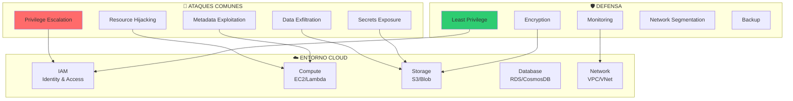
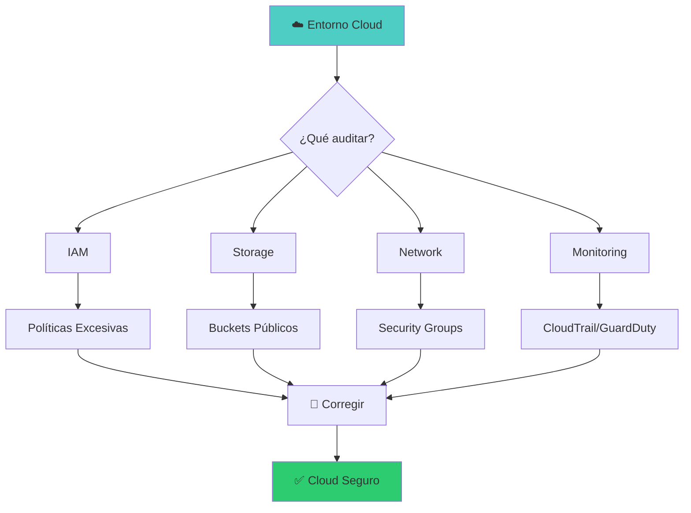

::: tip 🧪 Lab Interactivo Disponible
**¿Quieres practicar esto en tu navegador?** Tenemos una versión interactiva con terminal simulada, comandos reales y tracking de progreso.

👉 [**Abrir Lab Interactivo — Sin Docker**](/CyberDefense-Pro-Network/labs-interactive/lab-cloud-01.html)
:::

# ☁️ Lab cloud-01: Cloud Security (AWS/Azure)

> Aprende a proteger y atacar entornos cloud siguiendo el Cloud Security Framework.

## 📊 Diagrama de Cloud Security



## 🎯 Objetivos

- [ ] Configurar IAM con least privilege
- [ ] Detectar exposición de secrets
- [ ] Proteger buckets de almacenamiento
- [ ] Monitorear actividad sospechosa
- [ ] Implementar encryption at rest/transit
- [ ] Configurar alertas de seguridad

## ⏱️ Información del Lab

| Campo | Valor |
|-------|-------|
| **Dificultad** | 🔴 Avanzado |
| **Tiempo estimado** | 120 minutos |
| **XP en juego** | 500 puntos |
| **Herramientas** | AWS CLI, Prowler, ScoutSuite, CloudSploit |
| **Escenario** | AWS + Azure |

## 🚀 Inicio Rápido

```bash
# Levantar entorno cloud (simulado)
cd labs/avanzado/cloud-01
docker compose up -d

# Obtener shell con AWS CLI
docker compose exec cloud-lab bash

# Verificar configuración AWS
aws sts get-caller-identity
```

## 📋 Caso: Migración Cloud Insegura

> **Escenario:** Tu empresa migró a AWS recientemente pero cometió errores de configuración. Encuentra y corrige las vulnerabilidades.

## 📋 Fase 1: Auditoría IAM (150 XP)

### Ejercicio 1.1: Analizar Políticas IAM (50 XP)

```bash
# Listar usuarios IAM
aws iam list-users

# Listar políticas adjuntas
aws iam list-attached-user-policies --user-name [USUARIO]

# Ver políticas inline
aws iam list-user-policies --user-name [USUARIO]
```

**Usuarios encontrados:**

| Usuario | Policies | Riesgo |
|---------|----------|--------|
| `[___]` | `[___]` | `[___]` |

---

### Ejercicio 1.2: Detectar Privilegios Excesivos (50 XP)

```bash
# Buscar políticas con Action: *
aws iam get-account-authorization-details | grep -A5 '"Action": "*"'

# Buscar recursos con * 
aws iam get-account-authorization-details | grep -A5 '"Resource": "*"'

# Usar Prowler para auditoría completa
prowler aws --checks iam_root_hardware_mfa_enabled
```

**Políticas problemáticas:**

| Policy | Problema | Solución |
|--------|----------|----------|
| `[___]` | `[___]` | `[___]` |

---

### Ejercicio 1.3: Configurar MFA (50 XP)

```bash
# Verificar MFA en usuarios
aws iam list-mfa-devices --user-name [USUARIO]

# Crear MFA virtual
aws iam create-virtual-mfa-device --virtual-mfa-device-name [NOMBRE]

# Activar MFA
aws iam enable-mfa-device \
  --user-name [USUARIO] \
  --serial-number [ARN] \
  --authentication-code-1 [CODE1] \
  --authentication-code-2 [CODE2]
```

**¿Qué usuarios tienen MFA habilitado?** `[___]`

## 📋 Fase 2: Almacenamiento Seguro (150 XP)

### Ejercicio 2.1: Auditar Buckets S3 (50 XP)

```bash
# Listar todos los buckets
aws s3 ls

# Verificar configuración de cada bucket
aws s3api get-bucket-acl --bucket [NOMBRE_BUCKET]
aws s3api get-bucket-policy --bucket [NOMBRE_BUCKET]

# Buscar buckets públicos
aws s3api get-bucket-acl --bucket [NOMBRE] | grep -i "AllUsers"
```

**Buckets encontrados:**

| Bucket | Público | Datos Sensibles |
|--------|---------|-----------------|
| `[___]` | `[Sí/No]` | `[___]` |

---

### Ejercicio 2.2: Cifrar Datos en Rest (50 XP)

```bash
# Habilitar cifrado por defecto
aws s3api put-bucket-encryption --bucket [NOMBRE] \
  --server-side-encryption-configuration '{
    "Rules": [{
      "ApplyServerSideEncryptionByDefault": {
        "SSEAlgorithm": "aws:kms"
      }
    }]
  }'

# Cifrar objetos existentes
aws s3 cp s3://[BUCKET]/[ARCHIVO] s3://[BUCKET]/[ARCHIVO] \
  --sse aws:kms --sse-kms-key-id [KEY_ID]
```

**¿Qué buckets tienen cifrado habilitado?** `[___]`

---

### Ejercicio 2.3: Implementar Versioning (50 XP)

```bash
# Habilitar versionado
aws s3api put-bucket-versioning --bucket [NOMBRE] \
  --versioning-configuration Status=Enabled

# Verificar versionado
aws s3api get-bucket-versioning --bucket [NOMBRE]
```

**¿Qué buckets tienen versionado?** `[___]`

## 📋 Fase 3: Monitoreo y Alertas (100 XP)

### Ejercicio 3.1: Configurar CloudTrail (50 XP)

```bash
# Verificar si CloudTrail está habilitado
aws cloudtrail describe-trails

# Habilitar CloudTrail
aws cloudtrail create-trail --name [NOMBRE] --s3-bucket-name [BUCKET]
aws cloudtrail start-logging --name [NOMBRE]

# Buscar eventos sospechosos
aws cloudtrail lookup-events \
  --lookup-attributes AttributeKey=EventName,AttributeValue=ConsoleLogin
```

**¿CloudTrail está habilitado?** `[Sí/No]`

---

### Ejercicio 3.2: Crear Alertas de GuardDuty (50 XP)

```bash
# Habilitar GuardDuty
aws guardduty create-detector --enable

# Verificar hallazgos
aws guardduty list-findings

# Configurar alertas SNS
aws sns create-topic --name [ALERT_TOPIC]
aws sns subscribe --topic-arn [ARN] --protocol email --notification-endpoint [EMAIL]
```

**¿GuardDuty está habilitado?** `[Sí/No]`

**Hallazgos detectados:** `[___]`

## 📋 Fase 4: Secrets Management (100 XP)

### Ejercicio 4.1: Detectar Secrets Expuestos (50 XP)

```bash
# Buscar secrets en código fuente
grep -r "AKIA" /repositorio/
grep -r "password" /repositorio/ --include="*.py"
grep -r "secret" /repositorio/ --include="*.js"

# Buscar en historial de git
git log --all --full-history -- "*.env"
git log --all --full-history -- "*credentials*"
```

**Secrets encontrados:**

| Tipo | Ubicación | Acción |
|------|-----------|--------|
| `[___]` | `[___]` | `[___]` |

---

### Ejercicio 4.2: Migrar a AWS Secrets Manager (50 XP)

```bash
# Crear secret
aws secretsmanager create-secret \
  --name [NOMBRE] \
  --secret-string '{"username":"admin","password":"[PASS]"}'

# Obtener secret
aws secretsmanager get-secret-value --secret-id [NOMBRE]

# Rotar secret
aws secretsmanager rotate-secret --secret-id [NOMBRE]
```

**¿Se migraron los secrets?** `[Sí/No]`

## 🔍 Flujo de Auditoría



## 🏁 Validación

```bash
# Validación completa
./scripts/validate.sh

# Ejecutar Prowler
prowler aws --checks iam_root_hardware_mfa_enabled,s3_bucket_public_access

# Ejecutar ScoutSuite
scout aws
```

## 📝 Criterios de Éxito

| Fase | Criterio | Puntos | Estado |
|------|----------|--------|--------|
| **1. IAM** | | | |
| | Políticas analizadas | 50 | ⬜ |
| | Privilegios detectados | 50 | ⬜ |
| | MFA configurado | 50 | ⬜ |
| **2. Storage** | | | |
| | Buckets auditados | 50 | ⬜ |
| | Cifrado habilitado | 50 | ⬜ |
| | Versioning activo | 50 | ⬜ |
| **3. Monitoreo** | | | |
| | CloudTrail habilitado | 55 | ⬜ |
| | GuardDuty activo | 50 | ⬜ |
| **4. Secrets** | | | |
| | Secrets detectados | 50 | ⬜ |
| | Migrados a Secrets Manager | 50 | ⬜ |
| **Total** | | **500** | ⬜ |

## 🎓 Conceptos Clave

### Shared Responsibility Model

```
┌─────────────────────────────────────────────────────────────┐
│                    AWS RESPONSABILITY                        │
├─────────────────────────────────────────────────────────────┤
│  ✅ Physical Security                                      │
│  ✅ Infrastructure                                         │
│  ✅ Network Infrastructure                                 │
│  ✅ Hypervisor                                            │
└─────────────────────────────────────────────────────────────┘

┌─────────────────────────────────────────────────────────────┐
│                   YOUR RESPONSABILITY                        │
├─────────────────────────────────────────────────────────────┤
│  🔐 Data Encryption                                        │
│  🔐 IAM Configuration                                     │
│  🔐 Security Groups/Firewall                              │
│  🔐 Application Security                                  │
│  🔐 Operating System Patching                             │
└─────────────────────────────────────────────────────────────┘
```

### Top Cloud Security Risks (CSA)

| Rank | Risk | Description |
|------|------|-------------|
| 1 | Misconfiguration | #1 cause of breaches |
| 2 | Inadequate IAM | Weak passwords, no MFA |
| 3 | Unsecured APIs | Exposed endpoints |
| 4 | Data Breaches | Unencrypted data |
| 5 | Account Hijacking | Compromised credentials |

## 🚨 Solución (Solo después de intentar)

<details>
<summary>🔓 Click para ver la solución completa</summary>

### IAM Issues Found
1. **User: dev-user** - Has `AdministratorAccess` policy
2. **Solution:** Attach only `PowerUserAccess` or specific policies

### S3 Issues Found
1. **Bucket: company-backups** - Public read access
2. **Solution:** Remove AllUsers grant, enable encryption

### Monitoring
1. **CloudTrail:** Not enabled → Enable with log file validation
2. **GuardDuty:** Not enabled → Enable for threat detection

### Secrets
1. **Found:** AWS key in `/config.py`
2. **Solution:** Migrate to AWS Secrets Manager

</details>

---

*Lab creado para CyberDefense Labs — Nivel Avanzado*
