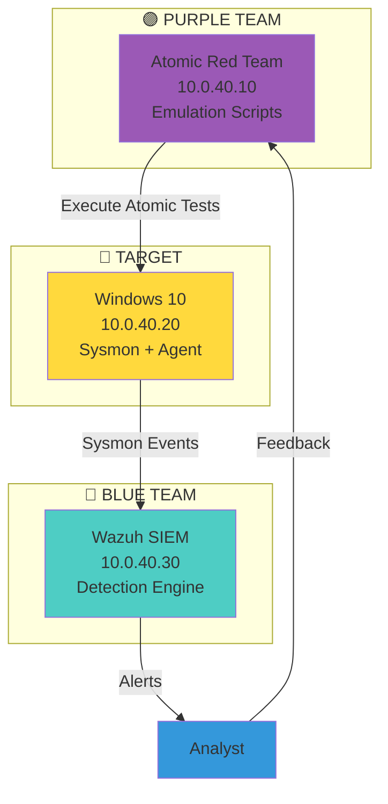

# 🟣 Lab purple-emulation-01: Adversary Emulation Pipeline

> Emula un APT real, detecta con SIEM, cierra el gap — el ciclo Purple Team completo.

## 📊 Diagrama del Escenario



## 🎯 Objetivos de Aprendizaje

Al completar este lab podrás:
- [ ] Instalar y configurar Atomic Red Team
- [ ] Ejecutar tests por táctica MITRE ATT&CK
- [ ] Configurar Sysmon para visibilidad máxima
- [ ] Crear detection rules en Sigma
- [ ] Medir detection coverage (% de tácticas detectadas)
- [ ] Generar reporte ejecutivo de Purple Team

## 📋 Requisitos

- Docker >= 24.0
- 6GB RAM mínimo
- Conocimientos: MITRE ATT&CK, SIEM basics

## 🚀 Setup

```bash
cd labs/avanzado/purple-emulation-01
docker-compose up -d

# Verificar servicios
docker-compose ps
```

## 📝 Instrucciones

### Fase 1: Blue Team — Setup SIEM (20 min)

1. **Acceder a Wazuh Dashboard:**
```
URL: http://10.0.40.30:5601
Creds: admin / admin
```

2. **Instalar agent en el target:**
```bash
# Descargar agente Wazuh para Windows
# https://documentation.wazuh.com/current/installation-guide/packages/windows.html
# Instalar y conectar al manager
```

3. **Configurar Sysmon:**
```powershell
# En el target Windows
# Descargar Sysmon
https://docs.microsoft.com/en-us/sysinternals/downloads/sysmon

# Instalar con config de SwiftOnSecurity
sysmon64.exe -accepteula -i sysmonconfig.xml
```

### Fase 2: Purple Team — Ejecutar Emulación (40 min)

1. **Instalar Atomic Red Team:**
```powershell
# En el target Windows (PowerShell como Admin)
IEX (IWR 'https://raw.githubusercontent.com/redcanaryco/invoke-atomicredteam/master/install-atomicredteam.ps1' -UseBasicParsing)
Install-AtomicRedTeam
```

2. **Ejecutar tests por táctica:**
```powershell
# Táctica: Execution (T1059.001 — PowerShell)
Invoke-AtomicRedTeam T1059.001 -TestNumbers 1,2,3 -TimeoutSeconds 30

# Táctica: Persistence (T1547.001 — Registry Run Key)
Invoke-AtomicRedTeam T1547.001 -TestNumbers 1 -TimeoutSeconds 30

# Táctica: Privilege Escalation (T1068 — Unquoted Service Path)
Invoke-AtomicRedTeam T1068 -TestNumbers 1 -TimeoutSeconds 30

# Táctica: Credential Access (T1003.001 — LSASS Memory)
Invoke-AtomicRedTeam T1003.001 -TestNumbers 1 -TimeoutSeconds 30

# Táctica: Discovery (T1087.001 — Account Discovery)
Invoke-AtomicRedTeam T1087.001 -TestNumbers 1,2 -TimeoutSeconds 30

# Táctica: Lateral Movement (T1021.002 — SMB)
Invoke-AtomicRedTeam T1021.002 -TestNumbers 1 -TimeoutSeconds 30
```

3. **Limpiar después de cada test:**
```powershell
Invoke-AtomicRedTeam T1059.001 -TestNumbers 1,2,3 -Cleanup
Invoke-AtomicRedTeam T1547.001 -TestNumbers 1 -Cleanup
# ... etc
```

### Fase 3: Blue Team — Detección (30 min)

1. **Revisar alertas en Wazuh:**
- Security Events → Alerts
- Buscar por: `atomic`, `powershell`, `mimikatz`, `scheduled task`

2. **Crear Sigma rules para gaps:**
```yaml
# rules/sigma/atomic-red-team-persistence.yml
title: Atomic Red Team - Registry Run Key Persistence
id: purple-emulation-01-persistence
status: experimental
description: Detects Atomic Red Team test T1547.001
detection:
  selection:
    EventID: 13
    TargetObject|contains:
      - 'CurrentVersion\Run'
      - 'CurrentVersion\RunOnce'
    Image|endswith:
      - '\reg.exe'
  condition: selection
level: high
tags:
  - attack.persistence
  - attack.t1547.001
```

3. **Medir cobertura:**
```
Táctica Evaluada          Detectada    Tiempo
─────────────────────────────────────────────
Execution (T1059.001)     ✅ SÍ       3s
Persistence (T1547.001)   ✅ SÍ       8s
Priv Esc (T1068)          ❌ NO       N/A
Credential Access (T1003) ✅ SÍ       15s
Discovery (T1087)         ✅ SÍ       2s
Lateral Movement (T1021)  ❌ NO       N/A
─────────────────────────────────────────────
COBERTURA TOTAL: 66% (4/6)
```

### Fase 4: Reporte Purple Team (20 min)

Crear reporte ejecutivo:
```markdown
# Purple Team Report — [Fecha]

## Resumen
- **Adversario emulado:** Generic APT (6 tácticas)
- **Tests ejecutados:** 12
- **Cobertura de detección:** 66%
- **Tiempo promedio de detección:** 7 segundos

## Gaps Identificados
1. Privilege Escalation — No detectado
2. Lateral Movement — No detectado

## Acciones Correctivas
1. Agregar Sysmon rule para service creation
2. Configurar Wazuh para SMB lateral monitoring
3. Deploy Sigma rules de Atomic Red Team
```

## 📊 Métricas del Lab

| Métrica | Objetivo |
|---------|----------|
| Atomic tests ejecutados | ≥ 10 |
| Detecciones configuradas | ≥ 5 |
| Detection coverage | > 60% |
| Sigma rules creadas | ≥ 3 |
| Reporte ejecutivo | ✅ |

## 🗂️ Estructura de archivos

```
purple-emulation-01/
├── README.md
├── docker-compose.yml
├── target/
│   ├── Dockerfile
│   └── sysmon-config.xml
├── siem/
│   └── docker-compose.yml
├── rules/
│   └── sigma/
│       ├── execution-powershell.yml
│       ├── persistence-run-key.yml
│       ├── credential-access-lsass.yml
│       └── discovery-account.yml
└── reports/
    └── template.md
```

---

*Última actualización: Agosto 2026*
*CyberDefense-Pro-Network — Aprende haciendo. Demuestra con evidencia.*
