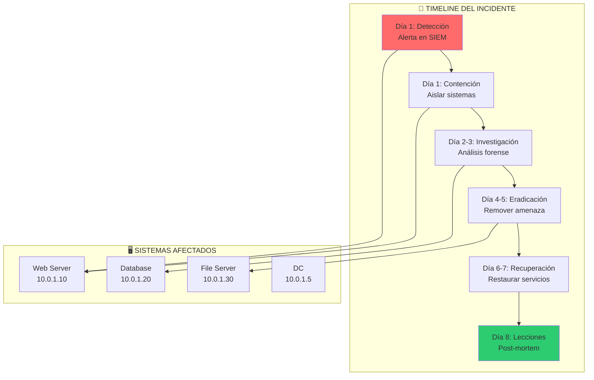
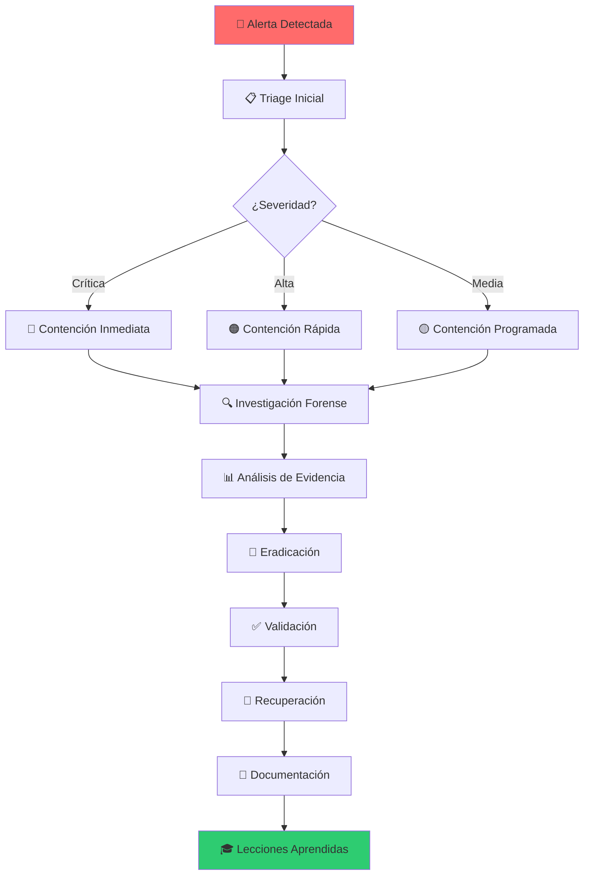

# 🚨 Lab incident-01: Incident Response Simulation

> Simula un incidente de seguridad real y practica las fases de respuesta a incidentes.

## 📊 Diagrama del Incidente



## 🎯 Objetivos

- [ ] Identificar el tipo de ataque
- [ ] Contener la amenaza correctamente
- [ ] Recolectar evidencia forense
- [ ] Determinar el alcance del incidente
- [ ] Eradicar la amenaza
- [ ] Documentar el incidente

## ⏱️ Información del Lab

| Campo | Valor |
|-------|-------|
| **Dificultad** | 🏆 Expert |
| **Tiempo estimado** | 180 minutos |
| **XP en juego** | 1000 puntos |
| **Herramientas** | Volatility, Autopsy, Wireshark, YARA |
| **Flags** | 10 |

## 🚀 Inicio Rápido

```bash
# Levantar el entorno completo de incidente
cd labs/expert/incident-01
docker compose up -d

# Verificar servicios
docker compose ps

# Obtener acceso al SIEM
docker compose exec siem bash
```

## 📋 Fase 1: Detección y Triage (200 XP)

### Ejercicio 1.1: Analizar Alerta SIEM (50 XP)

```bash
# Revisar alertas recientes
docker compose exec siem curl http://localhost:9200/alerts/_search?pretty

# O usando el dashboard
# Abrir http://localhost:5601
```

**Pregunta:** ¿Qué tipo de alerta se generó?
- [ ] Brute Force
- [ ] Malware Detected
- [ ] Data Exfiltration
- [ ] Unauthorized Access

**Respuesta:** `[___]`

---

### Ejercicio 1.2: Identificar Sistema Comprometido (50 XP)

```bash
# Revisar logs de syslog
docker compose exec webserver cat /var/log/syslog | grep -i "error\|alert"

# Revisar auth.log
docker compose exec webserver cat /var/log/auth.log | tail -100
```

**Pregunta:** ¿Qué sistema fue comprometido primero?
- `[___]`

---

### Ejercicio 1.3: Determinar Vector de Ataque (50 XP)

```bash
# Revisar logs de Apache
docker compose exec webserver cat /var/log/apache2/access.log | grep -E "POST|cmd|shell"

# Buscar webshells
docker compose exec webserver find /var/www -name "*.php" -exec grep -l "eval\|system\|exec" {} \;
```

**Pregunta:** ¿Cuál fue el vector de entrada inicial?
- `[___]`

---

### Ejercicio 1.4: Clasificar Severidad (50 XP)

Basándote en la información recolectada, clasifica el incidente:

| Criterio | Puntuación |
|----------|------------|
| Datos comprometidos | `[1-5]` |
| Sistemas afectados | `[1-5]` |
| Tiempo de respuesta requerido | `[1-5]` |
| Impacto al negocio | `[1-5]` |

**Severidad calculada:** `[___]` / 20

## 📋 Fase 2: Contención (200 XP)

### Ejercicio 2.1: Contención Corto Plazo (50 XP)

```bash
# Aislar sistema comprometido
docker compose exec webserver iptables -A INPUT -s 10.0.1.100 -j DROP
docker compose exec webserver iptables -A OUTPUT -d 10.0.1.100 -j DROP

# O usando redes Docker
docker network disconnect incident-net webserver
```

- [ ] ¿Sistema aislado? `[Sí/No]`
- [ ] Comando utilizado: `[___]`

---

### Ejercicio 2.2: Contención Largo Plazo (50 XP)

```bash
# Cambiar credenciales comprometidas
docker compose exec webserver chpasswd <<< "newpassword123"

# Deshabilitar cuenta atacante
docker compose exec dc samba-tool user disable compromised_user
```

- [ ] ¿Credenciales cambiadas? `[Sí/No]`

---

### Ejercicio 2.3: Monitoreo Activo (50 XP)

```bash
# Configurar reglas de monitoreo
docker compose exec siem curl -X POST "http://localhost:9200/monitoring/_doc" -H 'Content-Type: application/json' -d '{
  "rule": "block_attacker_ip",
  "ip": "10.0.1.100",
  "action": "drop"
}'
```

- [ ] ¿Regla de monitoreo creada? `[Sí/No]`

---

### Ejercicio 2.4: Comunicación (50 XP)

**Tarea:** Redactar comunicado inicial a stakeholders

```
PARA: [___]
DE: [___]
ASUNTO: [___]
FECHA: [___]

RESUMEN:
[___]
```

## 📋 Fase 3: Investigación Forense (300 XP)

### Ejercicio 3.1: Capturar Evidencia (50 XP)

```bash
# Crear imagen forense
docker compose exec webserver dd if=/dev/sda of=/evidence/disk.img bs=4M

# Calcular hash
docker compose exec webserver sha256sum /evidence/disk.img
```

- [ ] ¿Imagen creada? `[Sí/No]`
- [ ] Hash SHA256: `[___]`

---

### Ejercicio 3.2: Análisis de Memoria (100 XP)

```bash
# Volatility analysis
docker compose exec forensics volatility -f /evidence/memory.raw imageinfo
docker compose exec forensics volatility -f /evidence/memory.raw pslist
docker compose exec forensics volatility -f /evidence/memory.raw netscan
```

**Preguntas:**

1. ¿Qué procesos sospechosos encontraste?
   - `[___]`

2. ¿Qué conexiones de red estaban activas?
   - `[___]`

3. ¿Se inyectó algún proceso?
   - `[___]`

---

### Ejercicio 3.3: Análisis de Logs (100 XP)

```bash
# Correlacionar logs
docker compose exec siem curl "http://localhost:9200/logs/_search" -H 'Content-Type: application/json' -d '{
  "query": {
    "bool": {
      "must": [
        {"match": {"source_ip": "10.0.1.100"}},
        {"range": {"timestamp": {"gte": "2024-01-15T00:00:00"}}}
      ]
    }
  }
}'
```

**Timeline reconstruida:**

| Hora | Evento | Host | IP Origen |
|------|--------|------|-----------|
| `[___]` | `[___]` | `[___]` | `[___]` |
| `[___]` | `[___]` | `[___]` | `[___]` |
| `[___]` | `[___]` | `[___]` | `[___]` |

---

### Ejercicio 3.4: Análisis de Malware (50 XP)

```bash
# Buscar indicators of compromise
docker compose exec webserver yara /rules/malware.yar /var/www/

# Analizar binario sospechoso
docker compose exec forensics strings /evidence/suspicious.bin | head -50
```

**IOC encontrados:**

| Tipo | Valor |
|------|-------|
| IP Address | `[___]` |
| Domain | `[___]` |
| File Hash | `[___]` |
| YARA Rule | `[___]` |

## 📋 Fase 4: Eradicación (150 XP)

### Ejercicio 4.1: Remover Malware (50 XP)

```bash
# Eliminar webshells
docker compose exec webserver find /var/www -name "*.php" -delete

# Limpiar persistencias
docker compose exec webserver crontab -r
docker compose exec webserver rm /etc/cron.d/malicious
```

- [ ] ¿Malware eliminado? `[Sí/No]`

---

### Ejercicio 4.2: Parchear Vulnerabilidades (50 XP)

```bash
# Actualizar sistema
docker compose exec webserver apt update && apt upgrade -y

# Instalar WAF
docker compose exec webserver apt install modsecurity -y
```

- [ ] ¿Sistema parcheado? `[Sí/No]`

---

### Ejercicio 4.3: Validar Limpieza (50 XP)

```bash
# Escaneo completo
docker compose exec webserver clamscan -r /var/www

# Verificar integridad
docker compose exec webserver debsums -c
```

- [ ] ¿Sistema limpio? `[Sí/No]`

## 📋 Fase 5: Recuperación y Documentación (150 XP)

### Ejercicio 5.1: Restaurar Servicios (50 XP)

```bash
# Reconectar a la red
docker network connect incident-net webserver

# Reiniciar servicios
docker compose exec webserver systemctl restart apache2

# Verificar funcionalidad
curl -I http://localhost:8080
```

- [ ] ¿Servicios restaurados? `[Sí/No]`

---

### Ejercicio 5.2: Monitoreo Post-Incidente (50 XP)

```bash
# Configurar alertas mejoradas
docker compose exec siem curl -X POST "http://localhost:9200/rules/_doc" -H 'Content-Type: application/json' -d '{
  "rule": "detect_webshell",
  "pattern": "eval|system|exec",
  "alert": "critical"
}'
```

- [ ] ¿Monitoreo configurado? `[Sí/No]`

---

### Ejercicio 5.3: Reporte Final (50 XP)

**Tarea:** Completar el reporte de incidente

```markdown
# REPORTE DE INCIDENTE #INC-2024-001

## Resumen Ejecutivo
[___]

## Timeline
[___]

## Impacto
[___]

## Causa Raíz
[___]

## Acciones Tomadas
[___]

## Lecciones Aprendidas
[___]

## Recomendaciones
[___]
```

## 🔍 Flujo del Incidente



## 🏁 Validación

```bash
# Validación completa
./scripts/validate.sh

# Verificar evidencia recolectada
./scripts/check-evidence.sh

# Calcular puntuación
./scripts/calculate-score.sh
```

## 📝 Criterios de Éxito

| Fase | Criterio | Puntos | Estado |
|------|----------|--------|--------|
| **1. Detección** | | | |
| | Alerta correctamente analizada | 50 | ⬜ |
| | Sistema comprometido identificado | 50 | ⬜ |
| | Vector de ataque determinado | 50 | ⬜ |
| | Severidad clasificada | 50 | ⬜ |
| **2. Contención** | | | |
| | Sistema aislado | 50 | ⬜ |
| | Credenciales cambiadas | 50 | ⬜ |
| | Monitoreo activo | 50 | ⬜ |
| | Comunicación realizada | 50 | ⬜ |
| **3. Investigación** | | | |
| | Evidencia capturada | 50 | ⬜ |
| | Análisis de memoria | 100 | ⬜ |
| | Análisis de logs | 100 | ⬜ |
| | IOC identificados | 50 | ⬜ |
| **4. Eradicación** | | | |
| | Malware removido | 50 | ⬜ |
| | Vulnerabilidades parcheadas | 50 | ⬜ |
| | Sistema validado | 50 | ⬜ |
| **5. Recuperación** | | | |
| | Servicios restaurados | 50 | ⬜ |
| | Monitoreo mejorado | 50 | ⬜ |
| | Reporte completado | 50 | ⬜ |
| **Total** | | **1000** | ⬜ |

## 🎓 Framework de Referencia

### NIST SP 800-61

```
┌─────────────────────────────────────────────────────┐
│           RESPUESTA A INCIDENTES NIST               │
├─────────────────────────────────────────────────────┤
│  1. Preparación                                     │
│  2. Detección y Análisis                           │
│  3. Contención, Erradicación y Recuperación        │
│  4. Actividades Post-Incidente                      │
└─────────────────────────────────────────────────────┘
```

## 🚨 Solución (Solo después de intentar)

<details>
<summary>🔓 Click para ver la solución completa</summary>

### Fase 1: Detección
- Alerta: Webshell detectado en /var/www/html/shell.php
- Sistema: Web Server (10.0.1.10)
- Vector: Vulnerabilidad CVE-2024-XXXX en PHP
- Severidad: Crítica (18/20)

### Fase 2: Contención
```bash
iptables -A INPUT -s 10.0.1.100 -j DROP
chpasswd <<< "newpassword123"
```

### Fase 3: Investigación
- Proceso sospechoso: php-fpm (PID 1234)
- Conexión: 10.0.1.100:4444 (C2 Server)
- IOC: 8f14e45f-ceea-167a-9700-0e0a3b1f5e45

### Fase 4: Eradicación
```bash
rm /var/www/html/shell.php
apt update && apt upgrade -y
```

### Fase 5: Recuperación
- Servicios restaurados: ✅
- Monitoreo: ✅
- Reporte: ✅

**Lecciones aprendidas:**
1. Implementar WAF
2. Habilitar logging detallado
3. Capacitar al equipo de TI

</details>

---

*Lab creado para CyberDefense Labs — Nivel Expert*
