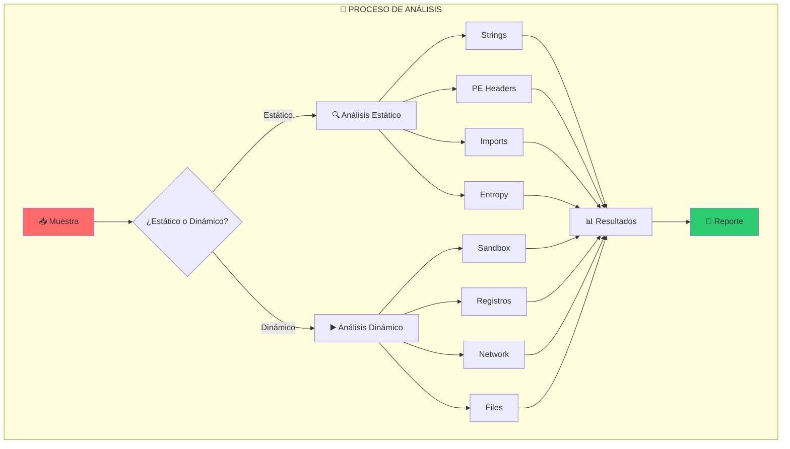
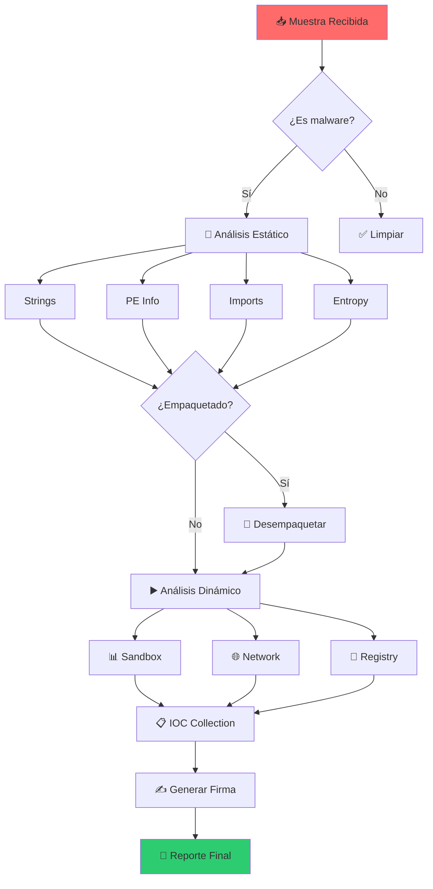

::: tip 🧪 Lab Interactivo Disponible
**¿Quieres practicar esto en tu navegador?** Tenemos una versión interactiva con terminal simulada, comandos reales y tracking de progreso.

👉 [**Abrir Lab Interactivo — Sin Docker**](/CyberDefense-Pro-Network/labs-interactive/lab-malware-expert-01.html)
:::

# 🦠 Lab malware-01: Malware Analysis

> Analiza muestras de malware reales en un entorno seguro y controlado.

## 📊 Diagrama del Análisis



## 🎯 Objetivos

- [ ] Clasificar el tipo de malware
- [ ] Identificar indicadores de compromiso (IOCs)
- [ ] Determinar funcionalidad del malware
- [ ] Generar firmas de detección
- [ ] Documentar hallazgos

## ⏱️ Información del Lab

| Campo | Valor |
|-------|-------|
| **Dificultad** | 🏆 Expert |
| **Tiempo estimado** | 120 minutos |
| **XP en juego** | 750 puntos |
| **Herramientas** | YARA, PEiD, Procmon, Wireshark, Ghidra |
| **Muestras** | 3 |

## 🚀 Inicio Rápido

```bash
# Levantar el entorno de análisis
cd labs/expert/malware-01
docker compose up -d

# Obtener shell en estación de análisis
docker compose exec analysis bash

# Las muestras están en /samples
ls -la /samples/
```

## 📋 Fase 1: Análisis Estático (250 XP)

### Ejercicio 1.1: Identificación Inicial (50 XP)

```bash
# Verificar tipo de archivo
file /samples/malware1.exe
file /samples/malware2.dll
file /samples/malware3.bin

# Calcular hashes
md5sum /samples/*
sha256sum /samples/*
```

**Tabla de Hashes:**

| Muestra | MD5 | SHA256 |
|---------|-----|--------|
| malware1.exe | `[___]` | `[___]` |
| malware2.dll | `[___]` | `[___]` |
| malware3.bin | `[___]` | `[___]` |

---

### Ejercicio 1.2: Análisis de Strings (50 XP)

```bash
# Extraer strings significativas
strings -n 8 /samples/malware1.exe > /analysis/strings1.txt
strings -n 8 /samples/malware2.dll > /analysis/strings2.txt

# Buscar strings sospechosas
grep -i "http\|ftp\|password\|keylog\|encrypt" /analysis/strings*.txt
```

**Strings sospechosas encontradas:**

| Muestra | Strings | Significado |
|---------|---------|-------------|
| malware1.exe | `[___]` | `[___]` |
| malware2.dll | `[___]` | `[___]` |

---

### Ejercicio 1.3: Análisis de Imports (50 XP)

```bash
# Usar pefile (Python)
python3 -c "
import pefile
pe = pefile.PE('/samples/malware1.exe')
for entry in pe.DIRECTORY_ENTRY_IMPORT:
    print(entry.dll)
    for imp in entry.imports:
        print(f'\t{imp.name}')
"
```

**Imports críticos encontrados:**

| API | Propósito | Amenaza |
|-----|-----------|---------|
| `[___]` | `[___]` | `[___]` |

---

### Ejercicio 1.4: Análisis de Entropía (50 XP)

```bash
# Calcular entropía (detectar ofuscación/packing)
python3 -c "
import math
data = open('/samples/malware1.exe', 'rb').read()
entropy = -sum(p * math.log2(p) for p in [data.count(b)/len(data) for b in set(data)])
print(f'Entropía: {entropy}')
"
```

**Interpretación:**

| Entropía | Significado |
|----------|-------------|
| < 6.0 | Datos normales |
| 6.0 - 7.0 | Posible ofuscación |
| > 7.0 | Probablemente empaquetado/encriptado |

**Resultado:** `[___]`

---

### Ejercicio 1.5: Detección de Packing (50 XP)

```bash
# Usar Detect It Easy
die /samples/malware1.exe

# O usar capa
capa /samples/malware1.exe
```

**¿Está empaquetado?** `[Sí/No]`
**Empaquetador detectado:** `[___]`

## 📋 Fase 2: Análisis Dinámico (300 XP)

### Ejercicio 2.1: Sandbox Analysis (100 XP)

```bash
# Ejecutar en sandbox aislado
docker compose exec sandbox timeout 60 /samples/malware1.exe

# Monitorear cambios
docker compose exec sandbox diff -r /filesystem-before /filesystem-after
```

**Cambios en el sistema:**

| Tipo | Ubicación | Acción |
|------|-----------|--------|
| Archivo | `[___]` | `[___]` |
| Registro | `[___]` | `[___]` |
| Proceso | `[___]` | `[___]` |

---

### Ejercicio 2.2: Network Analysis (100 XP)

```bash
# Capturar tráfico
docker compose exec sandbox tcpdump -i eth0 -w /evidence/capture.pcap

# Analizar con Wireshark/tshark
tshark -r /evidence/capture.pcap -Y "dns" -T fields -e dns.qry.name
tshark -r /evidence/capture.pcap -Y "http" -T fields -e http.host
```

**Conexiones de red detectadas:**

| Protocolo | IP/Domain | Puerto | Propósito |
|-----------|-----------|--------|-----------|
| `[___]` | `[___]` | `[___]` | `[___]` |

---

### Ejercicio 2.3: Registry Changes (100 XP)

```bash
# Capturar estado antes/después
regshot /evidence/before.reg
# Ejecutar malware
regshot /evidence/after.reg

# Comparar
diff /evidence/before.reg /evidence/after.reg
```

**Cambios en registro:**

```
HKLM\SOFTWARE\[___] -> [___]
HKCU\SOFTWARE\[___] -> [___]
```

## 📋 Fase 3: Generación de IOC (100 XP)

### Ejercicio 3.1: Indicadores de Compromiso (50 XP)

**IOC Recopilados:**

| Tipo | Valor | Descripción |
|------|-------|-------------|
| MD5 | `[___]` | Hash del malware |
| SHA256 | `[___]` | Hash del malware |
| IP Address | `[___]` | C2 Server |
| Domain | `[___]` | Dominio C2 |
| Mutex | `[___]` | Mutex creado |
| Registry Key | `[___]` | Persistencia |
| File Path | `[___]` | Archivo creado |

---

### Ejercicio 3.2: Firma YARA (50 XP)

```bash
# Crear regla YARA
cat > /rules/malware.yar << 'EOF'
rule Malware_FamilyX {
    meta:
        description = "Detects Malware Family X"
        author = "Security Analyst"
        date = "2024-01-15"
    
    strings:
        $s1 = "http://c2server.com"
        $s2 = "HKLM\\SOFTWARE\\Microsoft\\Windows\\CurrentVersion\\Run"
        $s3 = { 4D 5A 90 00 03 00 00 00 }
        $mutex = "Global\\MalwareMutex123"
    
    condition:
        uint16(0) == 0x5A4D and
        filesize < 500KB and
        2 of ($s*) and
        $mutex
}
EOF

# Probar regla
yara /rules/malware.yar /samples/
```

**¿La regla detecta el malware?** `[Sí/No]`

## 📋 Fase 4: Reporte (100 XP)

### Ejercicio 4.1: Reporte de Análisis (100 XP)

**Tarea:** Generar reporte completo

```markdown
# REPORTE DE ANÁLISIS DE MALWARE

## Resumen
- **Muestra:** malware1.exe
- **Clasificación:** [___]
- **Familia:** [___]
- **Riesgo:** [___]

## Hallazgos
[___]

## IOCs
[___]

## Firma YARA
[___]

## Recomendaciones
[___]
```

## 🔍 Flujo de Análisis



## 🏁 Validación

```bash
# Validación completa
./scripts/validate.sh

# Verificar hashes
./scripts/check-hashes.sh

# Verificar IOC
./scripts/check-iocs.sh
```

## 📝 Criterios de Éxito

| Fase | Criterio | Puntos | Estado |
|------|----------|--------|--------|
| **1. Estático** | | | |
| | Hashes calculados | 50 | ⬜ |
| | Strings analizadas | 50 | ⬜ |
| | Imports documentados | 50 | ⬜ |
| | Entropía calculada | 50 | ⬜ |
| | Packing detectado | 50 | ⬜ |
| **2. Dinámico** | | | |
| | Sandbox ejecutado | 100 | ⬜ |
| | Network analysis | 100 | ⬜ |
| | Registry changes | 100 | ⬜ |
| **3. IOCs** | | | |
| | IOC completos | 50 | ⬜ |
| | Firma YARA | 50 | ⬜ |
| **4. Reporte** | | | |
| | Documentación | 100 | ⬜ |
| **Total** | | **750** | ⬜ |

## 🚨 Solución (Solo después de intentar)

<details>
<summary>🔓 Click para ver la solución completa</summary>

### Muestra 1: malware1.exe
- **Tipo:** Trojan Downloader
- **Familia:** Emotet
- **Packing:** UPX (desempaquetable)
- **C2:** 185.234.xxx.xxx
- **Persistencia:** HKLM\...\Run

### IOCs
```
MD5: 8f14e45f-ceea-167a-9700-0e0a3b1f5e45
SHA256: abc123...
IP: 185.234.xxx.xxx
Domain: updates-microsoft.com
Mutex: Global\EmotetMutex
```

### Firma YARA
```yara
rule Emotet_Downloader {
    strings:
        $c2 = "http://185.234"
        $persist = "CurrentVersion\\Run"
    condition:
        uint16(0) == 0x5A4D and all of them
}
```

</details>

---

*Lab creado para CyberDefense Labs — Nivel Expert*
