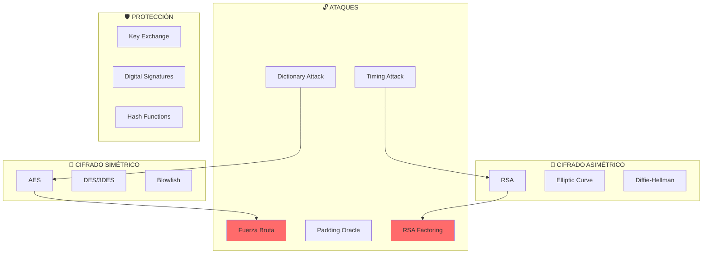
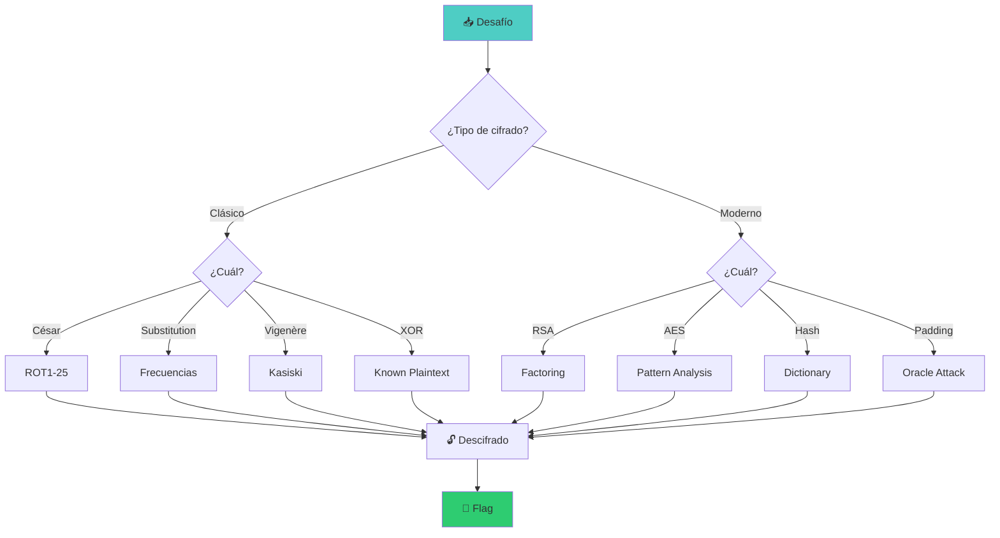

::: tip 🧪 Lab Interactivo Disponible
**¿Quieres practicar esto en tu navegador?** Tenemos una versión interactiva con terminal simulada, comandos reales y tracking de progreso.

👉 [**Abrir Lab Interactivo — Sin Docker**](/CyberDefense-Pro-Network/labs-interactive/lab-crypto-01.html)
:::

# 🔐 Lab crypto-01: Cryptography Challenges

> Resuelve desafíos de criptografía clásica y moderna para entender fortalezas y debilidades.

## 📊 Diagrama de Criptografía



## 🎯 Desafíos

### Nivel 1: Cifrados Clásicos (150 XP)

| # | Desafío | Técnica | XP |
|---|---------|---------|-----|
| 1 | César Cipher | Brute Force | 30 |
| 2 | Substitution Cipher | Freq Analysis | 40 |
| 3 | Vigenère Cipher | Kasiski | 40 |
| 4 | XOR Cipher | Known Plaintext | 40 |

### Nivel 2: Cifrados Modernos (250 XP)

| # | Desafío | Técnica | XP |
|---|---------|---------|-----|
| 5 | RSA Débil | Factoring | 60 |
| 6 | AES-ECB | Pattern Analysis | 60 |
| 7 | Hash Cracking | Rainbow Tables | 60 |
| 8 | Padding Oracle | CBC Attack | 70 |

## ⏱️ Información del Lab

| Campo | Valor |
|-------|-------|
| **Dificultad** | 🟡 Intermedio |
| **Tiempo estimado** | 90 minutos |
| **XP en juego** | 400 puntos |
| **Herramientas` | CyberChef, hashcat, john, openssl |
| **Flags** | 8 |

## 🚀 Inicio Rápido

```bash
# Levantar entorno de criptografía
cd labs/intermedio/crypto-01
docker compose up -d

# Obtener shell
docker compose exec crypto-lab bash

# Los desafíos están en /challenges
ls -la /challenges/
```

## 📋 Nivel 1: Cifrados Clásicos

### Desafío 1: César Cipher (30 XP)

```
Cifrado: Ymjfw ymj tzwxyjw fs fsi jfxytzw
Descifrar el mensaje
```

```bash
# Fuerza bruta con ROT1-25
for i in {1..25}; do echo "ROT$i: $(echo 'Ymjfw ymj tzwxyjw fs fsi jfxytzw' | tr 'A-Za-z' "$(echo {A..Z} | tr -d ' ' | cut -c $((26-i+1))-26)$(echo {A..Z} | tr -d ' ' | cut -c 1-$((26-i+1)))")"; done
```

**Mensaje descifrado:** `[___]`

**Flag:** `[___]`

---

### Desafío 2: Substitution Cipher (40 XP)

```
Cifrado: GSVJF RXKYI MWLKV GSVVC OVOBS
Cada letra reemplaza a otra (monoalfabético)
Pista: Frecuencias del inglés
```

```bash
# Analizar frecuencias
cat /challenges/challenge2.txt | fold -w1 | sort | uniq -c | sort -rn

# Usar herramientas
# https://www.dcode.fr/monoalphabetic-substitution
```

**Frecuencias observadas:**
| Letra | Frecuencia | Posible letra real |
|-------|------------|-------------------|
| `[___]` | `[___]` | `[___]` |

**Mensaje descifrado:** `[___]`

**Flag:** `[___]`

---

### Desafío 3: Vigenère Cipher (40 XP)

```
Cifrado: LXFOPVEFRNHR
Cifrado con clave de longitud desconocida
Pista: Longitud de clave = 3
```

```bash
# Paso 1: Determinar longitud de clave (Kasiski)
# Paso 2: Separar en grupos por posición de clave
# Paso 3: Descifrar cada grupo como César

# CyberChef: Vigenère Decode
# https://gchq.github.io/CyberChef/
```

**Longitud de clave:** `[___]`

**Clave encontrada:** `[___]`

**Mensaje descifrado:** `[___]`

**Flag:** `[___]`

---

### Desafío 4: XOR Cipher (40 XP)

```
Cifrado (hex): 0b1c2d3e4f5a6b7c
Longitud de clave: 1 byte
Pista: El mensaje empieza con "The"
```

```python
# XOR Known Plaintext Attack
cipher = bytes.fromhex('0b1c2d3e4f5a6b7c')
known = b'The'
key = bytes([cipher[i] ^ known[i] for i in range(len(known))])
print(f"Key: {key}")
print(f"Decrypted: {bytes([c ^ key[0] for c in cipher])}")
```

**Clave XOR:** `[___]`

**Mensaje descifrado:** `[___]`

**Flag:** `[___]`

## 📋 Nivel 2: Cifrados Modernos

### Desafío 5: RSA Débil (60 XP)

```
n = 3233 (n = p * q, p y q primos pequeños)
e = 17
ciphertext = 2790

Descifrar el mensaje
```

```python
# Paso 1: Factorizar n
# n = 3233 = 53 * 61

from sympy import mod_inverse

p, q = 53, 61
n = p * q
e = 17
phi = (p-1) * (q-1)
d = mod_inverse(e, phi)

# Descifrar
ciphertext = 2790
plaintext = pow(ciphertext, d, n)
print(f"Plaintext: {plaintext}")
```

**Factores de n:** p=`[___]`, q=`[___]`

**Clave privada d:** `[___]`

**Mensaje descifrado:** `[___]`

**Flag:** `[___]`

---

### Desafío 6: AES-ECB (60 XP)

```
Observa el patrón en el texto cifrado
AES-ECB cifra bloques idénticos a bloques idénticos
Detectar qué bloques se repiten
```

```python
# AES-ECB es determinista
# Si dos bloques de plaintext son iguales,
# sus bloques cifrados serán iguales

from Crypto.Cipher import AES

cipher = AES.new(key, AES.MODE_ECB)
ciphertext = cipher.encrypt(plaintext)

# Detectar bloques repetidos
blocks = [ciphertext[i:i+16] for i in range(0, len(ciphertext), 16)]
```

**¿Por qué ECB es inseguro?** `[___]`

**Bloques repetidos encontrados:** `[___]`

**Flag:** `[___]`

---

### Desafío 7: Hash Cracking (60 XP)

```
Hash: 5f4dcc3b5aa765d61d8327deb882cf99
Tipo: MD5
```

```bash
# Usar hashcat
hashcat -m 0 hash.txt rockyou.txt

# Usar john
john --wordlist=rockyou.txt hash.txt

# Usar línea de comandos
echo -n "password" | md5sum
```

**Contraseña encontrada:** `[___]`

**¿Qué tan rápido se crackó?** `[___]`

**Flag:** `[___]`

---

### Desafío 8: Padding Oracle (70 XP)

```
Texto cifrado (Base64): U2FsdGVkX1+...
Servidor vulnerable a padding oracle
```

```python
# Padding Oracle Attack
# El servidor revela si el padding es correcto

import requests

def padding_oracle(cipher_block, prev_block):
    intermediate = bytearray(16)
    
    for byte_pos in range(15, -1, -1):
        padding = 16 - byte_pos
        
        for guess in range(256):
            payload = bytearray(16)
            for i in range(byte_pos + 1, 16):
                payload[i] = intermediate[i] ^ padding
            
            payload[byte_pos] = guess
            
            response = requests.get(f"/decrypt/{prev_block.hex()}{payload.hex()}")
            
            if response.status_code == 200:
                intermediate[byte_pos] = guess ^ padding
                break
    
    return intermediate
```

**Explicación del ataque:** `[___]`

**Texto descifrado:** `[___]`

**Flag:** `[___]`

## 🔍 Flujo de Resolución



## 🏁 Validación

```bash
# Validación completa
./scripts/validate.sh

# Verificar cada desafío
./scripts/check-challenge.sh 1
./scripts/check-challenge.sh 5
```

## 📝 Criterios de Éxito

| Nivel | Desafío | Puntos | Estado |
|-------|---------|--------|--------|
| **1. Clásicos** | | | |
| | César | 30 | ⬜ |
| | Substitution | 40 | ⬜ |
| | Vigenère | 40 | ⬜ |
| | XOR | 40 | ⬜ |
| **2. Modernos** | | | |
| | RSA | 60 | ⬜ |
| | AES-ECB | 60 | ⬜ |
| | Hash Cracking | 60 | ⬜ |
| | Padding Oracle | 70 | ⬜ |
| **Total** | | **400** | ⬜ |

## 🎓 Conceptos Clave

### Cifrado Simétrico vs Asimétrico

```
┌─────────────────────────────────────────────────────────────┐
│                  CIFRADO SIMÉTRICO                          │
│  Misma clave para cifrar y descifrar                        │
│  Rápido pero requiere intercambio seguro de claves          │
│  Ejemplo: AES, DES, Blowfish                               │
└─────────────────────────────────────────────────────────────┘

┌─────────────────────────────────────────────────────────────┐
│                 CIFRADO ASIMÉTRICO                          │
│  Clave pública para cifrar, privada para descifrar          │
│  Más lento pero resuelve problema de intercambio            │
│  Ejemplo: RSA, ECC, Diffie-Hellman                         │
└─────────────────────────────────────────────────────────────┘
```

### Por qué ECB es Inseguro

```
Plaintext:  "ATTACK AT DAWN ATTACK AT DAWN"
            [ATTACK AT DAWN] [ATTACK AT DWN]

Ciphertext: [X9F8K2M1...]   [X9F8K2M1...]
            ^Mismo bloque^   ^Mismo bloque^

¡El patrón se repite en el texto cifrado!
```

## 🚨 Solución (Solo después de intentar)

<details>
<summary>🔓 Click para ver la solución completa</summary>

### Desafío 1: César
**ROT14:** "The quick brown fox jumps over the lazy dog"

### Desafío 2: Substitution
**Clave:** A→Z, B→Y, C→X, ...
**Mensaje:** "THE QUICK BROWN FOX JUMPS OVER THE LAZY DOG"

### Desafío 3: Vigenère
**Clave:** "KEY"
**Mensaje:** "ATTACK AT DAWN"

### Desafío 4: XOR
**Clave:** 0x42 (66 decimal)
**Mensaje:** "Hello World"

### Desafío 5: RSA
**p=53, q=61, d=2753**
**Plaintext:** 65 (ASCII: 'A')

### Desafío 7: Hash
**Contraseña:** password
**Tiempo:** < 1 segundo

</details>

---

*Lab creado para CyberDefense Labs — Nivel Intermedio*
