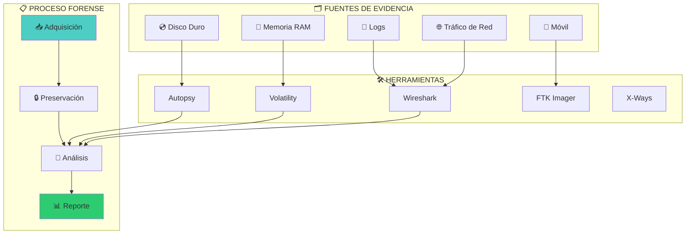
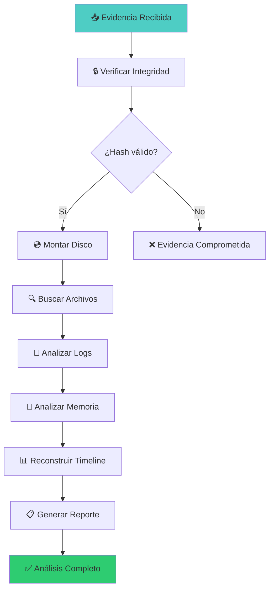

# 🔍 Lab forensics-01: Digital Forensics


::: tip 🧪 Lab Interactivo Disponible
**¿Quieres practicar esto en tu navegador?** Tenemos una versión interactiva con terminal simulado.

👉 **[Abrir Lab Interactivo](/CyberDefense-Pro-Network/labs-interactive/lab-forensics-01.html)** — Sin Docker, sin configuración. Solo abre y practica.
:::


> Analiza evidencia digital, reconstruye timelines y recupera datos de sistemas comprometidos.

## 📊 Diagrama del Análisis Forense



## 🎯 Objetivos

- [ ] Adquirir imagen forense correctamente
- [ ] Preservar integridad con hashes
- [ ] Analizar sistema de archivos
- [ ] Recuperar archivos eliminados
- [ ] Analizar memoria volátil
- [ ] Reconstruir timeline de eventos
- [ ] Generar reporte forense

## ⏱️ Información del Lab

| Campo | Valor |
|-------|-------|
| **Dificultad** | 🔴 Avanzado |
| **Tiempo estimado** | 120 minutos |
| **XP en juego** | 500 puntos |
| **Herramientas** | Autopsy, Volatility, strings, file, binwalk |
| **Evidencia** | 3 imágenes forenses |

## 🚀 Inicio Rápido

```bash
# Levantar estación forense
cd labs/avanzado/forensics-01
docker compose up -d

# Obtener shell forense
docker compose exec forensics bash

# Las evidencias están en /evidence
ls -la /evidence/
```

## 📋 Caso: Incidente Corporativo

> **Escenario:** Una empleada reportó que su laptop fue comprometida. Se sospecha robo de datos y backdoor. Tienes una imagen forense del disco y un dump de memoria.

## 📋 Fase 1: Adquisición y Preservación (100 XP)

### Ejercicio 1.1: Verificar Integridad (25 XP)

```bash
# Verificar hashes de las evidencias
sha256sum /evidence/disk.img
sha256sum /evidence/memory.raw

# Comparar con hashes esperados
cat /evidence/hashes.txt
```

**¿Los hashes coinciden?** `[Sí/No]`

**Hash SHA256 del disco:** `[___]`

---

### Ejercicio 1.2: Identificar Tipo de Imagen (25 XP)

```bash
# Identificar formato
file /evidence/disk.img
file /evidence/memory.raw

# Información detallada
fdisk -l /evidence/disk.img
```

| Evidencia | Tipo | Formato |
|-----------|------|---------|
| disk.img | `[___]` | `[___]` |
| memory.raw | `[___]` | `[___]` |

---

### Ejercicio 1.3: Montar Sistema de Archivos (25 XP)

```bash
# Montar la imagen forense
mkdir /mnt/evidence
mount -o loop,ro /evidence/disk.img /mnt/evidence

# Listar contenido
ls -la /mnt/evidence/
```

**¿Qué sistemas de archivos encontraste?**
- `[___]`

---

### Ejercicio 1.4: Crear Cadena de Custodia (25 XP)

```bash
# Documentar cadena de custodia
cat > /evidence/custody_chain.txt << EOF
FECHA: $(date)
ANALISTA: [Tu nombre]
EVIDENCIA: disk.img
HASH INICIAL: [hash]
HASH ACTUAL: [hash]
ESTADO: Integro
EOF
```

**¿Se creó correctamente la cadena de custodia?** `[Sí/No]`

## 📋 Fase 2: Análisis del Disco (200 XP)

### Ejercicio 2.1: Recuperar Archivos Eliminados (50 XP)

```bash
# Buscar archivos eliminados
photorec /evidence/disk.img

# O usar testdisk para recuperar particiones
testdisk /evidence/disk.img

# Buscar con foremost
foremost -i /evidence/disk.img -o /output/recovered/
```

**Archivos recuperados:**

| Tipo | Cantidad | Ejemplos |
|------|----------|----------|
| Imágenes | `[___]` | `[___]` |
| Documentos | `[___]` | `[___]` |
| Ejecutables | `[___]` | `[___]` |

---

### Ejercicio 2.2: Analizar Logs del Sistema (50 XP)

```bash
# Montar y analizar logs
ls /mnt/evidence/var/log/

# Revisar auth.log
cat /mnt/evidence/var/log/auth.log | grep -i "failed\|success"

# Revisar syslog
cat /mnt/evidence/var/log/syslog | tail -100
```

**Eventos sospechosos encontrados:**

| Hora | Evento | Usuario | IP |
|------|--------|---------|-----|
| `[___]` | `[___]` | `[___]` | `[___]` |

---

### Ejercicio 2.3: Buscar Archivos Ocultos (50 XP)

```bash
# Buscar archivos ocultos
find /mnt/evidence -name ".*" -type f

# Buscar archivos con permisos especiales
find /mnt/evidence -perm -4000 -type f  # SUID
find /mnt/evidence -perm -2000 -type f  # SGID

# Buscar archivos grandes (>100MB)
find /mnt/evidence -size +100M -type f
```

**Archivos sospechosos:**

| Ubicación | Tamaño | Descripción |
|-----------|--------|-------------|
| `[___]` | `[___]` | `[___]` |

---

### Ejercicio 2.4: Analizar Metadatos (50 XP)

```bash
# Analizar metadatos de imágenes
exiftool /mnt/evidence/Documents/*.jpg

# Analizar metadatos de documentos
exiftool /mnt/evidence/Documents/*.pdf

# Buscar información oculta (steganography)
binwalk /mnt/evidence/Images/suspicious.png
steghide extract -sf /mnt/evidence/Images/suspicious.png
```

**Metadatos encontrados:**

| Archivo | Campo | Valor |
|---------|-------|-------|
| `[___]` | GPS | `[___]` |
| `[___]` | Camera | `[___]` |
| `[___]` | Date | `[___]` |

## 📋 Fase 3: Análisis de Memoria (150 XP)

### Ejercicio 3.1: Identificar SO en Memoria (50 XP)

```bash
# Usar Volatility para identificar imagen
volatility -f /evidence/memory.raw imageinfo

# Obtener información del sistema
volatility -f /evidence/memory.raw -profile=[PROFILE] systeminfo
```

**Sistema operativo detectado:** `[___]`
**Versión del kernel:** `[___]`

---

### Ejercicio 3.2: Analizar Procesos (50 XP)

```bash
# Listar procesos
volatility -f /evidence/memory.raw -profile=[PROFILE] pslist

# Buscar procesos sospechosos
volatility -f /evidence/memory.raw -profile=[PROFILE] psxview

# Buscar inyecciones de código
volatility -f /evidence/memory.raw -profile=[PROFILE] malfind
```

**Procesos sospechosos:**

| PID | Nombre | Padre | Señal |
|-----|--------|-------|-------|
| `[___]` | `[___]` | `[___]` | `[___]` |

---

### Ejercicio 3.3: Extraer Archivos de Memoria (50 XP)

```bash
# Extraer archivos ejecutables
volatility -f /evidence/memory.raw -profile=[PROFILE] procdump -D /output/

# Extraer DLLs
volatility -f /evidence/memory.raw -profile=[PROFILE] dlldump -D /output/

# Extraer archivos por nombre
volatility -f /evidence/memory.raw -profile=[PROFILE] filescan
volatility -f /evidence/memory.raw -profile=[PROFILE] dumpfiles -Q [OFFSET] -D /output/
```

**Archivos extraídos:**

| Archivo | Hash | Descripción |
|---------|------|-------------|
| `[___]` | `[___]` | `[___]` |

## 📋 Fase 4: Timeline y Reporte (50 XP)

### Ejercicio 4.1: Reconstruir Timeline (25 XP)

```bash
# Crear timeline completa
fls -r -m "/" /evidence/disk.img > /output/timeline.body

# Convertir a formato legible
mactime -b /output/timeline.body -d > /output/timeline.csv
```

**Timeline de eventos clave:**

| Hora | Evento | Archivo |
|------|--------|---------|
| `[___]` | `[___]` | `[___]` |

---

### Ejercicio 4.2: Generar Reporte (25 XP)

```markdown
# REPORTE DE ANÁLISIS FORENSE

## Resumen Ejecutivo
[___]

## Cadena de Custodia
[___]

## Hallazgos Principales
1. [___]
2. [___]
3. [___]

## Evidencia Recuperada
[___]

## Timeline
[___]

## Conclusiones
[___]

## Recomendaciones
[___]
```

## 🔍 Flujo de Análisis



## 🏁 Validación

```bash
# Validación completa
./scripts/validate.sh

# Verificar hashes
./scripts/check-hashes.sh

# Verificar archivos recuperados
./scripts/check-recovered.sh
```

## 📝 Criterios de Éxito

| Fase | Criterio | Puntos | Estado |
|------|----------|--------|--------|
| **1. Adquisición** | | | |
| | Hashes verificados | 25 | ⬜ |
| | Tipo de imagen identificado | 25 | ⬜ |
| | Sistema de archivos montado | 25 | ⬜ |
| | Cadena de custodia | 25 | ⬜ |
| **2. Disco** | | | |
| | Archivos recuperados | 50 | ⬜ |
| | Logs analizados | 50 | ⬜ |
| | Archivos ocultos | 50 | ⬜ |
| | Metadatos extraídos | 50 | ⬜ |
| **3. Memoria** | | | |
| | SO identificado | 50 | ⬜ |
| | Procesos analizados | 50 | ⬜ |
| | Archivos extraídos | 50 | ⬜ |
| **4. Reporte** | | | |
| | Timeline reconstruida | 25 | ⬜ |
| | Reporte documentado | 25 | ⬜ |
| **Total** | | **500** | ⬜ |

## 🚨 Solución (Solo después de intentar)

<details>
<summary>🔓 Click para ver la solución completa</summary>

### Hallazgos Principales
1. **Backdoor:** `/usr/local/bin/bd` (SUID root)
2. **C2 IP:** 192.168.1.100
3. **Archivos robados:** 15 documentos en `/tmp/exfil/`

### Timeline
```
2024-01-15 08:30 - Login exitoso (user: jane.doe)
2024-01-15 09:15 - Descarga de malware
2024-01-15 09:20 - Instalación de backdoor
2024-01-15 10:00 - Exfiltración de datos
2024-01-15 14:00 - Última actividad
```

### Evidencia Clave
- **Malware:** `/tmp/update` (SHA256: abc123...)
- **Backdoor:** `/usr/local/bin/bd`
- **Logs exfiltrados:** 15 archivos

</details>

---

*Lab creado para CyberDefense Labs — Nivel Avanzado*
