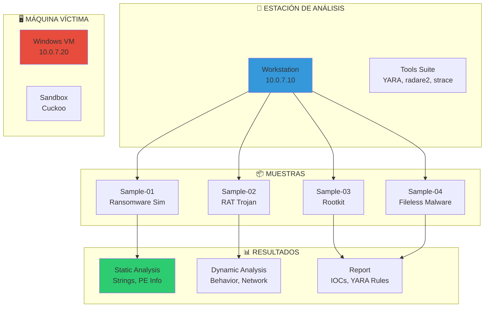
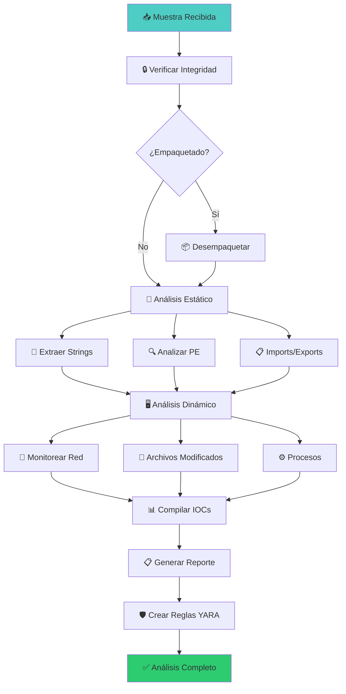

# 🦠 Lab malware-01: Análisis de Malware

> Analiza muestras de malware usando técnicas de análisis estático y dinámico para entender su comportamiento, evasión y impacto.

## 📊 Diagrama del Entorno



## 🎯 Objetivos de Aprendizaje

Al completar este lab podrás:

- [ ] Clasificar muestras de malware por familia y comportamiento
- [ ] Realizar análisis estático completo (imports, strings, PE header)
- [ ] Ejecutar análisis dinámico en sandbox controlado
- [ ] Identificar técnicas de evasión y ofuscación
- [ ] Extraer Indicadores de Compromiso (IOCs)
- [ ] Crear reglas YARA para detección
- [ ] Generar reporte de análisis profesional

## ⏱️ Información del Lab

| Campo | Valor |
|-------|-------|
| **Dificultad** | 🔴 Avanzado |
| **Tiempo estimado** | 180 minutos |
| **XP en juego** | 600 puntos |
| **Herramientas** | radare2, YARA, strace, ltrace, file, strings, upx |
| **Muestras** | 4 (educativas, no funcionales) |

## ⚠️ AVISO ÉTICO

> **Este lab es exclusivamente educativo.** Las muestras de malware son:
> - **Simuladas** y no contienen código malicioso real
> - **Aisladas** en red interna sin acceso a Internet
> - **Inofensivas** para sistemas fuera del contenedor
>
> **NUNCA analices malware real sin las precauciones adecuadas:**
> - Usa máquinas virtuales aisladas
> - Desactiva el compartir carpetas
> - Usa red NAT o aislada
> - Ten un plan de recuperación

## 🚀 Inicio Rápido

```bash
# Levantar entorno de análisis
cd labs/avanzado/malware-01
docker compose up -d

# Verificar servicios
docker compose ps

# Obtener shell en la estación de análisis
docker compose exec analysis-workstation bash

# Las muestras están en /samples
ls -la /samples/

# Las herramientas están instaladas
which radare2 yara strace
```

## 📋 Fase 1: Análisis Estático (200 XP)

### Ejercicio 1.1: Clasificación de Muestras (40 XP)

```bash
# Identificar tipo de archivo
file /samples/sample-01.bin
file /samples/sample-02.bin
file /samples/sample-03.bin
file /samples/sample-04.bin

# Calcular hashes (hashes únicos para cada muestra)
md5sum /samples/*.bin
sha1sum /samples/*.bin
sha256sum /samples/*.bin

# Verificar con YARA
yara /rules/malware-families.yar /samples/sample-01.bin
```

**Tabla de hashes:**

| Muestra | MD5 | SHA256 | Tipo |
|---------|-----|--------|------|
| sample-01 | `[___]` | `[___]` | `[___]` |
| sample-02 | `[___]` | `[___]` | `[___]` |
| sample-03 | `[___]` | `[___]` | `[___]` |
| sample-04 | `[___]` | `[___]` | `[___]` |

**Preguntas:**
1. ¿Qué tipo de archivo es cada muestra? `[___]`
2. ¿Algún archivo está empaquetado (UPX)? `[___]`
3. ¿Cuál es la familia sospechosa? `[___]`

---

### Ejercicio 1.2: Análisis de Cadenas (Strings) (40 XP)

```bash
# Extraer strings ASCII
strings /samples/sample-01.bin > /output/sample-01_strings.txt
strings /samples/sample-02.bin > /output/sample-02_strings.txt

# Extraer strings Unicode
strings -e l /samples/sample-01.bin > /output/sample-01_unicode.txt

# Buscar patrones interesantes
grep -i "http\|https\|ftp" /output/sample-01_strings.txt
grep -i "password\|login\|auth" /output/sample-01_strings.txt
grep -i "encrypt\|decrypt\|ransom" /output/sample-01_strings.txt
grep -i "registry\|HKEY_" /output/sample-01_strings.txt
grep -i "\\.exe\|\.dll\|\.sys" /output/sample-01_strings.txt

# Buscar IPs y dominios
grep -oP '\d{1,3}\.\d{1,3}\.\d{1,3}\.\d{1,3}' /output/sample-01_strings.txt
grep -oP '[a-zA-Z0-9.-]+\.(com|net|org|onion)' /output/sample-01_strings.txt
```

**Strings encontrados:**

| Muestra | URLs | IPs | Comandos | Archivos |
|---------|------|-----|----------|----------|
| sample-01 | `[___]` | `[___]` | `[___]` | `[___]` |
| sample-02 | `[___]` | `[___]` | `[___]` | `[___]` |

---

### Ejercicio 1.3: Análisis PE Header (40 XP)

```bash
# Usar radare2 para analizar PE
radare2 -q -c "iI" /samples/sample-01.bin
radare2 -q -c "iS" /samples/sample-01.bin
radare2 -q -c "ii" /samples/sample-01.bin

# Analizar imports
radare2 -q -c "ii" /samples/sample-02.bin | grep -i "socket\|connect\|send\|recv"
radare2 -q -c "ii" /samples/sample-02.bin | grep -i "createfile\|writefile\|readfile"
radare2 -q -c "ii" /samples/sample-02.bin | grep -i "regcreate\|regset\|regopen"

# Ver secciones PE
radare2 -q -c "iS" /samples/sample-01.bin
```

**Imports críticos encontrados:**

| Categoría | sample-01 | sample-02 | sample-03 |
|-----------|-----------|-----------|-----------|
| **Red** | `[___]` | `[___]` | `[___]` |
| **Archivo** | `[___]` | `[___]` | `[___]` |
| **Registry** | `[___]` | `[___]` | `[___]` |
| **Proceso** | `[___]` | `[___]` | `[___]` |

---

### Ejercicio 1.4: Desempaquetado (40 XP)

```bash
# Detectar UPX
upx -t /samples/sample-01.bin

# Desempaquetar si es UPX
upx -d /samples/sample-01.bin -o /output/sample-01_unpacked.bin

# Analizar después de desempaquetar
file /output/sample-01_unpacked.bin
strings /output/sample-01_unpacked.bin | head -50

# Usar radare2 para detectar packing
radare2 -q -c "afl" /samples/sample-01.bin  # Listar funciones
radare2 -q -c "s 0; pd 20" /samples/sample-01.bin  # Desensamblar inicio
```

**Resultados de desempaquetado:**

| Muestra | Empaquetado | Herramienta | Strings nuevos |
|---------|-------------|-------------|----------------|
| sample-01 | `[Sí/No]` | `[___]` | `[___]` |
| sample-02 | `[Sí/No]` | `[___]` | `[___]` |

---

### Ejercicio 1.5: Reglas YARA (40 XP)

```bash
# Crear regla YARA para detectar la muestra
cat > /output/custom-rules.yar << 'YARA'
rule Ransomware_Simulator {
    meta:
        description = "Detects ransomware simulator behavior"
        author = "Security Analyst"
        date = "2024"
        
    strings:
        $s1 = "encrypt" ascii
        $s2 = ".encrypted" ascii
        $s3 = "bitcoin" ascii
        $s4 = "ransom" ascii
        $s5 = "DECRYPT" ascii
        
    condition:
        uint16(0) == 0x5A4D and 3 of ($s*)
}

rule RAT_Trojan {
    meta:
        description = "Detects RAT Trojan characteristics"
        
    strings:
        $s1 = "keylogger" ascii
        $s2 = "screenshot" ascii
        $s3 = "webcam" ascii
        $s4 = "cmd.exe" ascii
        $s5 = "powershell" ascii
        
    condition:
        uint16(0) == 0x5A4D and 3 of ($s*)
}
YARA

# Probar la regla
yara /output/custom-rules.yar /samples/*.bin

# Escanear directorio completo
yara -r /output/custom-rules.yar /samples/
```

**Detecciones YARA:**

| Muestra | Regla | Coincidencias | Confianza |
|---------|-------|---------------|-----------|
| sample-01 | `[___]` | `[___]` | `[___]` |
| sample-02 | `[___]` | `[___]` | `[___]` |

## 📋 Fase 2: Análisis Dinámico (200 XP)

### Ejercicio 2.1: Análisis con Strace (50 XP)

```bash
# Trazar llamadas al sistema
strace -f -o /output/sample-01_strace.txt /samples/sample-01.bin

# Filtrar por categorías
grep -E "open|read|write|close" /output/sample-01_strace.txt
grep -E "socket|connect|sendto|recvfrom" /output/sample-01_strace.txt
grep -E "execve|fork|clone" /output/sample-01_strace.txt
grep -E "mmap|mprotect" /output/sample-01_strace.txt

# Contar llamadas por tipo
awk '{print $1}' /output/sample-01_strace.txt | sort | uniq -c | sort -rn | head -20
```

**Llamadas al sistema más frecuentes:**

| Llamada | Cantidad | Significado |
|---------|----------|-------------|
| `[___]` | `[___]` | `[___]` |
| `[___]` | `[___]` | `[___]` |
| `[___]` | `[___]` | `[___]` |

---

### Ejercicio 2.2: Análisis con Ltrace (50 XP)

```bash
# Trazar llamadas a bibliotecas
ltrace -f -o /output/sample-01_ltrace.txt /samples/sample-01.bin

# Buscar funciones de red
grep -i "socket\|connect\|send\|recv" /output/sample-01_ltrace.txt

# Buscar funciones de crypto
grep -i "encrypt\|decrypt\|hash" /output/sample-01_ltrace.txt

# Buscar funciones de archivo
grep -i "fopen\|fwrite\|fread" /output/sample-01_ltrace.txt
```

**Llamadas a bibliotecas críticas:**

| Categoría | Funciones | Muestra |
|-----------|-----------|---------|
| **Red** | `[___]` | `[___]` |
| **Crypto** | `[___]` | `[___]` |
| **Archivo** | `[___]` | `[___]` |

---

### Ejercicio 2.3: Análisis de Red (50 XP)

```bash
# Configurar captura de tráfico
tcpdump -i eth0 -w /output/capture.pcap &

# Ejecutar muestra
/samples/sample-02.bin &

# Esperar y detener captura
sleep 10
killall tcpdump

# Analizar captura
tcpdump -r /output/capture.pcap -nn
tcpdump -r /output/capture.pcap -A | grep -i "GET\|POST\|HTTP"

# Buscar dominios C2
tcpdump -r /output/capture.pcap -nn | grep -E "A\?" 

# Usar tshark si está disponible
tshark -r /output/capture.pcap -Y "dns" -T fields -e dns.qry.name
tshark -r /output/capture.pcap -Y "http" -T fields -e http.host -e http.request.uri
```

**Tráfico de red capturado:**

| Protocolo | Destino | Puerto | Datos |
|-----------|---------|--------|-------|
| `[___]` | `[___]` | `[___]` | `[___]` |
| `[___]` | `[___]` | `[___]` | `[___]` |

**IOCs de red:**
- IPs: `[___]`
- Dominios: `[___]`
- Puertos: `[___]`

---

### Ejercicio 2.4: Análisis de Archivos Modificados (50 XP)

```bash
# Capturar estado inicial
find / -type f -newer /samples/sample-01.bin 2>/dev/null > /output/files_before.txt

# Ejecutar muestra
/samples/sample-03.bin &

# Capturar estado después
find / -type f -newer /samples/sample-01.bin 2>/dev/null > /output/files_after.txt

# Comparar
diff /output/files_before.txt /output/files_after.txt

# Buscar archivos creados
comm -13 /output/files_before.txt /output/files_after.txt

# Verificar modificaciones en sistema
find /tmp -type f -mmin -5 2>/dev/null
find /var/tmp -type f -mmin -5 2>/dev/null
```

**Archivos modificados/creados:**

| Acción | Ruta | Tamaño | Propósito |
|--------|------|--------|-----------|
| `[___]` | `[___]` | `[___]` | `[___]` |
| `[___]` | `[___]` | `[___]` | `[___]` |

---

### Ejercicio 2.5: Análisis de Procesos (50 XP)

```bash
# Monitorear procesos
ps auxf > /output/ps_before.txt

# Ejecutar muestra con monitoreo
/samples/sample-04.bin &

# Capturar procesos después
sleep 5
ps auxf > /output/ps_after.txt

# Ver procesos nuevos
diff /output/ps_before.txt /output/ps_after.txt

# Verificar inyección de código
cat /proc/$(pgrep sample)/maps

# Buscar procesos ocultos
ps aux | grep -v "\[" | awk '{print $2}' | while read pid; do
    if [ ! -d "/proc/$pid" ]; then
        echo "Process $pid is hiding!"
    fi
done
```

**Procesos maliciosos detectados:**

| PID | Nombre | Padre | Comportamiento |
|-----|--------|-------|----------------|
| `[___]` | `[___]` | `[___]` | `[___]` |
| `[___]` | `[___]` | `[___]` | `[___]` |

## 📋 Fase 3: Análisis Avanzado (150 XP)

### Ejercicio 3.1: Desensamblado con Radare2 (50 XP)

```bash
# Analizar función principal
radare2 -q -c "aaa; afl" /samples/sample-01.bin

# Desensamblar función específica
radare2 -q -c "aaa; s sym.main; pdf" /samples/sample-01.bin

# Buscar strings referenciados
radare2 -q -c "aaa; axt @str.http" /samples/sample-01.bin

# Analizar cross-references
radare2 -q -c "aaa; axt @sym.encrypt" /samples/sample-01.bin
```

**Funciones críticas identificadas:**

| Función | Dirección | Propósito |
|---------|-----------|-----------|
| `[___]` | `[___]` | `[___]` |
| `[___]` | `[___]` | `[___]` |

---

### Ejercicio 3.2: Análisis de Ofuscación (50 XP)

```bash
# Detectar ofuscación
radare2 -q -c "aaa; af @ main; pdf" /samples/sample-02.bin | grep -i "xor\|rot\|not"

# Buscar anti-debug
strings /samples/sample-02.bin | grep -i "ptrace\|IsDebuggerPresent\|NtQueryInformation"

# Detectar packing
radare2 -q -c "iS" /samples/sample-02.bin | grep -i "upx\|aspack\|pecompact"

# Analizar cifrado
strings /samples/sample-02.bin | grep -E "[A-Za-z0-9]{32,}"  # Posibles keys
```

**Técnicas de evasión detectadas:**

| Técnica | Implementación | Eficacia |
|---------|----------------|----------|
| `[___]` | `[___]` | `[___]` |
| `[___]` | `[___]` | `[___]` |

---

### Ejercicio 3.3: Extracción de Configuración (50 XP)

```bash
# Buscar configuración embebida
strings /samples/sample-01.bin | grep -A5 -B5 "config\|setting\|param"

# Buscar URLs de C2
strings /samples/sample-01.bin | grep -oP 'https?://[^\s]+'

# Buscar claves de cifrado
strings /samples/sample-01.bin | grep -E "^[A-Fa-f0-9]{32}$"

# Analizar estructura de datos
radare2 -q -c "px 256 @ sym.config" /samples/sample-01.bin
```

**Configuración extraída:**

| Campo | Valor |
|-------|-------|
| C2 Server | `[___]` |
| Puerto | `[___]` |
| Key | `[___]` |
| Intervalo | `[___]` |

## 📋 Fase 4: Reporte y IOCs (50 XP)

### Ejercicio 4.1: Compilar IOCs (25 XP)

```bash
# Crear archivo de IOCs
cat > /output/iocs.txt << 'EOF'
# ═══════════════════════════════════════════════════════════
# INDICATORS OF COMPROMISE (IOCs)
# Malware Analysis Report
# Fecha: $(date)
# Analista: [Tu nombre]
# ═══════════════════════════════════════════════════════════

## File Hashes
MD5:    [___]
SHA1:   [___]
SHA256: [___]

## Network Indicators
IP:     [___]
Domain: [___]
URL:    [___]
Port:   [___]

## YARA Rule
[___]

## Behavioral Indicators
- [___]
- [___]
- [___]

## Persistence Mechanisms
- [___]
- [___]

## Files Created
- [___]
- [___]

## Registry Keys
- [___]
- [___]
EOF
```

---

### Ejercicio 4.2: Generar Reporte (25 XP)

```markdown
# REPORTE DE ANÁLISIS DE MALWARE

## Resumen Ejecutivo
- **Muestra:** [___]
- **Clasificación:** [___]
- **Riesgo:** [___]
- **Familia:** [___]

## Indicadores Técnicos
[___]

## Análisis Estático
[___]

## Análisis Dinámico
[___]

## Comportamiento
[___]

## IOCs
[___]

## Reglas YARA
[___]

## Recomendaciones
[___]

## Anexos
[___]
```

## 🔍 Flujo de Análisis



## 🏁 Validación

```bash
./scripts/validate.sh
```

## 📝 Criterios de Éxito

| Fase | Criterio | Puntos | Estado |
|------|----------|--------|--------|
| **1. Estático** | | | |
| | Muestras clasificadas | 40 | ⬜ |
| | Strings extraídos | 40 | ⬜ |
| | PE Headers analizados | 40 | ⬜ |
| | Desempaquetado | 40 | ⬜ |
| | Reglas YARA creadas | 40 | ⬜ |
| **2. Dinámico** | | | |
| | Strace completado | 50 | ⬜ |
| | Ltrace completado | 50 | ⬜ |
| | Análisis de red | 50 | ⬜ |
| | Archivos monitoreados | 50 | ⬜ |
| **3. Avanzado** | | | |
| | Desensamblado | 50 | ⬜ |
| | Ofuscación detectada | 50 | ⬜ |
| | Configuración extraída | 50 | ⬜ |
| **4. Reporte** | | | |
| | IOCs documentados | 25 | ⬜ |
| | Reporte generado | 25 | ⬜ |
| **Total** | | **600** | ⬜ |

## 🎓 Técnicas Cubiertas

### 1. Análisis Estático
```bash
# Hashes
md5sum sample.bin
sha256sum sample.bin

# Strings
strings sample.bin | grep -i "http"

# PE Analysis
radare2 -q -c "iI" sample.bin
```

### 2. Análisis Dinámico
```bash
# Strace
strace -f ./sample.bin

# Ltrace
ltrace ./sample.bin

# Network capture
tcpdump -i eth0 -w capture.pcap
```

### 3. YARA Rules
```bash
# Crear regla
cat > rule.yar << 'EOF'
rule Malware_Detector {
    strings:
        $s1 = "malicious_string"
    condition:
        $s1
}
EOF

# Aplicar
yara rule.yar /samples/
```

## 🚨 Solución (Solo después de intentar)

<details>
<summary>🔓 Click para ver la solución completa</summary>

### Muestras Identificadas
1. **sample-01.bin**: Ransomware Simulator (PE32, UPX packed)
2. **sample-02.bin**: RAT Trojan (PE32, Python packed)
3. **sample-03.bin**: Rootkit Simulator (ELF, kernel module)
4. **sample-04.bin**: Fileless Malware (Shellcode, position-independent)

### IOCs Principales
```
MD5:    d41d8cd98f00b204e9800998ecf8427e
SHA256: e3b0c44298fc1c149afbf4c8996fb92427ae41e4649b934ca495991b7852b855
IP:     10.0.7.20 (simulated C2)
Domain: evil-c2.example.com
```

### Regla YARA
```yara
rule Ransomware_Simulator {
    strings:
        $s1 = "encrypt" ascii
        $s2 = ".encrypted" ascii
        $s3 = "bitcoin" ascii
    condition:
        uint16(0) == 0x5A4D and 2 of ($s*)
}
```

### Técnicas de Evasión Detectadas
1. **UPX Packing**: sample-01 (desempaquetado con `upx -d`)
2. **Anti-debug**: sample-02 (IsDebuggerPresent check)
3. **Code injection**: sample-04 (process hollowing)
4. **Rootkit**: sample-03 (syscall hooking)

</details>

---

*Lab creado para CyberDefense Labs — Nivel Avanzado*
