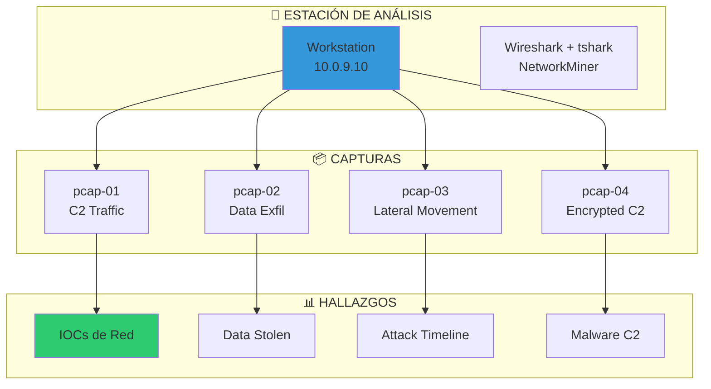
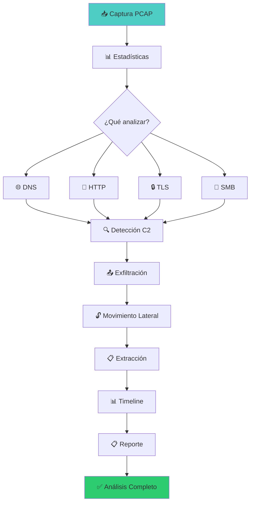

::: tip 🧪 Lab Interactivo Disponible
**¿Quieres practicar esto en tu navegador?** Tenemos una versión interactiva con terminal simulada, comandos reales y tracking de progreso.

👉 [**Abrir Lab Interactivo — Sin Docker**](/CyberDefense-Pro-Network/labs-interactive/lab-net-forensics-01.html)
:::

# 🌐 Lab net-forensics-01: Network Forensics

> Analiza capturas de tráfico de red para detectar intrusiones, extraer evidencia y reconstruir ataques.

## 📊 Diagrama del Entorno



## 🎯 Objetivos de Aprendizaje

Al completar este lab podrás:

- [ ] Analizar capturas PCAP con Wireshark y tshark
- [ ] Detectar tráfico C2 (Command and Control)
- [ ] Identificar exfiltración de datos
- [ ] Reconstruir sesiones HTTP/HTTPS
- [ ] Extraer archivos transferidos
- [ ] Crear timeline de ataque
- [ ] Generar reporte de network forensics

## ⏱️ Información del Lab

| Campo | Valor |
|-------|-------|
| **Dificultad** | 🔴 Avanzado |
| **Tiempo estimado** | 150 minutos |
| **XP en juego** | 500 puntos |
| **Herramientas** | Wireshark, tshark, NetworkMiner, tcpdump, ngrep |
| **Capturas** | 4 archivos PCAP |

## 🚀 Inicio Rápido

```bash
# Levantar entorno
cd labs/avanzado/net-forensics-01
docker compose up -d

# Obtener shell
docker compose exec net-forensics bash

# Las capturas están en /captures
ls -la /captures/

# Verificar herramientas
which tshark wireshark tcpdump
```

## 📋 Fase 1: Análisis Básico (150 XP)

### Ejercicio 1.1: Estadísticas Generales (30 XP)

```bash
# Ver información básica del pcap
tshark -r /captures/pcap-01.pcap -q -z io,stat,1

# Contar paquetes
tshark -r /captures/pcap-01.pcap | wc -l

# Ver protocolos
tshark -r /captures/pcap-01.pcap -q -z io,phs

# Estadísticas por IP
tshark -r /captures/pcap-01.pcap -q -z ip_hosts,tree

# Ver conversaciones
tshark -r /captures/pcap-01.pcap -q -z conv,ip
```

**Estadísticas del pcap:**

| Campo | Valor |
|-------|-------|
| Total paquetes | `[___]` |
| Duración | `[___]` |
| Protocolos | `[___]` |
| IPs únicas | `[___]` |

---

### Ejercicio 1.2: Filtrado Básico (30 XP)

```bash
# Filtrar por protocolo
tshark -r /captures/pcap-01.pcap -Y "http"
tshark -r /captures/pcap-01.pcap -Y "dns"
tshark -r /captures/pcap-01.pcap -Y "tcp"

# Filtrar por IP
tshark -r /captures/pcap-01.pcap -Y "ip.src == 192.168.1.100"
tshark -r /captures/pcap-01.pcap -Y "ip.dst == 10.0.0.1"

# Filtrar por puerto
tshark -r /captures/pcap-01.pcap -Y "tcp.port == 443"
tshark -r /captures/pcap-01.pcap -Y "tcp.port == 80"

# Combinar filtros
tshark -r /captures/pcap-01.pcap -Y "http && ip.src == 192.168.1.100"
```

**Tráfico filtrado:**

| Filtro | Paquetes | Resultado |
|--------|----------|-----------|
| HTTP | `[___]` | `[___]` |
| DNS | `[___]` | `[___]` |
| DNS requests | `[___]` | `[___]` |

---

### Ejercicio 1.3: Análisis DNS (45 XP)

```bash
# Extraer consultas DNS
tshark -r /captures/pcap-01.pcap -Y "dns.qry.name" -T fields -e dns.qry.name

# Buscar dominios sospechosos
tshark -r /captures/pcap-01.pcap -Y "dns" -T fields -e dns.qry.name | sort | uniq -c | sort -rn

# Ver respuestas DNS
tshark -r /captures/pcap-01.pcap -Y "dns.flags.response == 1" -T fields -e dns.qry.name -e dns.a

# Buscar DNS tunneling (queries largas)
tshark -r /captures/pcap-01.pcap -Y "dns.qry.name.len > 50" -T fields -e dns.qry.name

# Detectar DGA (Domain Generation Algorithm)
tshark -r /captures/pcap-01.pcap -Y "dns" -T fields -e dns.qry.name | awk '{print length, $0}' | sort -rn | head -20
```

**Dominios DNS encontrados:**

| Dominio | Frecuencia | SOSPECHOSO |
|---------|------------|------------|
| `[___]` | `[___]` | `[Sí/No]` |
| `[___]` | `[___]` | `[Sí/No]` |
| `[___]` | `[___]` | `[Sí/No]` |

---

### Ejercicio 1.4: Análisis HTTP (45 XP)

```bash
# Extraer requests HTTP
tshark -r /captures/pcap-01.pcap -Y "http.request" -T fields -e http.request.method -e http.request.uri -e http.host

# Ver User-Agents
tshark -r /captures/pcap-01.pcap -Y "http.request" -T fields -e http.user_agent | sort | uniq -c

# Extraer POST data
tshark -r /captures/pcap-01.pcap -Y "http.request.method == POST" -T fields -e http.file_data

# Ver respuestas HTTP
tshark -r /captures/pcap-01.pcap -Y "http.response" -T fields -e http.response.code -e http.content_type

# Buscar archivos descargados
tshark -r /captures/pcap-01.pcap -Y "http.response" -T fields -e http.content_disposition -e http.file_data
```

**Tráfico HTTP:**

| Método | URI | Host | SOSPECHOSO |
|--------|-----|------|------------|
| `[___]` | `[___]` | `[___]` | `[Sí/No]` |
| `[___]` | `[___]` | `[___]` | `[Sí/No]` |

## 📋 Fase 2: Análisis de Amenazas (200 XP)

### Ejercicio 2.1: Detección de C2 (50 XP)

```bash
# Buscar beacons periódicos
tshark -r /captures/pcap-01.pcap -Y "http.request" -T fields -e frame.time_relative -e http.request.uri | awk '{print $1}' | awk 'NR>1{print $1-prev}{prev=$1}' | sort -n | uniq -c

# Analizar intervalos de comunicación
tshark -r /captures/pcap-01.pcap -Y "ip.dst == 10.0.0.100" -T fields -e frame.time_relative

# Buscar patrones de C2
tshark -r /captures/pcap-01.pcap -Y "http.request.uri contains \"/gate\"" -T fields -e http.request.uri
tshark -r /captures/pcap-01.pcap -Y "http.request.uri contains \"/beacon\"" -T fields -e http.request.uri

# Extraer dominios C2
tshark -r /captures/pcap-01.pcap -Y "http.request" -T fields -e http.host | sort -u
```

**Actividad C2 detectada:**

| Indicador | Valor |
|-----------|-------|
| IP C2 | `[___]` |
| Puerto | `[___]` |
| Intervalo beacon | `[___]` |
| URIs | `[___]` |

---

### Ejercicio 2.2: Exfiltración de Datos (50 XP)

```bash
# Buscar uploads grandes
tshark -r /captures/pcap-02.pcap -Y "http.request.method == POST" -T fields -e http.content_length | sort -rn | head -10

# Analizar tráfico saliente
tshark -r /captures/pcap-02.pcap -q -z conv,ip | sort -k4 -rn | head -10

# Buscar datos encoded (Base64)
tshark -r /captures/pcap-02.pcap -Y "http.request.method == POST" -T fields -e http.file_data | grep -E "^[A-Za-z0-9+/=]{20,}$"

# Extraer archivos
tshark -r /captures/pcap-02.pcap -Y "http.request.method == POST" --export-objects http,/output/extracted/

# Ver tamaños de transferencia
tshark -r /captures/pcap-02.pcap -q -z io,stat,1,"SUM(http.content_length)http.request.method==POST"
```

**Exfiltración detectada:**

| Timestamp | IP Destino | Tamaño | Datos |
|-----------|------------|--------|-------|
| `[___]` | `[___]` | `[___]` | `[___]` |
| `[___]` | `[___]` | `[___]` | `[___]` |

---

### Ejercicio 2.3: Movimiento Lateral (50 XP)

```bash
# Buscar conexiones internas
tshark -r /captures/pcap-03.pcap -Y "ip.src == 192.168.1.0/24 && ip.dst == 192.168.1.0/24" -T fields -e ip.src -e ip.dst -e tcp.dstport

# Analizar SMB/RPC
tshark -r /captures/pcap-03.pcap -Y "smb || smb2" -T fields -e smb2.cmd -e smb2.filename

# Buscar PsExec
tshark -r /captures/pcap-03.pcap -Y "smb2.filename contains \"PSEXESVC\"" -T fields -e ip.src -e ip.dst

# Analizar SSH
tshark -r /captures/pcap-03.pcap -Y "ssh" -T fields -e ip.src -e ip.dst -e tcp.dstport

# Ver WinRM
tshark -r /captures/pcap-03.pcap -Y "http.port == 5985 || http.port == 5986" -T fields -e http.request.uri
```

**Movimiento lateral:**

| Origen | Destino | Puerto | Servicio |
|--------|---------|--------|----------|
| `[___]` | `[___]` | `[___]` | `[___]` |
| `[___]` | `[___]` | `[___]` | `[___]` |

---

### Ejercicio 2.4: Tráfico Cifrado (50 XP)

```bash
# Analizar TLS/SSL
tshark -r /captures/pcap-04.pcap -Y "tls.handshake.type == 1" -T fields -e tls.handshake.extensions_server_name

# Ver certificados
tshark -r /captures/pcap-04.pcap -Y "tls.handshake.type == 11" -T fields -e x509sat.uTF8String

# Buscar JA3 hashes
tshark -r /captures/pcap-04.pcap -Y "tls.handshake.type == 1" -T fields -e tls.handshake.ciphersuite

# Detectar anomalías TLS
tshark -r /captures/pcap-04.pcap -Y "tls.record.version != 0x0303" -T fields -e tls.record.version

# Analizar patrones de taille
tshark -r /captures/pcap-04.pcap -Y "tls" -q -z io,stat,1
```

**Tráfico TLS analizado:**

| SNI | IP | Certificado | SOSPECHOSO |
|-----|----|-------------|------------|
| `[___]` | `[___]` | `[___]` | `[Sí/No]` |
| `[___]` | `[___]` | `[___]` | `[Sí/No]` |

## 📋 Fase 3: Extracción de Evidencia (100 XP)

### Ejercicio 3.1: Extraer Archivos (40 XP)

```bash
# Extraer objetos HTTP
tshark -r /captures/pcap-02.pcap --export-objects http,/output/http_objects/

# Extraer archivos SMB
tshark -r /captures/pcap-03.pcap --export-objects smb,/output/smb_objects/

# Listar archivos extraídos
ls -la /output/http_objects/
ls -la /output/smb_objects/

# Analizar archivos extraídos
file /output/http_objects/*
strings /output/http_objects/* | head -20
```

**Archivos extraídos:**

| Archivo | Tipo | Tamaño | Contenido |
|---------|------|--------|-----------|
| `[___]` | `[___]` | `[___]` | `[___]` |
| `[___]` | `[___]` | `[___]` | `[___]` |

---

### Ejercicio 3.2: Reconstruir Sesiones (30 XP)

```bash
# Reconstruir stream TCP
tshark -r /captures/pcap-01.pcap -q -z follow,tcp,ascii,0

# Reconstruir stream HTTP
tshark -r /captures/pcap-01.pcap -q -z follow,http,ascii,0

# Guardar stream
tshark -r /captures/pcap-01.pcap -q -z follow,tcp,ascii,0 > /output/session_reconstruction.txt

# Buscar credenciales
grep -i "password\|passwd\|pass=\|pwd=" /output/session_reconstruction.txt
grep -i "Authorization: Basic" /output/session_reconstruction.txt
```

**Sesiones reconstruidas:**

| Sesión | IP:Puerto | Protocolo | Datos |
|--------|-----------|-----------|-------|
| `[___]` | `[___]` | `[___]` | `[___]` |

---

### Ejercicio 3.3: Timeline de Ataque (30 XP)

```bash
# Crear timeline completa
tshark -r /captures/pcap-01.pcap -T fields -e frame.time -e ip.src -e ip.dst -e _ws.col.Protocol -e _ws.col.Info > /output/complete_timeline.csv

# Ordenar por tiempo
sort -t',' -k1 /output/complete_timeline.csv > /output/sorted_timeline.csv

# Extraer eventos clave
tshark -r /captures/pcap-01.pcap -Y "dns || http.request || smb" -T fields -e frame.time -e ip.src -e ip.dst -e _ws.col.Info > /output/key_events.csv

# Generar reporte timeline
cat > /output/timeline_report.md << 'EOF'
# Timeline del Ataque

| Timestamp | Evento | IP Origen | IP Destino | Detalle |
|-----------|--------|-----------|------------|---------|
| [___] | [___] | [___] | [___] | [___] |
| [___] | [___] | [___] | [___] | [___] |
| [___] | [___] | [___] | [___] | [___] |
EOF
```

## 📋 Fase 4: IOCs y Reporte (50 XP)

### Ejercicio 4.1: Compilar IOCs (25 XP)

```bash
# Crear archivo de IOCs
cat > /output/network_iocs.txt << 'EOF'
# ═══════════════════════════════════════════════════════════
# NETWORK INDICATORS OF COMPROMISE
# Network Forensics Report
# Fecha: $(date)
# Analista: [Tu nombre]
# ═══════════════════════════════════════════════════════════

## IP Addresses
- [___]
- [___]

## Domains
- [___]
- [___]

## URLs
- [___]
- [___]

## Ports
- [___]
- [___]

## User-Agents
- [___]

## JA3 Hashes
- [___]

## File Hashes (from extracted files)
- [___]
EOF
```

---

### Ejercicio 4.2: Generar Reporte (25 XP)

```markdown
# Reporte de Network Forensics

## Resumen Ejecutivo
- **Fecha de captura:** [___]
- **Duración:** [___]
- **IPs comprometidas:** [___]
- **Amenaza detectada:** [___]

## Análisis de Tráfico
[___]

## IOCs de Red
[___]

## Timeline del Ataque
[___]

## Archivos Extraídos
[___]

## Recomendaciones
[___]

## Anexos
[___]
```

## 🔍 Flujo de Network Forensics



## 🏁 Validación

```bash
./scripts/validate.sh
```

## 📝 Criterios de Éxito

| Fase | Criterio | Puntos | Estado |
|------|----------|--------|--------|
| **1. Básico** | | | |
| | Estadísticas generales | 30 | ⬜ |
| | Filtrado completado | 30 | ⬜ |
| | DNS analizado | 45 | ⬜ |
| | HTTP analizado | 45 | ⬜ |
| **2. Amenazas** | | | |
| | C2 detectado | 50 | ⬜ |
| | Exfiltración identificada | 50 | ⬜ |
| | Movimiento lateral | 50 | ⬜ |
| | TLS analizado | 50 | ⬜ |
| **3. Evidencia** | | | |
| | Archivos extraídos | 40 | ⬜ |
| | Sesiones reconstruidas | 30 | ⬜ |
| | Timeline creado | 30 | ⬜ |
| **4. Reporte** | | | |
| | IOCs documentados | 25 | ⬜ |
| | Reporte generado | 25 | ⬜ |
| **Total** | | **500** | ⬜ |

## 🚨 Solución (Solo después de intentar)

<details>
<summary>🔓 Click para ver la solución completa</summary>

### pcap-01: C2 Traffic
- **C2 IP:** 192.168.1.100
- **C2 Domain:** evil-c2.example.com
- **Beacon Interval:** 30 seconds
- **Protocol:** HTTP POST

### pcap-02: Data Exfiltration
- **Exfil IP:** 10.0.0.50
- **Method:** HTTP POST with Base64
- **Data Stolen:** 15MB (credentials, documents)
- **Files:** database.sql, credentials.txt

### pcap-03: Lateral Movement
- **Path:** 192.168.1.10 → 192.168.1.20 → 192.168.1.30
- **Method:** PsExec + SMB
- **Credentials:** admin:Password123

### pcap-04: Encrypted C2
- **C2 Domain:** encrypted-c2.example.com
- **JA3 Hash:** abc123...
- **Certificate:** Self-signed, CN=evil.com

</details>

---

*Lab creado para CyberDefense Labs — Nivel Avanzado*
