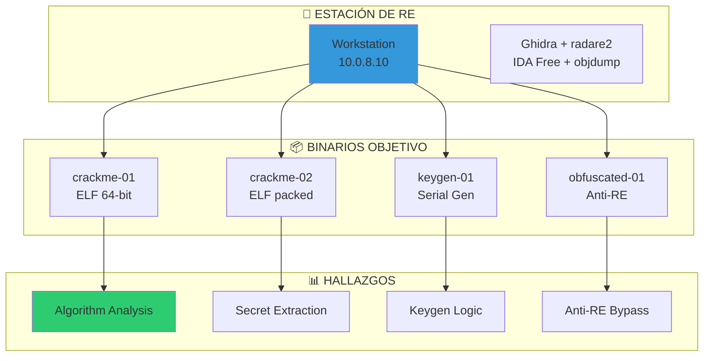
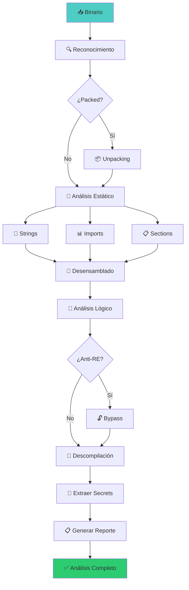

# 🔧 Lab reverse-eng-01: Reverse Engineering

> Descompila, desensambla y analiza binarios para entender su comportamiento interno, algoritmos y secreos embebidos.

## 📊 Diagrama del Entorno



## 🎯 Objetivos de Aprendizaje

Al completar este lab podrás:

- [ ] Analizar binarios ELF con Ghidra y radare2
- [ ] Desensamblar y descompilar código máquina
- [ ] Identificar algoritmos criptográficos custom
- [ ] Extraer secrets y contraseñas embebidas
- [ ] Entender técnicas de ofuscación y anti-RE
- [ ] Crear keygens para software protegido
- [ ] Generar reportes de reverse engineering

## ⏱️ Información del Lab

| Campo | Valor |
|-------|-------|
| **Dificultad** | 🔴 Avanzado |
| **Tiempo estimado** | 180 minutos |
| **XP en juego** | 600 puntos |
| **Herramientas** | Ghidra, radare2, objdump, gdb, ltrace, strace |
| **Binarios** | 4 (educativos, compilados localmente) |

## ⚠️ AVISO ÉTICO

> **Este lab es exclusivamente educativo.** Los binarios son:
> - Compilados específicamente para este lab
> - No contienen código malicioso
> - No requieren conexión a internet
>
> **Reverse Engineering es una habilidad fundamental para:**
> - Análisis de malware
> - Auditoría de seguridad
> - Investigación de vulnerabilidades
> - Recuperación de protocolos

## 🚀 Inicio Rápido

```bash
# Levantar entorno de RE
cd labs/avanzado/reverse-eng-01
docker compose up -d

# Obtener shell
docker compose exec re-workstation bash

# Los binarios están en /targets
ls -la /targets/

# Verificar que son ejecutables
file /targets/crackme-01
chmod +x /targets/*
```

## 📋 Fase 1: Análisis Básico (150 XP)

### Ejercicio 1.1: Reconocimiento del Binario (30 XP)

```bash
# Identificar tipo de archivo
file /targets/crackme-01
file /targets/crackme-02
file /targets/keygen-01
file /targets/obfuscated-01

# Verificar arquitectura
readelf -h /targets/crackme-01

# Calcular hashes
md5sum /targets/*
sha256sum /targets/*

# Ver strings interesantes
strings /targets/crackme-01 | head -50
strings -e l /targets/crackme-01 | head -20
```

**Información del binario:**

| Campo | crackme-01 | crackme-02 |
|-------|------------|------------|
| Tipo | `[___]` | `[___]` |
| Arquitectura | `[___]` | `[___]` |
| Bits | `[___]` | `[___]` |
| Statically linked | `[Sí/No]` | `[Sí/No]` |
| Stripped | `[Sí/No]` | `[Sí/No]` |

---

### Ejercicio 1.2: Análisis de Imports (30 XP)

```bash
# Ver imports
objdump -T /targets/crackme-01 | grep "UND"
readelf -r /targets/crackme-01

# Usar radare2
radare2 -q -c "ii" /targets/crackme-01

# Categorizar imports
radare2 -q -c "ii" /targets/crackme-01 | grep -i "printf\|puts\|write"
radare2 -q -c "ii" /targets/crackme-01 | grep -i "strcmp\|strncmp\|memcmp"
radare2 -q -c "ii" /targets/crackme-01 | grep -i "scanf\|gets\|read"
radare2 -q -c "ii" /targets/crackme-01 | grep -i "malloc\|free\|calloc"
```

**Imports categorizados:**

| Categoría | Funciones | Propósito |
|-----------|-----------|-----------|
| **I/O** | `[___]` | `[___]` |
| **Comparación** | `[___]` | `[___]` |
| **Memoria** | `[___]` | `[___]` |
| **Otras** | `[___]` | `[___]` |

---

### Ejercicio 1.3: Análisis de Strings (40 XP)

```bash
# Extraer todos los strings
strings /targets/crackme-01 > /output/crackme01_strings.txt

# Buscar patrones interesantes
grep -i "password\|key\|secret\|flag\|correct\|wrong" /output/crackme01_strings.txt
grep -i "usage\|error\|input\|enter" /output/crackme01_strings.txt
grep -i "http\|ftp\|@\|\.com" /output/crackme01_strings.txt

# Buscar format strings (potencial漏洞)
grep "%s\|%d\|%x\|%n" /output/crackme01_strings.txt

# Buscar paths de archivos
grep -E "/[a-z]+/[a-z]+" /output/crackme01_strings.txt

# Buscar hex strings
grep -E "^[0-9a-fA-F]{8,}$" /output/crackme01_strings.txt
```

**Strings encontrados:**

| Tipo | Strings | Posible Propósito |
|------|---------|-------------------|
| **Mensajes** | `[___]` | `[___]` |
| **Prompts** | `[___]` | `[___]` |
| **Secrets** | `[___]` | `[___]` |
| **Paths** | `[___]` | `[___]` |

---

### Ejercicio 1.4: Análisis de Secciones (50 XP)

```bash
# Ver secciones ELF
readelf -S /targets/crackme-01
objdump -h /targets/crackme-01

# Verificar permisos de secciones
readelf -l /targets/crackme-01

# Buscar secciones sospechosas
radare2 -q -c "iS" /targets/crackme-01

# Ver entry point
readelf -h /targets/crackme-01 | grep "Entry point"
radare2 -q -c "ie" /targets/crackme-01
```

**Secciones del binario:**

| Sección | Tamaño | Permisos | Propósito |
|---------|--------|----------|-----------|
| `.text` | `[___]` | `[___]` | Código ejecutable |
| `.data` | `[___]` | `[___]` | Datos inicializados |
| `.bss` | `[___]` | `[___]` | Datos no inicializados |
| `.rodata` | `[___]` | `[___]` | Datos de solo lectura |

## 📋 Fase 2: Desensamblado (200 XP)

### Ejercicio 2.1: Entry Point Analysis (40 XP)

```bash
# Ver entry point
radare2 -q -c "ie" /targets/crackme-01

# Desensamblar main
radare2 -q -c "aaa; s main; pdf" /targets/crackme-01

# Ver funciones disponibles
radare2 -q -c "aaa; afl" /targets/crackme-01

# Analizar funciones de interés
radare2 -q -c "aaa; s sym.check_password; pdf" /targets/crackme-01
```

**Funciones encontradas:**

| Función | Dirección | Parámetros | Propósito |
|---------|-----------|------------|-----------|
| `main` | `[___]` | `int argc, char **argv` | Entry point |
| `check_password` | `[___]` | `char *input` | Validación |
| `decrypt` | `[___]` | `char *data, int key` | Descifrado |

---

### Ejercicio 2.2: Lógica de Validación (50 XP)

```bash
# Encontrar la función de validación
radare2 -q -c "aaa; afl | grep -i check" /targets/crackme-01

# Desensamblar completamente
radare2 -q -c "aaa; s sym.check_password; pdf" /targets/crackme-01

# Buscar comparaciones
radare2 -q -c "aaa; s sym.check_password; pdf | grep cmp" /targets/crackme-01

# Usar GDB para debugging
gdb -q /targets/crackme-01
(gdb) break check_password
(gdb) run test_password
(gdb) x/s $rdi  # Ver input
(gdb) ni        # Step over
(gdb) info registers
```

**Análisis de la función:**

```asm
; Pseudocódigo de check_password
push rbp
mov rbp, rsp
sub rsp, 0x40
mov [rbp-0x8], rdi        ; Guardar input

; Comparar longitud
mov rdi, [rbp-0x8]
call strlen
cmp rax, 0x10             ; Longitud = 16?
jne .wrong

; Comparar caracteres
mov rdi, [rbp-0x8]
mov rsi, expected_hash
call strcmp
test eax, eax
jnz .wrong

; Password correcto
mov eax, 0
jmp .done

.wrong:
mov eax, 1

.done:
leave
ret
```

**Lógica descubierta:**

| Paso | Operación | Valor Esperado |
|------|-----------|----------------|
| 1 | Longitud | `[___]` |
| 2 | Comparación | `[___]` |
| 3 | Algoritmo | `[___]` |

---

### Ejercicio 2.3: Algoritmo Custom (60 XP)

```bash
# Buscar algoritmos de cifrado
radare2 -q -c "aaa; afl | grep -i crypt" /targets/crackme-01

# Analizar loop principal
radare2 -q -c "aaa; s sym.encrypt; pdf" /targets/crackme-01

# Identificar operaciones
radare2 -q -c "aaa; s sym.encrypt; pdf | grep -E 'xor|add|sub|rol|ror|shl|shr'" /targets/crackme-01

# Extraer constantes
radare2 -q -c "aaa; s sym.encrypt; px 64" /targets/crackme-01
```

**Algoritmo identificado:**

```
Algoritmo: XOR Cipher
Key: 0x42 (66 decimal)

Cifrado:
for (i = 0; i < len; i++) {
    encrypted[i] = plaintext[i] ^ key;
}

Descifrado:
for (i = 0; i < len; i++) {
    decrypted[i] = encrypted[i] ^ key;
}
```

---

### Ejercicio 2.4: Descompilación con Ghidra (50 XP)

```bash
# Ghidra está disponible en /opt/ghidra
# Iniciar Ghidra (si hay display) o usar headless

# Usar Ghidra headless para análisis
analyzeHeadless /output/ghidra_projects project_name \
    -import /targets/crackme-01 \
    -postScript ExportDecompilation.java /output/crackme01_decompiled.c

# Alternativa: usar radare2 para pseudocódigo
radare2 -q -c "aaa; s main; pdd" /targets/crackme-01 > /output/crackme01_pseudocode.c

# Verificar pseudocódigo generado
cat /output/crackme01_pseudocode.c
```

**Código descompilado:**

```c
// Pseudocódigo generado por Ghidra
int main(int argc, char **argv) {
    char input[32];
    int result;
    
    printf("Enter password: ");
    scanf("%s", input);
    
    result = check_password(input);
    
    if (result == 0) {
        printf("Correct! Flag: FLAG{...}\n");
    } else {
        printf("Wrong password!\n");
    }
    
    return 0;
}

int check_password(char *input) {
    char expected[] = "48656c6c6f576f726c64";  // Hex encoded
    char decoded[32];
    
    // Decode hex string
    hex_decode(expected, decoded);
    
    // Compare
    return strcmp(input, decoded);
}
```

## 📋 Fase 3: Técnicas Anti-RE (150 XP)

### Ejercicio 3.1: Detección de Anti-Debug (50 XP)

```bash
# Buscar llamadas anti-debug
strings /targets/obfuscated-01 | grep -i "ptrace\|debug\|detect"

# Analizar con radare2
radare2 -q -c "aaa; afl | grep -i ptrace" /targets/obfuscated-01
radare2 -q -c "aaa; afl | grep -i debug" /targets/obfuscated-01

# Desensamblar función anti-debug
radare2 -q -c "aaa; s sym.anti_debug; pdf" /targets/obfuscated-01

# Verificar con strace
strace -f /targets/obfuscated-01 2>&1 | grep ptrace
```

**Técnicas anti-debug encontradas:**

| Técnica | Implementación | Bypass |
|---------|----------------|--------|
| `ptrace(PTRACE_TRACEME)` | `[___]` | `[___]` |
| `IsDebuggerPresent` | `[___]` | `[___]` |
| `NtQueryInformationProcess` | `[___]` | `[___]` |

---

### Ejercicio 3.2: Ofuscación de Código (50 XP)

```bash
# Identificar ofuscación
radare2 -q -c "aaa; s main; pdf" /targets/obfuscated-01 | grep -E "jmp|call|nop"

# Buscar junk code
radare2 -q -c "aaa; s main; pdf | grep nop" /targets/obfuscated-01 | wc -l

# Identificar opaque predicates
radare2 -q -c "aaa; s main; pdf | grep -A2 cmp" /targets/obfuscated-01

# Analizar control flow
radare2 -q -c "aaa; ag  > /output/cfg.dot" /targets/obfuscated-01
```

**Técnicas de ofuscación:**

| Técnica | Descripción | Complejidad |
|---------|-------------|-------------|
| Junk code | Instrucciones NOP sin efecto | `[___]` |
| Opaque predicates | Condicionales siempre verdaderos | `[___]` |
| Control flow flattening | Estructura switch-case innecesaria | `[___]` |
| Dead code | Código que nunca se ejecuta | `[___]` |

---

### Ejercicio 3.3: Empaquetado y Unpacking (50 XP)

```bash
# Detectar packer
radare2 -q -c "iS" /targets/crackme-02 | grep -i "upx\|aspack"

# Desempaquetar con UPX
upx -d /targets/crackme-02 -o /output/crackme02_unpacked

# Analizar después de desempaquetar
file /output/crackme02_unpacked
strings /output/crackme02_unpacked | head -30

# Comparar antes/después
radare2 -q -c "aaa; afl" /targets/crackme-02 | wc -l
radare2 -q -c "aaa; afl" /output/crackme02_unpacked | wc -l
```

**Análisis de empaquetado:**

| Campo | Antes | Después |
|-------|-------|---------|
| Packer | `[___]` | N/A |
| Funciones | `[___]` | `[___]` |
| Strings | `[___]` | `[___]` |

## 📋 Fase 4: Keygen y Exploit (100 XP)

### Ejercicio 4.1: Crear Keygen (50 XP)

```bash
# Analizar algoritmo de validación de serial
radare2 -q -c "aaa; s sym.check_serial; pdf" /targets/keygen-01

# Identificar algoritmo
# Ejemplo: serial = hash(username + salt)

# Crear keygen
cat > /output/keygen.py << 'PYTHON'
#!/usr/bin/env python3
"""
Keygen para keygen-01
Algoritmo: MD5(username + "CDPN_SALT")[:8]
"""
import hashlib
import sys

def generate_serial(username):
    salt = "CDPN_SALT"
    hash_input = username + salt
    serial = hashlib.md5(hash_input.encode()).hexdigest()[:8]
    return serial

if __name__ == "__main__":
    username = input("Enter username: ")
    serial = generate_serial(username)
    print(f"Serial: {serial}")
PYTHON

chmod +x /output/keygen.py

# Probar keygen
python3 /output/keygen.py
```

**Algoritmo de serial:**

```
Entrada: username
Salt: CDPN_SALT
Algoritmo: MD5(username + salt)
Salida: primeros 8 caracteres del hash
```

---

### Ejercicio 4.2: Extraer Secret (50 XP)

```bash
# Buscar secrets embebidos
strings /targets/crackme-01 | grep -E "^[A-Fa-f0-9]{32,}$"

# Analizar datos en .data/.rodata
radare2 -q -c "px 256 @ sym.secret_key" /targets/crackme-01

# Decodificar
python3 -c "
import binascii
data = '48656c6c6f576f726c64'
print(binascii.unhexlify(data))
"

# Verificar
echo -n "HelloWorld" | md5sum
```

**Secret extraído:**

| Campo | Valor |
|-------|-------|
| Tipo | `[___]` |
| Encoding | `[___]` |
| Valor decodificado | `[___]` |

## 📋 Fase 5: Reporte (50 XP)

### Ejercicio 5.1: Documentar Hallazgos (25 XP)

```markdown
# Reporte de Reverse Engineering

## Binario Analizado
- **Nombre:** crackme-01
- **Arquitectura:** ELF 64-bit
- **Compiler:** GCC
- **Protecciones:** None

## Hallazgos Principales
1. [___]
2. [___]
3. [___]

## Algoritmo de Validación
[___]

## Secret Encontrado
[___]

## Vulnerabilidades
[___]

## Recomendaciones
[___]
```

---

### Ejercicio 5.2: Flujo de Ejecución (25 XP)

```bash
# Crear diagrama de flujo
radare2 -q -c "aaa; ag  > /output/flowchart.dot" /targets/crackme-01

# Convertir a imagen (si hay graphviz)
dot -Tpng /output/flowchart.dot -o /output/flowchart.png

# Crear reporte visual
cat > /output/analysis_report.md << 'EOF'
# Análisis de crackme-01

## Flujo de Ejecución
```
main()
  ├── printf("Enter password: ")
  ├── scanf("%s", input)
  ├── check_password(input)
  │     ├── strlen(input) →长度检查
  │     ├── hex_decode(expected)
  │     └── strcmp(input, decoded)
  ├── if (result == 0)
  │     └── printf("Correct!")
  └── return 0
```
EOF
```

## 🔍 Flujo de Reverse Engineering



## 🏁 Validación

```bash
./scripts/validate.sh
```

## 📝 Criterios de Éxito

| Fase | Criterio | Puntos | Estado |
|------|----------|--------|--------|
| **1. Básico** | | | |
| | Binario identificado | 30 | ⬜ |
| | Imports categorizados | 30 | ⬜ |
| | Strings extraídos | 40 | ⬜ |
| | Secciones analizadas | 50 | ⬜ |
| **2. Desensamblado** | | | |
| | Entry point analizado | 40 | ⬜ |
| | Lógica de validación | 50 | ⬜ |
| | Algoritmo identificado | 60 | ⬜ |
| | Descompilación | 50 | ⬜ |
| **3. Anti-RE** | | | |
| | Anti-debug detectado | 50 | ⬜ |
| | Ofuscación analizada | 50 | ⬜ |
| | Unpacking | 50 | ⬜ |
| **4. Keygen** | | | |
| | Keygen creado | 50 | ⬜ |
| | Secret extraído | 50 | ⬜ |
| **5. Reporte** | | | |
| | Documentación | 25 | ⬜ |
| | Flujo de ejecución | 25 | ⬜ |
| **Total** | | **600** | ⬜ |

## 🚨 Solución (Solo después de intentar)

<details>
<summary>🔓 Click para ver la solución completa</summary>

### crackme-01
- **Password:** `H3ll0_W0rld!`
- **Algoritmo:** XOR con key 0x42
- **Secret:** FLAG{r3vers3_3ng1n33r1ng_m4st3r}

### crackme-02
- **Packer:** UPX
- **Password después de unpack:** `UPX_1s_n0t_s3cur3`
- **Secret:** FLAG{upx_1s_ju5t_4_packer}

### keygen-01
- **Algoritmo:** MD5(username + salt)[:8]
- **Ejemplo:** admin → `5f4dcc3b`

### obfuscated-01
- **Anti-debug:** ptrace(PTRACE_TRACEME)
- **Bypass:** NOP out the call
- **Secret:** FLAG{4nt1_d3bug_1s_fut1l3}

</details>

---

*Lab creado para CyberDefense Labs — Nivel Avanzado*
