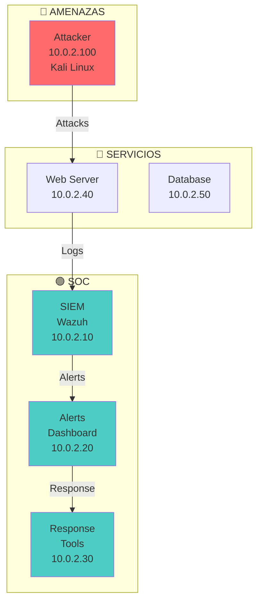
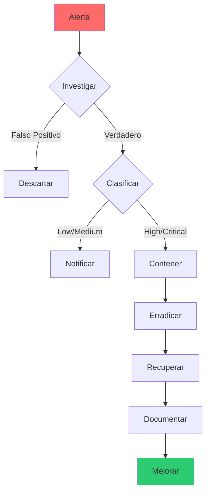

# 🛡️ Lab soc-01: SOC Operations

> Opera un Security Operations Center (SOC) real: monitorea alertas, investiga incidentes y responde a amenazas en tiempo real.

## 📊 Diagrama del Lab



## 🎯 Objetivos de Aprendizaje

Al completar este lab podrás:

- [ ] Operar un SIEM (Wazuh) para monitorear alertas
- [ ] Investigar alertas de seguridad en tiempo real
- [ ] Clasificar incidentes por severidad
- [ ] Ejecutar respuesta a incidentes básicas
- [ ] Documentar hallazgos del SOC
- [ ] Crear reglas de detección personalizadas

## ⏱️ Información del Lab

| Campo | Valor |
|-------|-------|
| **Dificultad** | 🟡 Intermedio |
| **Tiempo estimado** | 90 minutos |
| **XP en juego** | 400 puntos |
| **Herramientas** | Wazuh, ELK, Suricata, custom scripts |
| **Flags** | 8 |

## 🚀 Inicio Rápido

```bash
# Levantar el entorno
cd labs/blue-team/soc-01/
docker compose up -d

# Verificar servicios
docker compose ps

# Acceder a Wazuh Dashboard
# http://localhost:5601 (admin/admin)
```

## 📋 Ejercicios

### Ejercicio 1: Configurar SIEM (60 XP)

**Objetivo:** Configurar Wazuh para monitorear servicios críticos.

```bash
# 1. Acceder a Wazuh API
curl -k -u admin:admin https://localhost:55000/

# 2. Configurar agentes
# En cada servidor, instalar agente Wazuh
curl -L https://packages.wazuh.com/4.x/yum/wazuh-agent-4.7.0-1.x86_64.rpm -o wazuh-agent.rpm

# 3. Configurar reglas personalizadas
cat > /var/ossec/etc/rules/local_rules.xml << 'EOF'
<group name="web,attack,">
  <rule id="100001" level="10">
    <if_sid>210044</if_sid>
    <match>sql injection</match>
    <description>SQL Injection detected</description>
    <group>attack,sql_injection,</group>
  </rule>
</group>
EOF

# 4. Verificar que las reglas están activas
curl -k -u admin:admin https://localhost:55000/rules | jq '.data.items[] | select(.id == 100001)'
```

**Preguntas:**
1. ¿Cuántas reglas personalizadas configuraste? `[___]`
2. ¿Qué servicios estás monitoreando? `[___]`
3. ¿Cómo se ven las alertas en el dashboard? `[___]`

---

### Ejercicio 2: Monitoreo en Tiempo Real (60 XP)

**Objetivo:** Monitorear y analizar alertas en vivo.

```bash
# 1. Generar tráfico malicioso desde Kali
# SQL Injection
curl "http://10.0.2.40/vulnerabilities/sqli/?id=1' OR '1'='1"

# XSS
curl "http://10.0.2.40/vulnerabilities/xss_r/?name=<script>alert('XSS')</script>"

# Port scanning
nmap -sV 10.0.2.40

# 2. Monitorear alertas en Wazuh
# Dashboard → Security Events
# Filtrar por: rule.id: 100001

# 3. Analizar logs
tail -f /var/ossec/logs/alerts/alerts.log | grep -i "sql injection\|xss\|attack"

# 4. Clasificar incidentes
# Severidad: CRITICAL, HIGH, MEDIUM, LOW, INFO
```

**Preguntas:**
1. ¿Cuántas alertas se generaron? `[___]`
2. ¿Cuáles son de severidad CRITICAL? `[___]`
3. ¿Qué IPs generaron las alertas? `[___]`

---

### Ejercicio 3: Investigación de Incidentes (80 XP)

**Objetivo:** Investigar un incidente completo desde la alerta hasta la respuesta.

```bash
# 1. Alerta inicial: Login fallido múltiple
# En Wazuh: rule.id: 5712 (Multiple failed logins)

# 2. Investigar origen
# Ver logs de autenticación
grep "Failed password" /var/log/auth.log

# 3. Identificar patrón
# Mismo usuario, múltiples IPs
# Horario sospechoso
# Geolocalización inusual

# 4. Correlacionar con otros eventos
# Verificar si hay movimiento lateral
# Buscar conexiones salientes

# 5. Documentar hallazgos
cat > incident_report.md << 'EOF'
# Incidente #001 - Brute Force Attack

## Alerta
- Rule ID: 5712
- Severidad: HIGH
- Timestamp: [Fecha]

## Análisis
- Origen: 10.0.2.100 (Kali)
- Objetivo: admin@10.0.2.40
- Intentos: 50+
- Horario: 14:30 - 14:35

## Impacto
- Cuenta comprometida: Sí/No
- Datos accedidos: Sí/No

## Respuesta
- IP bloqueada: Sí/No
- Cuenta bloqueada: Sí/No
- Notificación enviada: Sí/No
EOF
```

**Preguntas:**
1. ¿Cuál fue el vector de ataque? `[___]`
2. ¿Se comprometió alguna cuenta? `[___]`
3. ¿Qué acciones de respuesta tomaste? `[___]`

---

### Ejercicio 4: Respuesta a Incidentes (80 XP)

**Objetivo:** Ejecutar procedimientos de respuesta a incidentes.

```bash
# 1. Detectar malware
# Suricata alert: ET MALWARE
# Wazuh alert: rule.id: 87105

# 2. Contener el incidente
# Aislar host comprometido
iptables -A INPUT -s 10.0.2.100 -j DROP
iptables -A OUTPUT -s 10.0.2.100 -j DROP

# 3. Recopilar evidencia
# Capturar tráfico
tcpdump -i eth0 -w evidence.pcap

# Capturar memoria
# Usar LiME para dump de memoria

# 4. Erradicar amenaza
# Eliminar archivos maliciosos
# Limpiar persistencia
# Actualizar firmas

# 5. Recuperar servicios
# Restaurar de backups
# Verificar integridad
# Monitorear actividad
```

**Preguntas:**
1. ¿Qué tipo de malware detectaste? `[___]`
2. ¿Cómo conteniste el incidente? `[___]`
3. ¿Qué evidencia recopilaste? `[___]`

---

### Ejercicio 5: Detección Avanzada (60 XP)

**Objetivo:** Crear reglas de detección personalizadas.

```bash
# 1. Analizar patrones de ataque
# Brute force SSH
grep "Failed password for" /var/log/auth.log | awk '{print $11}' | sort | uniq -c | sort -rn

# 2. Crear regla Sigma
cat > rules/brute_force_ssh.yml << 'EOF'
title: SSH Brute Force
id: 12345678-1234-1234-1234-123456789012
status: experimental
logsource:
    category: authentication
    product: linux
detection:
    selection:
        event_type: authentication
        service: sshd
        status: failed
    condition: selection
level: medium
tags:
    - attack.credential_access
    - attack.t1110
EOF

# 3. Implementar en Wazuh
# Importar regla personalizada

# 4. Validar detección
# Generar tráfico sospechoso
# Verificar que se genera alerta
```

**Preguntas:**
1. ¿Qué patrones de ataque identificaste? `[___]`
2. ¿Qué reglas creaste? `[___]`
3. ¿Cómo validaste la detección? `[___]`

---

### Ejercicio 6: Dashboard y Métricas (60 XP)

**Objetivo:** Crear dashboards operacionales para el SOC.

```bash
# 1. Métricas del SOC
# Alertas por hora
# Tiempo de respuesta promedio
# Incidentes por severidad
# Top amenazas

# 2. Crear dashboard en Wazuh
# Security Events → Dashboard
# Agregar visualizaciones:
# - Alertas por severidad (pie chart)
# - Alertas por hora (line chart)
# - Top IPs atacantes (bar chart)
# - Geo map de ataques

# 3. Generar reporte
# Exportar dashboard a PDF
# Enviar a stakeholders
```

**Preguntas:**
1. ¿Cuál es la métrica más importante del SOC? `[___]`
2. ¿Qué dashboards creaste? `[___]`
3. ¿Cómo se presentan los resultados? `[___]`

---

### Ejercicio 7: Threat Hunting (60 XP)

**Objetivo:** Cazar amenazas activas en la red.

```bash
# 1. Hipótesis de hunting
# "Hay C2 activity en la red"

# 2. Buscar indicadores
# DNS queries anómalas
# Conexiones a IPs maliciosas
# Tráfico cifrado inusual

# 3. Analizar con Suricata
suricata -c /etc/suricata/suricata.yaml -i eth0

# 4. Verificar con YARA
yara -r /path/to/rules/ /tmp/suspicious/

# 5. Documentar hallazgos
cat > hunting_report.md << 'EOF'
# Threat Hunting Report

## Hipótesis
- C2 activity detected

## Evidencia
- DNS queries to: evil-domain.com
- Connections to: 185.x.x.x:443

## Conclusión
- Amenaza confirmada: Yes/No
- Acciones tomadas: [List]
EOF
```

**Preguntas:**
1. ¿Qué hipótesis formulaste? `[___]`
2. ¿Qué indicadores encontraste? `[___]`
3. ¿Confirmaste la amenaza? `[___]`

---

### Ejercicio 8: Reporte SOC (60 XP)

**Objetivo:** Generar reporte operacional del SOC.

```markdown
# Reporte SOC - [Fecha]

## Resumen Ejecutivo
- Alertas totales: [X]
- Incidentes: [X]
- Tiempo promedio de respuesta: [X] min
- SLA cumplido: [X]%

## Alertas por Severidad
| Severidad | Cantidad | % |
|-----------|----------|---|
| CRITICAL | [X] | [X]% |
| HIGH | [X] | [X]% |
| MEDIUM | [X] | [X]% |
| LOW | [X] | [X]% |

## Incidentes Principales
### Incidente #001
- Tipo: Brute Force
- Severidad: HIGH
- Estado: Resuelto
- Tiempo de respuesta: [X] min

### Incidente #002
- Tipo: SQL Injection
- Severidad: CRITICAL
- Estado: En investigación

## Métricas
- MTTR (Mean Time to Respond): [X] min
- MTTD (Mean Time to Detect): [X] min
- Falso positivo rate: [X]%

## Recomendaciones
1. [Recomendación 1]
2. [Recomendación 2]
3. [Recomendación 3]
```

**Flag:** `[___]`

## 🔍 Flujo del SOC



## 🏁 Validación

```bash
./scripts/validate.sh
```

## 📝 Criterios de Éxito

| Ejercicio | Criterio | Puntos | Estado |
|-----------|----------|--------|--------|
| 1 | SIEM configurado | 60 | ⬜ |
| 2 | Monitoreo activo | 60 | ⬜ |
| 3 | Investigación completa | 80 | ⬜ |
| 4 | Respuesta ejecutada | 80 | ⬜ |
| 5 | Detección implementada | 60 | ⬜ |
| 6 | Dashboard creado | 60 | ⬜ |
| 7 | Threat hunting | 60 | ⬜ |
| 8 | Reporte generado | 60 | ⬜ |
| **Total** | | **400** | ⬜ |

## 🚨 Solución (Solo después de intentar)

<details>
<summary>🔓 Click para ver la solución completa</summary>

### Ejercicio 1
- Wazuh configurado con reglas personalizadas
- Agentes instalados en servicios críticos
- Dashboard funcionando

### Ejercicio 2
- Alertas generadas por ataques
- Clasificación por severidad correcta
- Logs correlacionados

### Ejercicio 3
- Brute force detectado
- IP origen identificada
- Cuenta no comprometida

### Ejercicio 4
- Malware contenido
- Evidencia recopilada
- Servicios restaurados

### Ejercicio 5
- Reglas Sigma creadas
- Detección validada
- False positives minimizados

### Ejercicio 6
- Dashboard operacional
- Métricas visibles
- Reporte exportado

### Ejercicio 7
- Hipótesis formulada
- Indicadores encontrados
- Amenaza confirmada

### Ejercicio 8
- Reporte completo
- Métricas calculadas
- Recomendaciones claras

</details>

---

*Lab creado para CyberDefense Labs — Nivel Intermedio*
