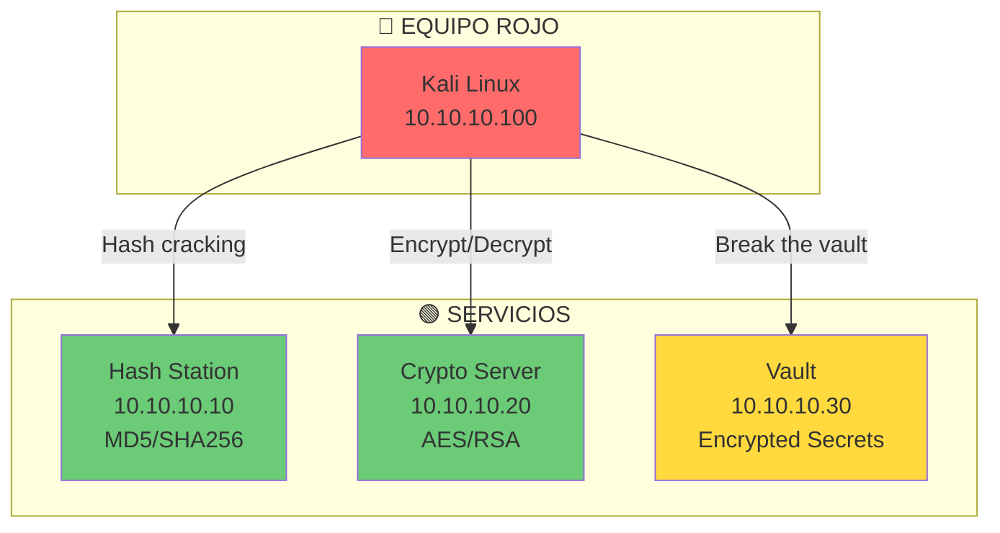
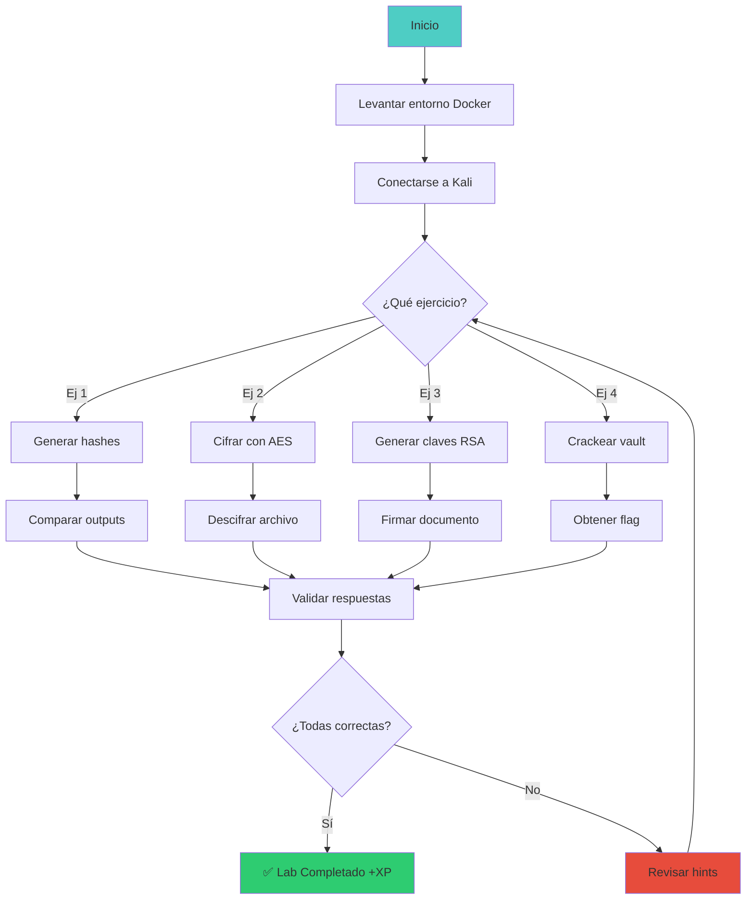

# 🔐 Lab crypto-01: Criptografía Práctica


::: tip 🧪 Lab Interactivo Disponible
**¿Quieres practicar esto en tu navegador?** Tenemos una versión interactiva con terminal simulado.

👉 **[Abrir Lab Interactivo](/labs-interactive/lab-crypto-01.html)** — Sin Docker, sin configuración. Solo abre y practica.
:::


> Domina los fundamentos de criptografía con ejercicios hands-on de hashing, cifrado simétrico y asimétrico.

## 📊 Diagrama del Lab



## 🎯 Objetivos de Aprendizaje

Al completar este lab podrás:

- [ ] Generar hashes con diferentes algoritmos (MD5, SHA256, SHA512)
- [ ] Descifrar hashes con john the ripper y hashcat
- [ ] Cifrar y descifrar archivos con AES-256
- [ ] Generar pares de claves RSA
- [ ] Firmar y verificar documentos digitalmente
- [ ] Entender la diferencia entre cifrado simétrico y asimétrico

## ⏱️ Información del Lab

| Campo | Valor |
|-------|-------|
| **Dificultad** | 🟢 Principiante |
| **Tiempo estimado** | 45 minutos |
| **XP en juego** | 150 puntos |
| **Herramientas** | openssl, hashcat, john, gpg |
| **Flags** | 4 |

## 🚀 Inicio Rápido

```bash
# Levantar el entorno
cd labs/fundamentos/crypto-01/
docker compose up -d

# Verificar que los contenedores están corriendo
docker compose ps

# Obtener shell en Kali
docker compose exec kali bash
```

## 📋 Ejercicios

### Ejercicio 1: Generación de Hashes (25 XP)

**Tarea:** Genera hashes de la contraseña "password123" con cada algoritmo:

```bash
# MD5
echo -n "password123" | md5sum

# SHA-1
echo -n "password123" | sha1sum

# SHA-256
echo -n "password123" | sha256sum

# SHA-512
echo -n "password123" | sha512sum
```

**Preguntas:**

1. ¿Cuál es el hash MD5 de "password123"?
   - Respuesta: `[___]`

2. ¿Cuántos caracteres tiene un hash SHA-256?
   - Respuesta: `[___]`

3. ¿Por qué no se debe usar MD5 para contraseñas?
   - Respuesta: `[___]`

---

### Ejercicio 2: Cifrado Simétrico con AES (50 XP)

**Tarea:** Cifra y descifra un archivo con AES-256-CBC:

```bash
# Crear archivo secreto
echo "FLAG{s3cr3t_m3ss4g3}" > secreto.txt

# Cifrar con AES-256-CBC
openssl enc -aes-256-cbc -salt -in secreto.txt -out secreto.enc -k "mi_contraseña"

# Descifrar
openssl enc -aes-256-cbc -d -in secreto.enc -out secreto_dec.txt -k "mi_contraseña"

# Verificar
cat secreto_dec.txt
```

**Preguntas:**

1. ¿Qué extensión tiene el archivo cifrado?
   - Respuesta: `[___]`

2. ¿Se puede leer el archivo cifrado con `cat`?
   - Respuesta: `[___]`

3. ¿Qué pasa si usas una contraseña incorrecta para descifrar?
   - Respuesta: `[___]`

---

### Ejercicio 3: Cifrado Asimétrico con RSA (50 XP)

**Tarea:** Genera un par de claves RSA y firma un documento:

```bash
# Generar par de claves RSA
openssl genrsa -out private_key.pem 2048
openssl rsa -in private_key.pem -pubout -out public_key.pem

# Cifrar con clave pública
echo "FLAG{r5a_3ncrypt3d}" > mensaje.txt
openssl pkeyutl -encrypt -pubin -inkey public_key.pem -in mensaje.txt -out mensaje.enc

# Descifrar con clave privada
openssl pkeyutl -decrypt -inkey private_key.pem -in mensaje.enc -out mensaje_dec.txt

# Verificar
cat mensaje_dec.txt
```

**Preguntas:**

1. ¿Qué tamaño de clave RSA generaste?
   - Respuesta: `[___]` bits

2. ¿Quién puede descifrar un mensaje cifrado con la clave pública?
   - Respuesta: `[___]`

3. ¿Cuál es la diferencia principal entre cifrado simétrico y asimétrico?
   - Respuesta: `[___]`

---

### Ejercicio 4: Romper el Vault (25 XP)

**Tarea:** Descifra el hash del vault para obtener la flag:

```bash
# El vault contiene un hash MD5
cat /vault/hash.txt

# Usar john the ripper para crackear
john --format=raw-md5 --wordlist=/usr/share/wordlists/rockyou.txt /vault/hash.txt

# Ver resultados
john --show --format=raw-md5 /vault/hash.txt
```

**Flag:** `FLAG{___}`

---

## 🔍 Flujo de Resolución



## 🏁 Validación

```bash
# Ejecutar validación automática
./scripts/validate.sh

# Verificar respuestas específicas
./scripts/check-exercise.sh 1
./scripts/check-exercise.sh 2
./scripts/check-exercise.sh 3
./scripts/check-exercise.sh 4
```

## 📝 Criterios de Éxito

| Criterio | Puntos | Estado |
|----------|--------|--------|
| Hashes generados correctamente | 25 | ⬜ |
| AES encrypt/decrypt funciona | 50 | ⬜ |
| RSA key generation funciona | 25 | ⬜ |
| RSA encrypt/decrypt funciona | 25 | ⬜ |
| Vault crackeado | 25 | ⬜ |
| **Total** | **150** | ⬜ |

## 🎓 Conceptos Clave

### Hashing vs Cifrado

```
Hashing (One-way):
  input → [hash function] → hash
  "hello" → [SHA256] → 2cf24dba5fb0a30e26e83b2ac5b9e29e1b161e5c1fa7425e73043362938b9824

Cifrado (Two-way):
  input + key → [encrypt] → ciphertext
  ciphertext + key → [decrypt] → input
```

### Simétrico vs Asimétrico

```
Simétrico (AES):
  Misma clave para cifrar y descifrar
  Rápido,适合 datos grandes
  Problema: ¿cómo compartir la clave?

Asimétrico (RSA):
  Clave pública para cifrar, privada para descifrar
  Lento,适合 key exchange
  Resuelve el problema de compartir claves
```

## 🚨 Solución (Solo después de intentar)

<details>
<summary>🔓 Click para ver la solución completa</summary>

### Ejercicio 1
1. MD5: `09981850493885693388093654634394`
2. 64 caracteres hexadecimales
3. MD5 es rápido de calcular y vulnerable a rainbow tables

### Ejercicio 2
1. `.enc`
2. No, se ve como bytes basura
3. Error: "bad decrypt" o bytes basura

### Ejercicio 3
1. 2048 bits
2. Solo el poseedor de la clave privada
3. Simétrico = 1 clave, Asimétrico = 2 claves (pública/privada)

### Ejercicio 4
Flag: `FLAG{cr4ck3d_md5_hash}`

</details>

---

*Lab creado para CyberDefense Labs — Nivel Fundamentos*
