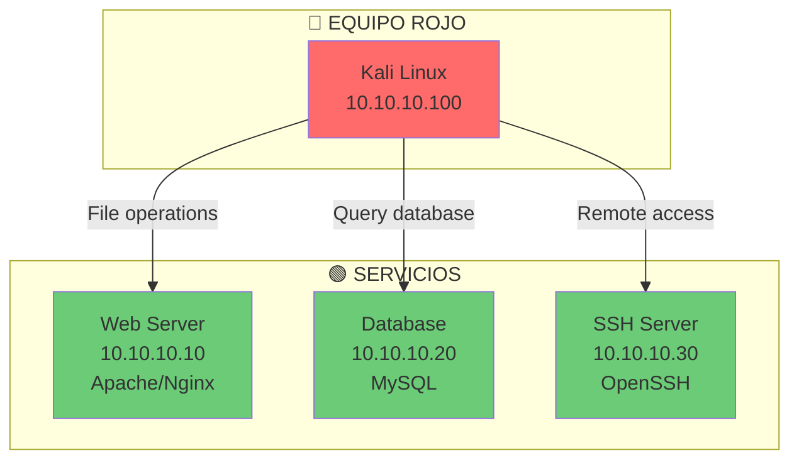
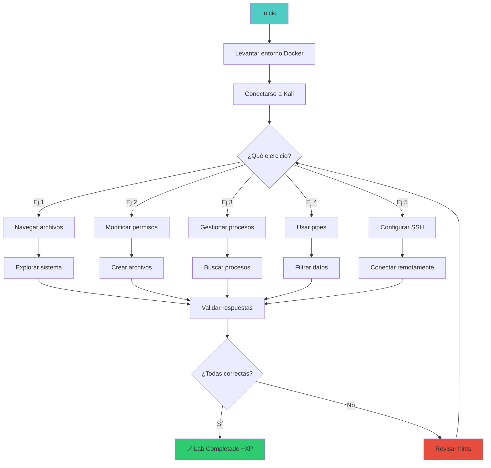

# 🐧 Lab linux-01: Linux y Terminal

> Domina la terminal de Linux con ejercicios prácticos de navegación, permisos, procesos y servicios.

## 📊 Diagrama del Lab



## 🎯 Objetivos de Aprendizaje

Al completar este lab podrás:

- [ ] Navegar el sistema de archivos de Linux
- [ ] Gestionar permisos de archivos y directorios
- [ ] Manipular procesos (listar, matar, priorizar)
- [ ] Configurar y verificar servicios con systemctl
- [ ] Usar pipes y redirecciones
- [ ] Configurar claves SSH

## ⏱️ Información del Lab

| Campo | Valor |
|-------|-------|
| **Dificultad** | 🟢 Principiante |
| **Tiempo estimado** | 40 minutos |
| **XP en juego** | 125 puntos |
| **Herramientas** | bash, systemctl, ssh, ps, top |
| **Flags** | 3 |

## 🚀 Inicio Rápido

```bash
# Levantar el entorno
cd labs/fundamentos/linux-01/
docker compose up -d

# Verificar que los contenedores están corriendo
docker compose ps

# Obtener shell
docker compose exec kali bash
```

## 📋 Ejercicios

### Ejercicio 1: Navegación del Sistema de Archivos (25 XP)

**Tarea:** Explora el sistema de archivos y responde:

```bash
# Directorio actual
pwd

# Listar archivos
ls -la /

# Buscar archivos específicos
find / -name "*.conf" 2>/dev/null | head -10

# Contenido de archivos
cat /etc/hostname
cat /etc/os-release
```

**Preguntas:**

1. ¿Cuál es el contenido de `/etc/hostname`?
   - Respuesta: `[___]`

2. ¿Cuántos archivos hay en `/etc/`?
   - Respuesta: `[___]`

3. ¿Cuál es la diferencia entre `ls -l` y `ls -la`?
   - Respuesta: `[___]`

---

### Ejercicio 2: Permisos de Archivos (50 XP)

**Tarea:** Modifica permisos y comprende el sistema de permisos:

```bash
# Crear archivo con diferentes permisos
echo "contenido secreto" > secreto.txt
echo "contenido publico" > publico.txt

# Ver permisos actuales
ls -la secreto.txt publico.txt

# Cambiar permisos
chmod 600 secreto.txt    # Solo dueño puede leer/escribir
chmod 644 publico.txt    # Todos pueden leer, solo dueño escribir

# Verificar cambios
ls -la secreto.txt publico.txt

# Crear directorio con setgid
mkdir proyecto
chmod 2775 proyecto
ls -la | grep proyecto
```

**Preguntas:**

1. ¿Qué significan los números en `chmod 600`?
   - Respuesta: `[___]`

2. ¿Qué hace el bit setgid en un directorio?
   - Respuesta: `[___]`

3. ¿Cómo darías permisos de ejecución a un script?
   - Respuesta: `[___]`

---

### Ejercicio 3: Gestión de Procesos (25 XP)

**Tarea:** Lista, busca y gestiona procesos:

```bash
# Listar todos los procesos
ps aux

# Buscar un proceso específico
ps aux | grep nginx

# Ver procesos en tiempo real
top -bn1 | head -20

# Matar un proceso
sleep 3600 &
kill $!

# Verificar que se mató
ps aux | grep sleep
```

**Preguntas:**

1. ¿Qué proceso consume más CPU?
   - Respuesta: `[___]`

2. ¿Cuál es la diferencia entre `kill` y `kill -9`?
   - Respuesta: `[___]`

3. ¿Cómo encontrarías el PID de un proceso por nombre?
   - Respuesta: `[___]`

---

### Ejercicio 4: Pipes y Redirecciones (25 XP)

**Tarea:** Usa pipes y redirecciones para manipular datos:

```bash
# Contar líneas de un archivo
cat /etc/passwd | wc -l

# Buscar usuarios con /bin/bash
cat /etc/passwd | grep "/bin/bash"

# Redirección
echo "log entry" >> /tmp/mi_log.txt
cat /tmp/mi_log.txt

# Pipe múltiple
ps aux | grep nginx | grep -v grep | awk '{print $2}'

# Ordenar y mostrar top 5
ps aux | sort -k3 -rn | head -5
```

**Preguntas:**

1. ¿Cuántos usuarios tienen `/bin/bash` como shell?
   - Respuesta: `[___]`

2. ¿Qué hace `>>` vs `>`?
   - Respuesta: `[___]`

3. ¿Cómo guardarías la salida de un comando en un archivo?
   - Respuesta: `[___]`

---

### Ejercicio 5: Servicios y SSH (25 XP)

**Tarea:** Gestiona servicios y configura SSH:

```bash
# Ver estado de servicios
systemctl status nginx
systemctl status mysql

# Iniciar/detener servicios
systemctl start nginx
systemctl stop nginx

# Generar clave SSH
ssh-keygen -t ed25519 -f ~/.ssh/id_ed25519 -N ""

# Ver clave pública
cat ~/.ssh/id_ed25519.pub

# Conectar al servidor SSH
ssh usuario@10.10.10.30
```

**Preguntas:**

1. ¿Qué servicios están corriendo activamente?
   - Respuesta: `[___]`

2. ¿Cuál es la ventaja de Ed25519 sobre RSA?
   - Respuesta: `[___]`

3. ¿Cómo copiarías tu clave pública a un servidor remoto?
   - Respuesta: `[___]`

---

## 🔍 Flujo de Resolución



## 🏁 Validación

```bash
# Ejecutar validación automática
./scripts/validate.sh

# Verificar respuestas específicas
./scripts/check-exercise.sh 1
./scripts/check-exercise.sh 2
./scripts/check-exercise.sh 3
./scripts/check-exercise.sh 4
./scripts/check-exercise.sh 5
```

## 📝 Criterios de Éxito

| Criterio | Puntos | Estado |
|----------|--------|--------|
| Navegación correcta | 25 | ⬜ |
| Permisos modificados | 50 | ⬜ |
| Procesos gestionados | 25 | ⬜ |
| Pipes y redirecciones | 25 | ⬜ |
| Servicios y SSH | 25 | ⬜ |
| **Total** | **125** | ⬜ |

## 🎓 Conceptos Clave

### Sistema de Archivos Linux

```
/
├── /home/usuario      ← Home del usuario
├── /etc               ← Configuración
├── /var/log           ← Logs del sistema
├── /tmp               ← Archivos temporales
├── /usr/bin           ← Binarios del sistema
├── /opt               ← Aplicaciones opcionales
└── /root              ← Home de root
```

### Permisos en Octal

```
r=4, w=2, x=1

755 = rwxr-xr-x (dueño: todo, grupo: rx, otros: rx)
644 = rw-r--r-- (dueño: rw, grupo: r, otros: r)
600 = rw------- (solo dueño)
```

## 🚨 Solución (Solo después de intentar)

<details>
<summary>🔓 Click para ver la solución completa</summary>

### Ejercicio 1
1. Nombre del contenedor (ej: "kali")
2. Depende del sistema (~2000-3000)
3. `ls -la` incluye archivos ocultos (.) y muestra permisos detallados

### Ejercicio 2
1. 6=dueño(r+w), 0=grupo(nada), 0=otros(nada)
2. Archivos nuevos heredan el grupo del directorio padre
3. `chmod +x script.sh`

### Ejercicio 3
1. Generalmente "root" o "mysql"
2. `kill` envía SIGTERM (15), `kill -9` envía SIGKILL (forzado)
3. `pgrep nombre_proceso` o `ps aux | grep nombre`

### Ejercicio 4
1. Generalmente 3-4 (root, usuario, etc.)
2. `>>` agrega al final, `>` sobrescribe
3. `comando > archivo.txt`

### Ejercicio 5
1. nginx, mysql, sshd (generalmente)
2. Más rápido, más seguro, mejor resistencia a side-channel attacks
3. `ssh-copy-id usuario@servidor`

</details>

---

*Lab creado para CyberDefense Labs — Nivel Fundamentos*
