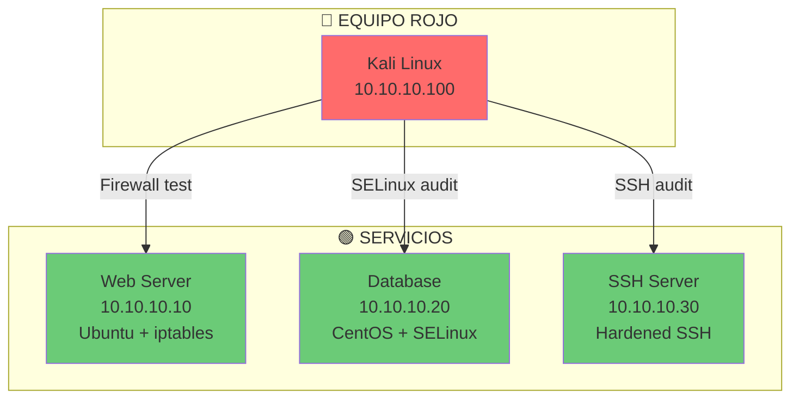
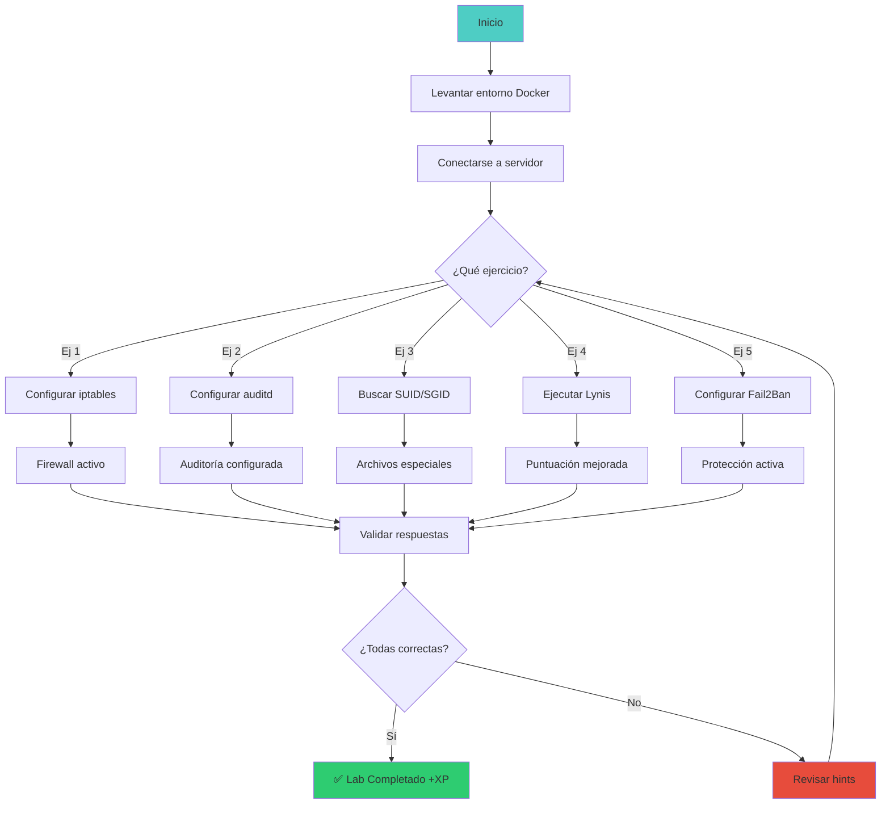

# 🛡️ Lab linux-sec-01: Seguridad en Linux

> Aprende a proteger y auditar sistemas Linux con防火墙, SELinux, auditoría y hardening.

## 📊 Diagrama del Lab



## 🎯 Objetivos de Aprendizaje

Al completar este lab podrás:

- [ ] Configurar iptables para proteger un servidor
- [ ] Verificar y gestionar SELinux/AppArmor
- [ ] Configurar auditoría con auditd
- [ ] Auditar permisos y archivos SUID/SGID
- [ ] Implementar Fail2Ban para protección contra fuerza bruta
- [ ] Ejecutar Lynis para auditoría de seguridad

## ⏱️ Información del Lab

| Campo | Valor |
|-------|-------|
| **Dificultad** | 🟡 Intermedio |
| **Tiempo estimado** | 50 minutos |
| **XP en juego** | 175 puntos |
| **Herramientas** | iptables, auditd, fail2ban, lynis, getcap |
| **Flags** | 4 |

## 🚀 Inicio Rápido

```bash
# Levantar el entorno
cd labs/fundamentos/linux-sec-01/
docker compose up -d

# Verificar que los contenedores están corriendo
docker compose ps

# Obtener shell en servidor web
docker compose exec web bash
```

## 📋 Ejercicios

### Ejercicio 1: Firewall con iptables (50 XP)

**Tarea:** Configura un firewall básico para proteger el servidor:

```bash
# Ver reglas actuales
iptables -L -n -v

# Política por defecto: denegar todo
iptables -P INPUT DROP
iptables -P FORWARD DROP
iptables -P OUTPUT ACCEPT

# Permitir tráfico establecido
iptables -A INPUT -m state --state ESTABLISHED,RELATED -j ACCEPT

# Permitir loopback
iptables -A INPUT -i lo -j ACCEPT

# Permitir SSH (solo tu IP)
iptables -A INPUT -p tcp --dport 22 -s 10.10.10.100 -j ACCEPT

# Permitir HTTP/HTTPS
iptables -A INPUT -p tcp --dport 80 -j ACCEPT
iptables -A INPUT -p tcp --dport 443 -j ACCEPT

# Bloquear un IP específico
iptables -A INPUT -s 10.10.10.50 -j DROP

# Logging
iptables -A INPUT -j LOG --log-prefix "BLOCKED: "

# Verificar reglas
iptables -L -n -v
```

**Preguntas:**

1. ¿Cuántas reglas hay configuradas?
   - Respuesta: `[___]`

2. ¿Qué política tiene INPUT por defecto?
   - Respuesta: `[___]`

3. ¿Cómo guardar las reglas para que persistan tras reboot?
   - Respuesta: `[___]`

---

### Ejercicio 2: Auditoría con auditd (50 XP)

**Tarea:** Configura auditoría para monitorear cambios críticos:

```bash
# Ver estado del servicio
systemctl status auditd

# Agregar reglas de auditoría
auditctl -w /etc/passwd -p wa -k user_changes
auditctl -w /etc/shadow -p wa -k shadow_changes
auditctl -w /etc/sudoers -p wa -k sudo_changes

# Verificar reglas
auditctl -l

# Generar actividad
echo "test" >> /etc/passwd
sudo useradd testuser

# Buscar en logs
ausearch -k user_changes --interpret
aureport --summary
```

**Preguntas:**

1. ¿Cuántas reglas de auditoría configuraste?
   - Respuesta: `[___]`

2. ¿Qué eventos se registran con `-p wa`?
   - Respuesta: `[___]`

3. ¿Cómo buscarías intentos de acceso fallidos?
   - Respuesta: `[___]`

---

### Ejercicio 3: Archivos SUID/SGID (25 XP)

**Tarea:** Identifica y evalúa archivos con permisos especiales:

```bash
# Buscar archivos con SUID
find / -perm -4000 -type f 2>/dev/null

# Buscar archivos con SGID
find / -perm -2000 -type f 2>/dev/null

# Buscar archivos sin dueño
find / -nouser -o -nogroup 2>/dev/null

# Verificar capabilities de un binario
getcap /usr/bin/passwd

# Ejemplo de explotación de Suid
# Si encuentras find con SUID:
find / -exec /bin/sh -p \;
```

**Preguntas:**

1. ¿Cuántos archivos SUID encontraste?
   - Respuesta: `[___]`

2. ¿Qué archivos SUID son potencialmente peligrosos?
   - Respuesta: `[___]`

3. ¿Cómo eliminarías el SUID de un archivo?
   - Respuesta: `[___]`

---

### Ejercicio 4: Hardening con Lynis (50 XP)

**Tarea:** Ejecuta una auditoría completa y mejora la puntuación:

```bash
# Instalar Lynis
apt update && apt install -y lynis

# Ejecutar auditoría completa
lynis audit system

# Revisar el Hardening Index
# Objetivo: alcanzar 70+

# Aplicar sugerencias críticas
# 1. Actualizar sistema
apt update && apt upgrade -y

# 2. Configurar SSH
sed -i 's/#PermitRootLogin yes/PermitRootLogin no/' /etc/ssh/sshd_config
sed -i 's/#PasswordAuthentication yes/PasswordAuthentication no/' /etc/ssh/sshd_config

# 3. Instalar fail2ban
apt install -y fail2ban
systemctl enable fail2ban

# Re-ejecutar Lynis
lynis audit system
```

**Preguntas:**

1. ¿Cuál fue tu puntuación inicial de Hardening Index?
   - Respuesta: `[___]`

2. ¿Cuántas sugerencias críticas encontró Lynis?
   - Respuesta: `[___]`

3. ¿Cuál es tu puntuación después de aplicar cambios?
   - Respuesta: `[___]`

---

### Ejercicio 5: Fail2Ban - Protección contra Fuerza Bruta (25 XP)

**Tarea:** Configura Fail2Ban para proteger SSH:

```bash
# Verificar que Fail2Ban está corriendo
systemctl status fail2ban

# Crear configuración personalizada
cat > /etc/fail2ban/jail.local << 'EOF'
[sshd]
enabled = true
port = ssh
filter = sshd
logpath = /var/log/auth.log
maxretry = 3
bantime = 3600
findtime = 600
EOF

# Reiniciar Fail2Ban
systemctl restart fail2ban

# Ver estado
fail2ban-client status sshd

# Simular intentos fallidos (desde otra terminal)
for i in {1..5}; do
  ssh nonexistent@localhost 2>/dev/null
done

# Ver IPs baneadas
fail2ban-client status sshd
```

**Preguntas:**

1. ¿Cuántos intentos fallidos antes de banear?
   - Respuesta: `[___]`

2. ¿Cuánto dura el baneo por defecto?
   - Respuesta: `[___]`

3. ¿Cómo desbanearías una IP?
   - Respuesta: `[___]`

---

## 🔍 Flujo de Resolución



## 🏁 Validación

```bash
# Ejecutar validación automática
./scripts/validate.sh

# Verificar respuestas específicas
./scripts/check-exercise.sh 1
./scripts/check-exercise.sh 2
./scripts/check-exercise.sh 3
./scripts/check-exercise.sh 4
./scripts/check-exercise.sh 5
```

## 📝 Criterios de Éxito

| Criterio | Puntos | Estado |
|----------|--------|--------|
| Firewall configurado | 50 | ⬜ |
| Auditoría configurada | 50 | ⬜ |
| SUID/SGID identificados | 25 | ⬜ |
| Lynis audit ejecutado | 50 | ⬜ |
| Fail2Ban configurado | 25 | ⬜ |
| **Total** | **175** | ⬜ |

## 🎓 Conceptos Clave

### Capas de Seguridad en Linux

```
┌─────────────────────────────────────┐
│  1. Firewall (iptables/nftables)    │  ← Filtra tráfico
├─────────────────────────────────────┤
│  2. SELinux/AppArmor                │  ← Control de acceso obligatorio
├─────────────────────────────────────┤
│  3. Auditoría (auditd)              │  ← Registra eventos
├─────────────────────────────────────┤
│  4. Fail2Ban                        │  ← Protege contra fuerza bruta
├─────────────────────────────────────┤
│  5. Hardening (CIS/Lynis)           │  ← Reduce superficie de ataque
└─────────────────────────────────────┘
```

### CIS Benchmark Checklist

```
[ ] Deshabilitar servicios innecesarios
[ ] Configurar firewall (deny all)
[ ] Habilitar auditoría (auditd)
[ ] Configurar SSH hardened
[ ] Instalar Fail2Ban
[ ] Actualizar sistema regularmente
[ ] Revisar permisos SUID/SGID
[ ] Configurar SELinux/AppArmor
[ ] Ejecutar Lynis y alcanzar 70+
```

## 🚨 Solución (Solo después de intentar)

<details>
<summary>🔓 Click para ver la solución completa</summary>

### Ejercicio 1
1. 8-10 reglas (depende de la configuración)
2. DROP (denegar todo)
3. `iptables-save > /etc/iptables/rules.v4`

### Ejercicio 2
1. 3 reglas (passwd, shadow, sudoers)
2. write y attribute changes
3. `ausearch -m AUTH --login --failed`

### Ejercicio 3
1. Generalmente 10-15
2. find, nmap, python, vim (depende del sistema)
3. `chmod u-s archivo`

### Ejercicio 4
1. Variable (generalmente 40-60 inicial)
2. 10-20 sugerencias críticas
3. Objetivo: 70+

### Ejercicio 5
1. 3 intentos
2. 3600 segundos (1 hora)
3. `fail2ban-client set sshd unbanip IP`

</details>

---

*Lab creado para CyberDefense Labs — Nivel Fundamentos*
