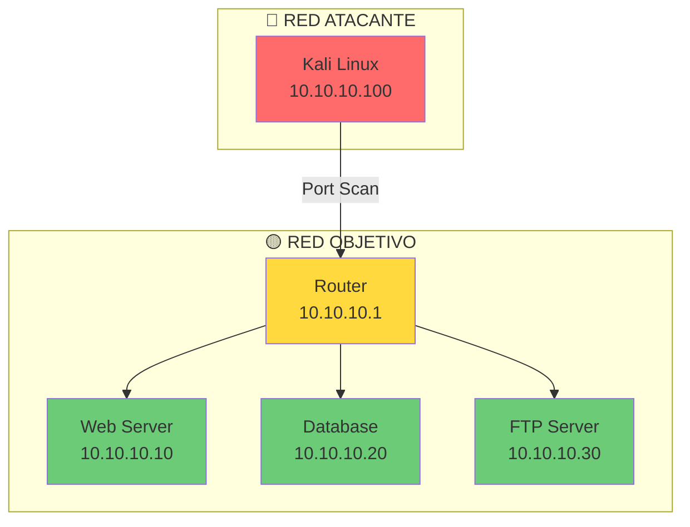
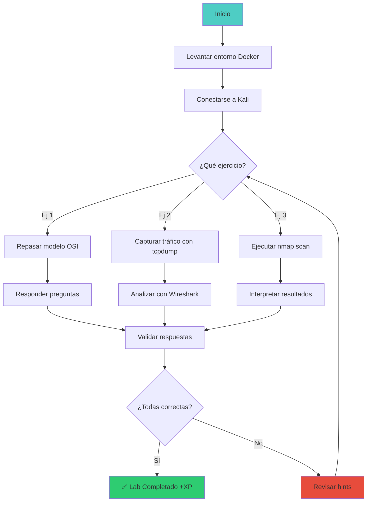

::: tip 🧪 Lab Interactivo Disponible
**¿Quieres practicar esto en tu navegador?** Tenemos una versión interactiva con terminal simulada, comandos reales y tracking de progreso.

👉 [**Abrir Lab Interactivo — Sin Docker**](/CyberDefense-Pro-Network/labs-interactive/lab-net-01.html)
:::

# 🌐 Lab net-01: TCP/IP & OSI Model

> Domina los fundamentos de redes que toda carrera en ciberseguridad requiere.

## 📊 Diagrama del Lab



## 🎯 Objetivos de Aprendizaje

Al completar este lab podrás:

- [ ] Identificar los 7 modelos OSI
- [ ] Explicar el flujo TCP handshake
- [ ] Realizar escaneo de puertos con nmap
- [ ] Interpretar resultados de captura de paquetes
- [ ] Identificar servicios y versiones en puertos abiertos

## ⏱️ Información del Lab

| Campo | Valor |
|-------|-------|
| **Dificultad** | 🟢 Principiante |
| **Tiempo estimado** | 30 minutos |
| **XP en juego** | 100 puntos |
| **Herramientas** | nmap, wireshark, netcat |
| **Flags** | 3 |

## 🚀 Inicio Rápido

```bash
# Levantar el entorno
docker compose up -d

# Verificar que los contenedores están corriendo
docker compose ps

# Obtener shell en Kali
docker compose exec kali bash
```

## 📋 Ejercicios

### Ejercicio 1: Modelo OSI (25 XP)

**Pregunta:** ¿En qué capa OSI opera un firewall de estado?

<details>
<summary>💡 Hint 1</summary>
Piensa en qué capa maneja las conexiones entre hosts.
</details>

<details>
<summary>💡 Hint 2</summary>
La capa 4 es donde TCP/UDP establecen conexiones.
</details>

**Respuesta:** `[/escribe aquí]`

---

### Ejercicio 2: TCP Three-Way Handshake (25 XP)

**Tarea:** Observa la captura de red y completa el flujo:

```
Client → Server: [SYN] Seq=0
Server → Client: [SYN-ACK] Seq=___ Ack=___
Client → Server: [ACK] Seq=___ Ack=___
```

<details>
<summary>💡 Hint 1</summary>
SYN-ACK incrementa el序列号 en 1 y confirma el del cliente.
</details>

**Respuesta:**
- SYN-ACK Seq: `[___]`
- SYN-ACK Ack: `[___]`
- ACK Seq: `[___]`
- ACK Ack: `[___]`

---

### Ejercicio 3: Escaneo de Puertos (50 XP)

**Tarea:** Realiza un escaneo completo y responde:

```bash
# Ejecuta este comando en Kali
nmap -sV -sC -oN scan_results.txt 10.10.10.0/24
```

**Preguntas:**

1. ¿Cuántos hosts están activos?
   - Respuesta: `[___]`

2. ¿Qué puerto está abierto en el Web Server (10.10.10.10)?
   - Respuesta: `[___]`

3. ¿Qué versión de Apache está ejecutándose?
   - Respuesta: `[___]`

4. ¿Qué servicio corre en el puerto 21 del FTP Server?
   - Respuesta: `[___]`

## 🔍 Flujo de Resolución



## 🏁 Validación

```bash
# Ejecutar validación automática
./scripts/validate.sh

# Verificar respuestas específicas
./scripts/check-exercise.sh 1
./scripts/check-exercise.sh 2
./scripts/check-exercise.sh 3
```

## 📝 Criterios de Éxito

| Criterio | Puntos | Estado |
|----------|--------|--------|
| Modelo OSI correctamente identificado | 25 | ⬜ |
| TCP handshake completado | 25 | ⬜ |
| Nmap scan ejecutado | 10 | ⬜ |
| Hosts activos identificados | 10 | ⬜ |
| Puertos abiertos documentados | 15 | ⬜ |
| Servicios y versiones correctos | 15 | ⬜ |
| **Total** | **100** | ⬜ |

## 🎓 Conceptos Clave

### Modelo OSI

```
┌─────────────────────────────────┐
│  7. Aplicación    │ HTTP, FTP   │
├─────────────────────────────────┤
│  6. Presentación  │ SSL, TLS    │
├─────────────────────────────────┤
│  5. Sesión        │ NetBIOS     │
├─────────────────────────────────┤
│  4. Transporte    │ TCP, UDP    │
├─────────────────────────────────┤
│  3. Red           │ IP, ICMP    │
├─────────────────────────────────┤
│  2. Enlace        │ Ethernet    │
├─────────────────────────────────┤
│  1. Físico        │ Cables      │
└─────────────────────────────────┘
```

### TCP Three-Way Handshake

```
   Cliente                    Servidor
      │                          │
      │──── SYN (Seq=0) ────────▶│
      │                          │
      │◀── SYN-ACK (Seq=0,Ack=1)─│
      │                          │
      │──── ACK (Seq=1,Ack=1) ──▶│
      │                          │
      │◀──── Conexión Establecida─│
```

## 🚨 Solución (Solo después de intentar)

<details>
<summary>🔓 Click para ver la solución completa</summary>

### Ejercicio 1
**Capa 4 - Transporte** (TCP/UDP)

### Ejercicio 2
```
SYN-ACK Seq=0 Ack=1
ACK Seq=1 Ack=1
```

### Ejercicio 3
1. Hosts activos: **3** (Router, Web Server, FTP Server)
2. Puerto abierto: **80/tcp**
3. Versión Apache: **Apache/2.4.41**
4. Servicio FTP: **vsftpd 3.0.3**

</details>

---

*Lab creado para CyberDefense Labs — Nivel Fundamentos*
