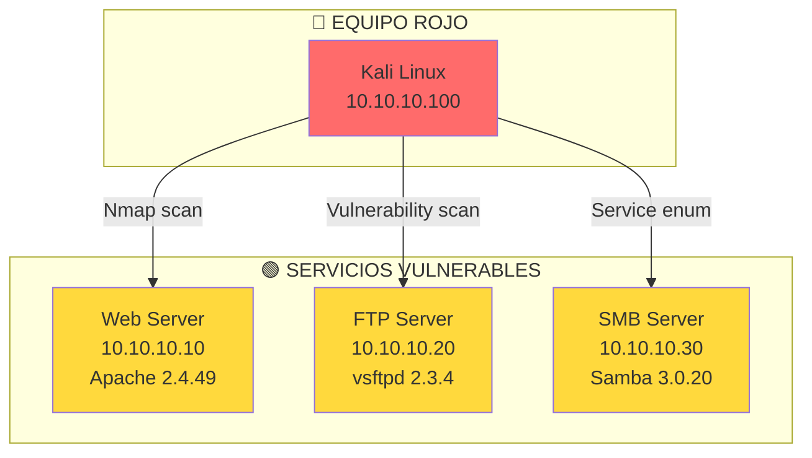
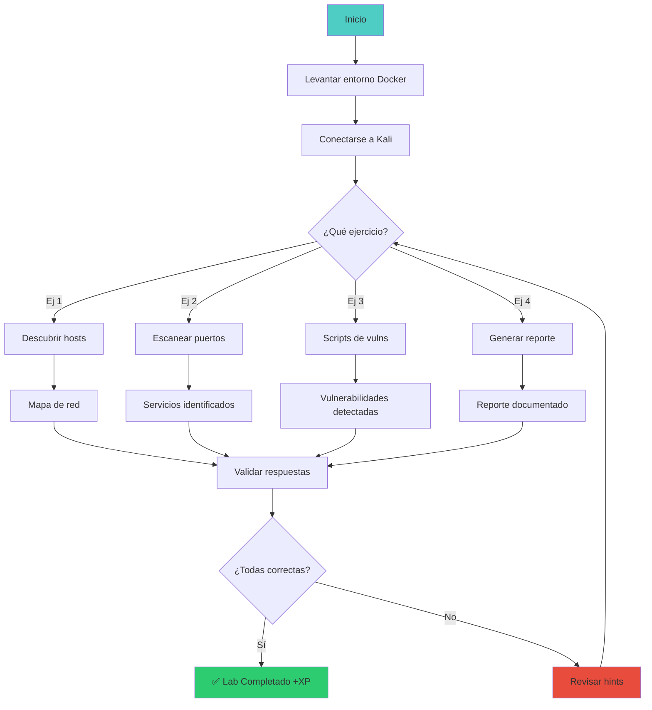

# 🎯 Lab vuln-01: Escaneo de Vulnerabilidades

> Aprende a identificar y priorizar vulnerabilidades con herramientas profesionales de escaneo.

## 📊 Diagrama del Lab



## 🎯 Objetivos de Aprendizaje

Al completar este lab podrás:

- [ ] Realizar escaneo de puertos y servicios con Nmap
- [ ] Identificar versiones de software vulnerables
- [ ] Usar scripts de vulnerabilidades de Nmap
- [ ] Interpretar resultados de escaneo
- [ ] Priorizar hallazgos por severidad
- [ ] Generar un reporte básico de vulnerabilidades

## ⏱️ Información del Lab

| Campo | Valor |
|-------|-------|
| **Dificultad** | 🟢 Principiante |
| **Tiempo estimado** | 35 minutos |
| **XP en juego** | 125 puntos |
| **Herramientas** | nmap, searchsploit, nikto |
| **Flags** | 3 |

## 🚀 Inicio Rápido

```bash
# Levantar el entorno
cd labs/fundamentos/vuln-01/
docker compose up -d

# Verificar que los contenedores están corriendo
docker compose ps

# Obtener shell en Kali
docker compose exec kali bash
```

## 📋 Ejercicios

### Ejercicio 1: Descubrimiento de Hosts (25 XP)

**Tarea:** Encuentra todos los hosts activos en la red:

```bash
# Ping sweep
nmap -sn 10.10.10.0/24

# Alternativa sin ping
nmap -sn -PE 10.10.10.0/24
```

**Preguntas:**

1. ¿Cuántos hosts están activos?
   - Respuesta: `[___]`

2. ¿Cuáles son las IPs de los hosts activos?
   - Respuesta: `[___]`

3. ¿Qué comando usarías para descubrir hosts sin ICMP?
   - Respuesta: `[___]`

---

### Ejercicio 2: Escaneo de Puertos y Servicios (50 XP)

**Tarea:** Identifica puertos abiertos y servicios en cada host:

```bash
# Escaneo completo de puertos
nmap -sV -sC -p- 10.10.10.10

# Escaneo rápido de puertos comunes
nmap -sV --top-ports 1000 10.10.10.20

# Output para analizar después
nmap -sV -oN scan_results.txt 10.10.10.0/24
```

**Preguntas:**

1. ¿Qué puertos están abiertos en el Web Server (10.10.10.10)?
   - Respuesta: `[___]`

2. ¿Qué versión de Apache está ejecutándose?
   - Respuesta: `[___]`

3. ¿Qué servicio está corriendo en el puerto 21 del FTP Server?
   - Respuesta: `[___]`

---

### Ejercicio 3: Scripts de Vulnerabilidades (25 XP)

**Tarea:** Usa scripts de Nmap para detectar vulnerabilidades:

```bash
# Script de vulnerabilidades general
nmap --script=vuln 10.10.10.10

# Script específico de SMB
nmap --script=smb-vuln-ms17-010 10.10.10.30

# Script deFTP anonymous
nmap --script=ftp-anon 10.10.10.20
```

**Preguntas:**

1. ¿Qué vulnerabilidades detectó el script `vuln` en el Web Server?
   - Respuesta: `[___]`

2. ¿Es vulnerable el SMB a EternalBlue (MS17-010)?
   - Respuesta: `[___]`

3. ¿Permite el FTP acceso anónimo?
   - Respuesta: `[___]`

---

### Ejercicio 4: Reporte de Vulnerabilidades (25 XP)

**Tarea:** Genera un reporte estructurado con tus hallazgos:

```bash
# Crear reporte
cat > reporte_vuln.md << 'EOF'
# Reporte de Vulnerabilidades

## Objetivo
- Rango: 10.10.10.0/24
- Fecha: $(date)

## Hosts Encontrados
| IP | Hostname | Puertos Abiertos |
|----|----------|------------------|
| 10.10.10.10 | web | 80, 443 |
| 10.10.10.20 | ftp | 21 |
| 10.10.10.30 | smb | 445 |

## Vulnerabilidades
| Severidad | Host | Servicio | Descripción |
|-----------|------|----------|-------------|
| CRITICAL | 10.10.10.20 | FTP | vsftpd 2.3.4 backdoor |
| HIGH | 10.10.10.30 | SMB | MS17-010 EternalBlue |
| MEDIUM | 10.10.10.10 | HTTP | Apache 2.4.49 path traversal |
EOF

cat reporte_vuln.md
```

**Preguntas:**

1. ¿Cuántas vulnerabilidades CRITICAL encontraste?
   - Respuesta: `[___]`

2. ¿Cuál es la vulnerabilidad más peligrosa y por qué?
   - Respuesta: `[___]`

3. ¿Qué recomendación darías para cada vulnerabilidad?
   - Respuesta: `[___]`

---

## 🔍 Flujo de Resolución



## 🏁 Validación

```bash
# Ejecutar validación automática
./scripts/validate.sh

# Verificar respuestas específicas
./scripts/check-exercise.sh 1
./scripts/check-exercise.sh 2
./scripts/check-exercise.sh 3
./scripts/check-exercise.sh 4
```

## 📝 Criterios de Éxito

| Criterio | Puntos | Estado |
|----------|--------|--------|
| Hosts descubiertos | 25 | ⬜ |
| Puertos y servicios identificados | 50 | ⬜ |
| Vulnerabilidades detectadas | 25 | ⬜ |
| Reporte generado | 25 | ⬜ |
| **Total** | **125** | ⬜ |

## 🎓 Conceptos Clave

### Tipos de Escaneo Nmap

```
-sS  TCP SYN stealth scan (rápido, menos detectable)
-sT  TCP connect scan (completo, más ruidoso)
-sU  UDP scan (lento, importante para servicios UDP)
-sV  Version detection
-sC  Default scripts
-O   OS detection
```

### Severidad de Vulnerabilidades

```
CRITICAL: Explotación remota sin autenticación
HIGH: Explotación con credenciales o local
MEDIUM: Requiere condiciones específicas
LOW: Impacto menor o difficulto de explotar
INFO: Informativo, no es una vulnerabilidad
```

## 🚨 Solución (Solo después de intentar)

<details>
<summary>🔊 Click para ver la solución completa</summary>

### Ejercicio 1
1. 3 hosts activos
2. 10.10.10.10, 10.10.10.20, 10.10.10.30
3. `nmap -sn -PE` o `nmap -sn -PS22,80,443`

### Ejercicio 2
1. 80/tcp (HTTP), 443/tcp (HTTPS)
2. Apache/2.4.49
3. vsftpd 2.3.4

### Ejercicio 3
1. Path traversal (CVE-2021-41773)
2. No vulnerable (o depende de la versión)
3. Sí, FTP permite acceso anónimo

### Ejercicio 4
1. 1 (vsftpd backdoor)
2. vsftpd 2.3.4 backdoor - permite shell remoto sin autenticación
3. Actualizar vsftpd, FTP anónimo, actualizar Apache

</details>

---

*Lab creado para CyberDefense Labs — Nivel Fundamentos*
