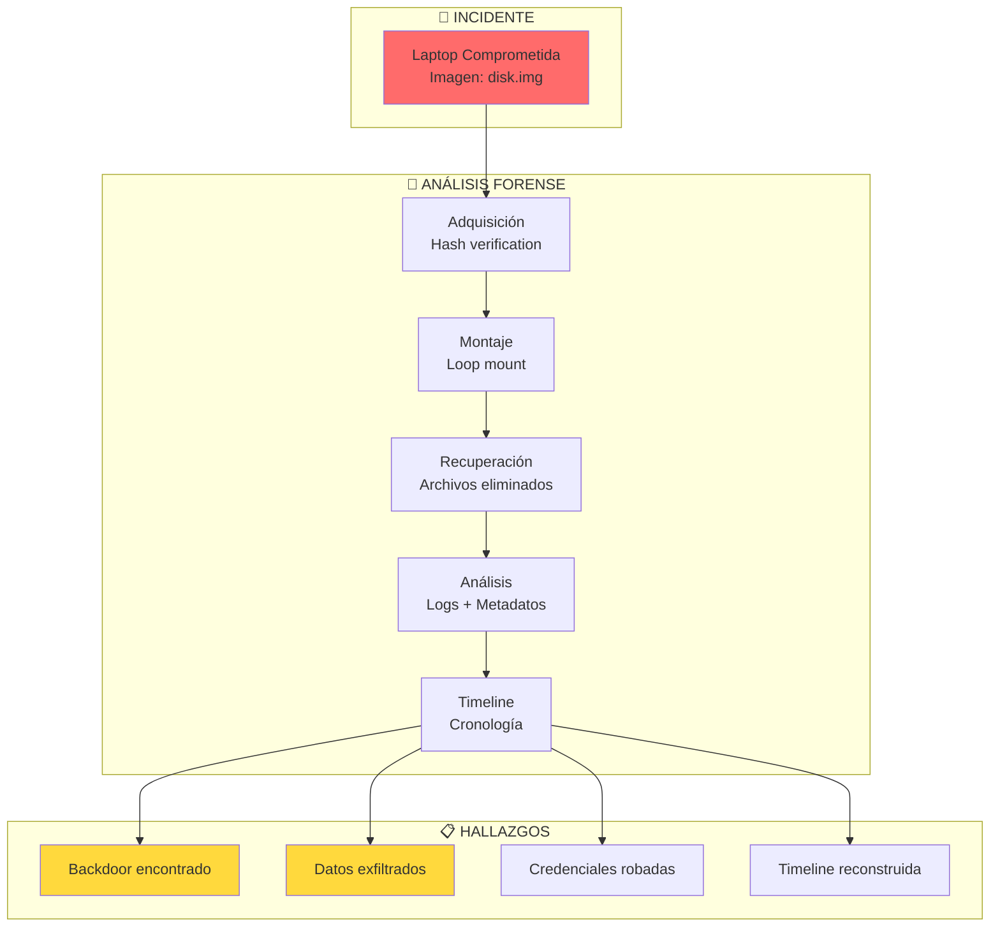
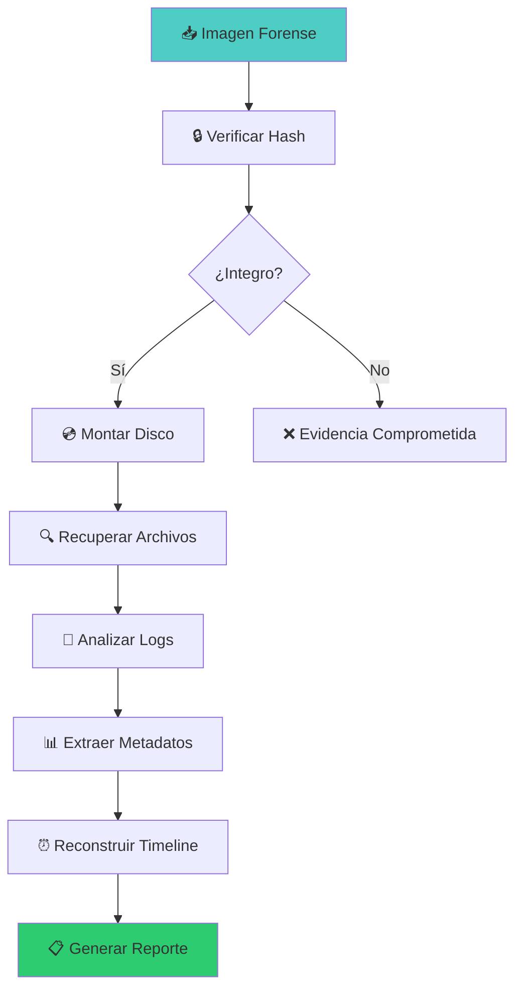

# 🔍 Lab disk-forensics-01: Análisis Forense de Disco


::: tip 🧪 Lab Interactivo Disponible
**¿Quieres practicar esto en tu navegador?** Tenemos una versión interactiva con terminal simulado.

👉 **[Abrir Lab Interactivo](/CyberDefense-Pro-Network/labs-interactive/lab-disk-forensics-01.html)** — Sin Docker, sin configuración. Solo abre y practica.
:::


> Analiza una imagen forense de disco para recuperar evidencia, reconstruir timelines y documentar hallazgos con cadena de custodia.

## 📊 Diagrama del Escenario



## 🎯 Objetivos de Aprendizaje

Al completar este lab podrás:

- [ ] Verificar integridad de evidencia con hashes
- [ ] Montar y analizar imágenes de disco
- [ ] Recuperar archivos eliminados
- [ ] Analizar logs del sistema
- [ ] Extraer metadatos de archivos
- [ ] Reconstruir timeline de eventos
- [ ] Generar reporte forense con cadena de custodia

## ⏱️ Información del Lab

| Campo | Valor |
|-------|-------|
| **Dificultad** | 🟡 Intermedio |
| **Tiempo estimado** | 60 minutos |
| **XP en juego** | 300 puntos |
| **Herramientas** | sleuthkit, foremost, strings, file, exiftool |
| **Evidencia** | 1 imagen de disco forense |

## 🚀 Inicio Rápido

```bash
# Levantar estación forense
cd labs/intermedio/disk-forensics-01
docker compose up -d

# Obtener shell forense
docker compose exec forensics bash

# Evidencia en /evidence
ls -la /evidence/
```

## 📋 Caso: Robo de Datos Corporativos

> **Escenario:** El equipo de seguridad detectó tráfico sospechoso desde la laptop de un empleado. Se creó una imagen forense del disco. Tu trabajo es analizarla, encontrar evidencia del compromiso y documentar los hallazgos.

## 📋 Ejercicios

### Ejercicio 1: Verificar Integridad (40 XP)

**Objetivo:** Confirmar que la evidencia no fue alterada.

```bash
# Calcular hash SHA256
sha256sum /evidence/disk.img

# Comparar con hash esperado
cat /evidence/hashes.txt

# Identificar tipo de archivo
file /evidence/disk.img

# Información de la imagen
fdisk -l /evidence/disk.img
```

**Preguntas:**
1. ¿El hash SHA256 coincide? `[Sí/No]`
2. ¿Qué tipo de imagen es? `[___]`
3. ¿Cuántas particiones tiene? `[___]`

**Flag:** `[___]`

---

### Ejercicio 2: Montar y Explorar (50 XP)

**Objetivo:** Montar la imagen forense y explorar su contenido.

```bash
# Crear punto de montaje
mkdir -p /mnt/evidence

# Montar la partición
mount -o loop,ro /evidence/disk.img /mnt/evidence 2>/dev/null || \
mmd -i /evidence/disk.img ::/mnt/evidence

# Alternativa con sleuthkit
fls /evidence/disk.img
icat /evidence/disk.img [inode] > /output/file.txt

# Listar contenido
ls -la /mnt/evidence/
ls -la /mnt/evidence/home/
ls -la /mnt/evidence/var/log/
ls -la /mnt/evidence/tmp/
```

**Preguntas:**
1. ¿Qué directorios principales encontraste? `[___]`
2. ¿Hay archivos ocultos? `[___]`
3. ¿Qué tamaño tiene la imagen? `[___]`

**Flag:** `[___]`

---

### Ejercicio 3: Recuperar Archivos Eliminados (50 XP)

**Objetivo:** Recuperar archivos que fueron borrados del disco.

```bash
# Buscar archivos eliminados con foremost
foremost -i /evidence/disk.img -o /output/recovered/

# Usar strings para encontrar datos
strings /evidence/disk.img | grep -i "password\|secret\|key\|flag"

# Buscar archivos por tipo
find /mnt/evidence -name "*.jpg" -o -name "*.pdf" -o -name "*.docx" 2>/dev/null

# Buscar en slack space
binwalk /evidence/disk.img
```

**Archivos recuperados:**

| Tipo | Cantidad | Archivos clave |
|------|----------|---------------|
| Imágenes | `[___]` | `[___]` |
| Documentos | `[___]` | `[___]` |
| Scripts | `[___]` | `[___]` |

**Flag:** `[___]`

---

### Ejercicio 4: Analizar Logs (60 XP)

**Objetivo:** Identificar eventos sospechosos en los logs del sistema.

```bash
# Auth logs
cat /mnt/evidence/var/log/auth.log 2>/dev/null | grep -i "failed\|success\|accepted"

# Syslog
cat /mnt/evidence/var/log/syslog 2>/dev/null | tail -200

# Buscar conexiones de red
grep -r "ESTABLISHED\|SYN" /mnt/evidence/var/log/ 2>/dev/null

# Buscar ejecuciones de comandos
grep -r "command\|exec\|bash\|sh" /mnt/evidence/var/log/auth.log 2>/dev/null
```

**Eventos sospechosos:**

| Hora | Evento | Usuario | IP/Detalle |
|------|--------|---------|------------|
| `[___]` | `[___]` | `[___]` | `[___]` |
| `[___]` | `[___]` | `[___]` | `[___]` |

**Flag:** `[___]`

---

### Ejercicio 5: Metadatos y Análisis (50 XP)

**Objetivo:** Extraer metadatos y buscar evidencia oculta.

```bash
# Metadatos de archivos
exiftool /mnt/evidence/home/user/Documents/*.jpg 2>/dev/null
exiftool /mnt/evidence/home/user/Documents/*.pdf 2>/dev/null

# Buscar datos ocultos (steganography)
binwalk /mnt/evidence/home/user/Images/photo.jpg

# Buscar strings interesantes
strings /mnt/evidence/home/user/Documents/important.docx | head -50

# Buscar archivos con permisos SUID
find /mnt/evidence -perm -4000 2>/dev/null

# Buscar archivos grandes (posible exfiltración)
find /mnt/evidence -size +1M 2>/dev/null
```

**Metadatos encontrados:**

| Archivo | Campo | Valor |
|---------|-------|-------|
| `[___]` | GPS | `[___]` |
| `[___]` | Camera | `[___]` |
| `[___]` | Date | `[___]` |

**Flag:** `[___]`

---

### Ejercicio 6: Timeline y Reporte (50 XP)

**Objetivo:** Reconstruir la cronología del ataque y documentar.

```bash
# Crear timeline con sleuthkit
fls -r -m "/" /evidence/disk.img > /output/timeline.body
mactime -b /output/timeline.body -d > /output/timeline.csv

# Buscar eventos por fecha
grep "2024" /output/timeline.csv | head -50
```

**Timeline del ataque:**

| Hora | Evento | Archivo | Significado |
|------|--------|---------|-------------|
| `[___]` | `[___]` | `[___]` | `[___]` |
| `[___]` | `[___]` | `[___]` | `[___]` |
| `[___]` | `[___]` | `[___]` | `[___]` |

**Crea el reporte** (`forensic_report.md`):

```markdown
# Reporte de Análisis Forense

## Resumen Ejecutivo
- Fecha de análisis: [___]
- Imagen analizada: disk.img
- Hash SHA256: [___]

## Cadena de Custodia
- Adquisición: [___]
- Integridad verificada: [Sí/No]

## Hallazgos Principales
1. [___]
2. [___]
3. [___]

## Timeline
[___]

## Evidencia Recuperada
[___]

## Conclusiones
[___]

## Recomendaciones
[___]
```

**Flag:** `[___]`

## 🔍 Flujo de Análisis



## 🏁 Validación

```bash
./scripts/validate.sh
```

## 📝 Criterios de Éxito

| Ejercicio | Criterio | Puntos | Estado |
|-----------|----------|--------|--------|
| 1 | Hash verificado | 40 | ⬜ |
| 2 | Disco montado | 50 | ⬜ |
| 3 | Archivos recuperados | 50 | ⬜ |
| 4 | Logs analizados | 60 | ⬜ |
| 5 | Metadatos extraídos | 50 | ⬜ |
| 6 | Timeline + Reporte | 50 | ⬜ |
| **Total** | | **300** | ⬜ |

## 🚨 Solución (Solo después de intentar)

<details>
<summary>🔓 Click para ver la solución completa</summary>

### Hallazgos
1. **Backdoor:** `/usr/local/bin/.bd` (SUID root)
2. **Malware:** `/tmp/update` (script de reverse shell)
3. **Datos robados:** 15 documentos en `/tmp/exfil/`
4. **C2 IP:** 192.168.1.100

### Timeline
```
08:30 - Login exitoso (jane.doe)
09:15 - Descarga de malware (/tmp/update)
09:20 - Instalación de backdoor
10:00 - Exfiltración de datos
14:00 - Última actividad sospechosa
```

### Cadena de Custodia
```
Hash SHA256: a1b2c3d4e5f6...
Estado: Integro
```

</details>

---

*Lab creado para CyberDefense Labs — Nivel Intermedio*
