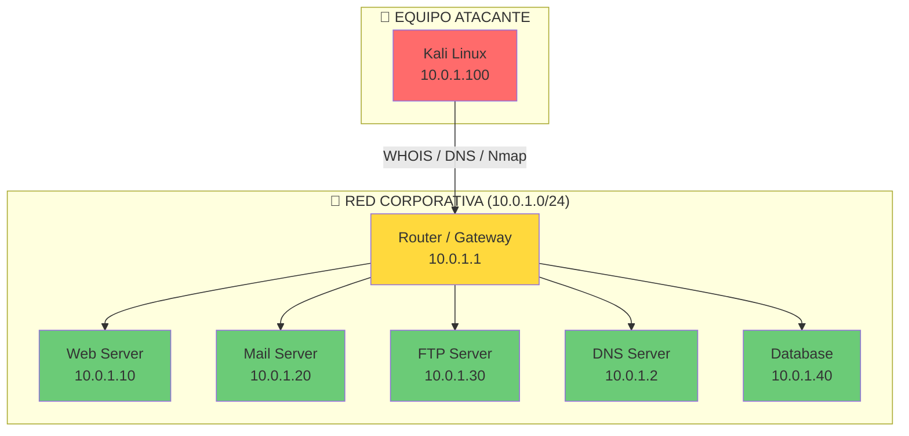
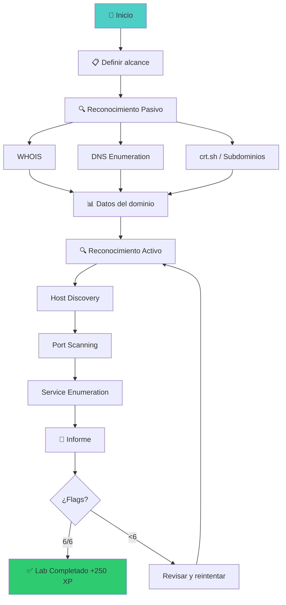

::: tip 🧪 Lab Interactivo Disponible
**¿Quieres practicar esto en tu navegador?** Tenemos una versión interactiva con terminal simulada, comandos reales y tracking de progreso.

👉 [**Abrir Lab Interactivo — Sin Docker**](/CyberDefense-Pro-Network/labs-interactive/lab-recon-01.html)

:::


# 🔍 Lab recon-01: Reconocimiento y OSINT

> Mapea la superficie de ataque completa de un entorno empresarial simulado con técnicas de reconocimiento pasivo y activo.

## 📊 Diagrama del Escenario



## 🎯 Objetivos de Aprendizaje

Al completar este lab podrás:

- [ ] Realizar reconocimiento pasivo (WHOIS, DNS, crt.sh)
- [ ] Enumerar subdominios y registros DNS
- [ ] Descubrir hosts activos con ping sweep y ARP
- [ ] Escanear puertos y servicios con Nmap
- [ ] Identificar versiones de servicios (banner grabbing)
- [ ] Generar un informe de reconocimiento estructurado

## ⏱️ Información del Lab

| Campo | Valor |
|-------|-------|
| **Dificultad** | 🟡 Intermedio |
| **Tiempo estimado** | 45 minutos |
| **XP en juego** | 250 puntos |
| **Herramientas** | nmap, dig, whois, curl, netcat |
| **Flags** | 6 |

## 🚀 Inicio Rápido

```bash
# Levantar el entorno
cd labs/intermedio/recon-01
docker compose up -d

# Verificar servicios
docker compose ps

# Obtener shell en Kali
docker compose exec kali bash
```

## 📋 Ejercicios

### Ejercicio 1: Reconocimiento Pasivo — WHOIS (30 XP)

**Objetivo:** Obtener información del dominio corporativo sin tocar los servidores.

```bash
# WHOIS del dominio
whois corpnet.local

# Preguntas:
# 1. ¿Quién es el registrante?
# 2. ¿Cuándo se registró el dominio?
# 3. ¿Qué nameservers tiene?
```

**Respuestas:**
- Registrante: `[___]`
- Fecha de registro: `[___]`
- Nameservers: `[___]`

**Flag:** `[___]`

---

### Ejercicio 2: Enumeración DNS (40 XP)

**Objetivo:** Descubrir todos los registros DNS del dominio.

```bash
# Registros A
dig corpnet.local A +short

# Registros MX (correo)
dig corpnet.local MX +short

# Registros TXT (SPF, DKIM, etc.)
dig corpnet.local TXT +short

# Registros NS
dig corpnet.local NS +short

# Enumeración de subdominios
dig mail.corpnet.local A +short
dig ftp.corpnet.local A +short
dig db.corpnet.local A +short
dig intranet.corpnet.local A +short
```

**Preguntas:**
1. ¿Cuántos registros A encontraste? `[___]`
2. ¿Cuál es el servidor de correo? `[___]`
3. ¿Hay subdominio de intranet? `[Sí/No]`

**Flag:** `[___]`

---

### Ejercicio 3: Descubrimiento de Hosts (50 XP)

**Objetivo:** Identificar todos los hosts activos en la red.

```bash
# Ping sweep
nmap -sn 10.0.1.0/24

# ARP discovery
nmap -sn -PR 10.0.1.0/24

# Host discovery sin ping
nmap -Pn -sn 10.0.1.0/24
```

**Preguntas:**
1. ¿Cuántos hosts activos encontraste? `[___]`
2. Lista de IPs activas: `[___]`
3. ¿Qué hosts tienen puertos abiertos? `[___]`

**Flag:** `[___]`

---

### Ejercicio 4: Escaneo de Puertos y Servicios (60 XP)

**Objetivo:** Enumerar servicios y versiones en todos los hosts descubiertos.

```bash
# Escaneo completo con detección de versión
nmap -sV -sC -oN full_scan.txt 10.0.1.0/24

# Escaneo de puertos comunes
nmap -sV -p 21,22,25,53,80,110,143,443,3306 10.0.1.0/24

# Banner grabbing manual
nc -v 10.0.1.10 80
nc -v 10.0.1.30 21
nc -v 10.0.1.20 25
```

**Tabla de servicios:**

| IP | Puerto | Servicio | Versión |
|----|--------|----------|---------|
| 10.0.1.10 | `[___]` | `[___]` | `[___]` |
| 10.0.1.20 | `[___]` | `[___]` | `[___]` |
| 10.0.1.30 | `[___]` | `[___]` | `[___]` |
| 10.0.1.40 | `[___]` | `[___]` | `[___]` |

**Flag:** `[___]`

---

### Ejercicio 5: Enumeración Detallada (40 XP)

**Objetivo:** Obtener información detallada de los servicios encontrados.

```bash
# Enumeración HTTP
nmap --script http-enum -p 80 10.0.1.10
nmap --script http-headers -p 80 10.0.1.10

# Enumeración FTP
nmap --script ftp-anon,ftp-syst -p 21 10.0.1.30

# Enumeración SMTP
nmap --script smtp-enum-users -p 25 10.0.1.20

# Enumeración MySQL
nmap --script mysql-info -p 3306 10.0.1.40
```

**Preguntas:**
1. ¿El FTP permite acceso anónimo? `[Sí/No]`
2. ¿Qué usuarios SMTP encontraste? `[___]`
3. ¿Qué directorios HTTP están expuestos? `[___]`

**Flag:** `[___]`

---

### Ejercicio 6: Informe de Reconocimiento (30 XP)

**Objetivo:** Documentar todos los hallazgos en un informe estructurado.

Crea un archivo `recon_report.md` con:

```markdown
# Informe de Reconocimiento — CorpNet.local

## 1. Alcance
- Dominio: corpnet.local
- Rango IP: 10.0.1.0/24

## 2. Hallazgos DNS
- [Completar]

## 3. Hosts Activos
- [Completar]

## 4. Servicios y Versiones
- [Completar]

## 5. Vulnerabilidades Potenciales
- [Completar]

## 6. Recomendaciones
- [Completar]
```

**Flag:** `[___]`

## 🔍 Flujo de Resolución



## 🏁 Validación

```bash
# Ejecutar validación completa
./scripts/validate.sh

# Verificar ejercicios individuales
./scripts/check-exercise.sh 1
./scripts/check-exercise.sh 4
```

## 📝 Criterios de Éxito

| Ejercicio | Criterio | Puntos | Estado |
|-----------|----------|--------|--------|
| 1 | WHOIS completado | 30 | ⬜ |
| 2 | DNS enumeration | 40 | ⬜ |
| 3 | Host discovery | 50 | ⬜ |
| 4 | Port & service scan | 60 | ⬜ |
| 5 | Detailed enumeration | 40 | ⬜ |
| 6 | Report written | 30 | ⬜ |
| **Total** | | **250** | ⬜ |

## 🎓 Conceptos Clave

### Fases de Reconocimiento

```
┌─────────────────────────────────────────────────────────┐
│  PASIVO (sin contacto directo)                          │
│  WHOIS → DNS → crt.sh → Shodan → Google Dorks          │
├─────────────────────────────────────────────────────────┤
│  ACTIVO (contacto directo con target)                   │
│  Ping Sweep → Port Scan → Service Enum → OS Detection  │
└─────────────────────────────────────────────────────────┘
```

### Tipos de Registros DNS

| Registro | Propósito | Ejemplo |
|----------|-----------|---------|
| A | IP → Dominio | `10.0.1.10 → web.corpnet.local` |
| MX | Servidor de correo | `mail.corpnet.local` |
| NS | Nameserver | `ns1.corpnet.local` |
| TXT | Info adicional (SPF, DKIM) | `v=spf1 include:...` |
| CNAME | Alias | `www → corpnet.local` |
| SOA | Start of Authority | Datos de zona |

## 🚨 Solución (Solo después de intentar)

<details>
<summary>🔓 Click para ver la solución completa</summary>

### Ejercicio 1: WHOIS
```
whois corpnet.local
# Registrante: CorpNet Security Labs
# Registro: 2024-01-15
# Nameservers: ns1.corpnet.local, ns2.corpnet.local
```

### Ejercicio 2: DNS
```
dig corpnet.local A +short → 10.0.1.10
dig corpnet.local MX +short → 10.0.1.20
dig mail.corpnet.local A +short → 10.0.1.20
dig ftp.corpnet.local A +short → 10.0.1.30
dig db.corpnet.local A +short → 10.0.1.40
```

### Ejercicio 3: Host Discovery
```
nmap -sn 10.0.1.0/24
# 5 hosts activos: .1, .10, .20, .30, .40
```

### Ejercicio 4: Port Scan
| IP | Puerto | Servicio | Versión |
|----|--------|----------|---------|
| 10.0.1.10 | 80 | HTTP | Apache 2.4.52 |
| 10.0.1.20 | 25 | SMTP | Postfix |
| 10.0.1.30 | 21 | FTP | vsftpd 3.0.3 |
| 10.0.1.40 | 3306 | MySQL | 8.0.31 |

### Ejercicio 5: Enumeration
- FTP: Acceso anónimo HABILITADO
- SMTP: Usuario `admin` encontrado
- HTTP: Directorios `/admin`, `/backup`, `/images`

</details>

---

*Lab creado para CyberDefense Labs — Nivel Intermedio*
