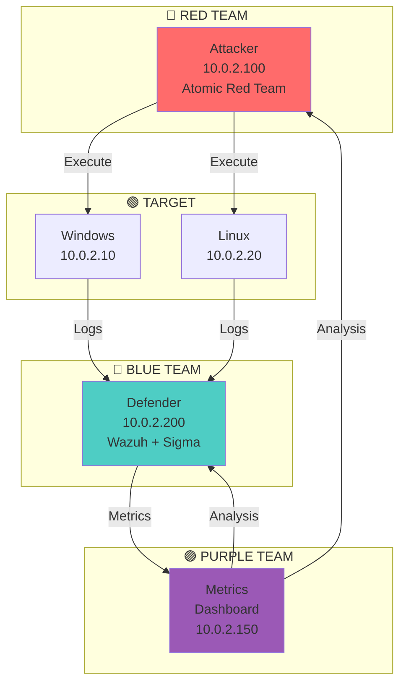
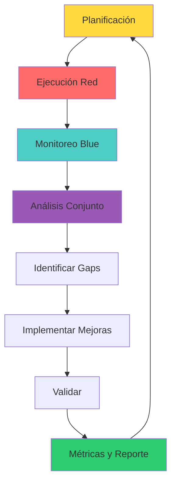

# 🟣 Lab purple-01: Purple Team Operations

> Ejecuta operaciones Purple Team completas: desde la planificación hasta la medición de métricas de mejora continua.

## 📊 Diagrama del Lab



## 🎯 Objetivos de Aprendizaje

Al completar este lab podrás:

- [ ] Ejecutar técnicas MITRE ATT&CK con Atomic Red Team
- [ ] Monitorear detecciones en Wazuh SIEM
- [ ] Medir MTTD y MTTR
- [ ] Analizar cobertura de detección
- [ ] Generar reporte Purple Team
- [ ] Identificar y priorizar gaps

## ⏱️ Información del Lab

| Campo | Valor |
|-------|-------|
| **Dificultad** | 🟡 Intermedio |
| **Tiempo estimado** | 120 minutos |
| **XP en juego** | 600 puntos |
| **Herramientas** | Atomic Red Team, Wazuh, Sigma, YARA |
| **Flags** | 10 |

## 🚀 Inicio Rápido

```bash
# Levantar el entorno
cd labs/purple-team/purple-01/
docker compose up -d

# Verificar servicios
docker compose ps

# Acceder a Wazuh Dashboard
# http://localhost:5601 (admin/admin)
```

## 📋 Ejercicios

### Ejercicio 1: Planificación Purple Team (60 XP)

Crea un plan de Purple Team engagement:

```yaml
# purple_team_plan.yml
metadata:
  project: "Purple Team Lab"
  duration: "2 hours"
  
scope:
  systems:
    - "Windows Target (10.0.2.10)"
    - "Linux Target (10.0.2.20)"
  
  techniques:
    - "T1003 - Credential Dumping"
    - "T1053 - Scheduled Task"
    - "T1059 - PowerShell"
    - "T1566 - Phishing"
    - "T1021 - Lateral Movement"
  
objectives:
  - "Validate detection coverage"
  - "Measure MTTD and MTTR"
  - "Identify gaps in logging"

red_team:
  tasks:
    - "Execute Atomic Red Team techniques"
    - "Document execution details"
    - "Provide timestamps"

blue_team:
  tasks:
    - "Monitor SIEM for alerts"
    - "Document detection times"
    - "Analyze coverage"
```

**Flag:** `[___]`

---

### Ejercicio 2: Ejecución Red Team (80 XP)

Ejecuta técnicas MITRE ATT&CK:

```bash
# 1. Instalar Atomic Red Team
# En Windows Target
powershell -Command "IEX (New-Object Net.WebClient).DownloadString('https://raw.githubusercontent.com/redcanaryco/invoke-atomicredteam/master/Install-AtomicRedTeam.ps1')"
Install-AtomicRedTeam -getAtomics

# 2. Ejecutar T1003 - Credential Dumping
Invoke-AtomicRedTeam -TestNumbers T1003 -GetPrereqs
Invoke-AtomicRedTeam -TestNumbers T1003
# Documentar: ¿Se ejecutó? ¿Qué se obtuvo?

# 3. Ejecutar T1053 - Scheduled Task
Invoke-AtomicRedTeam -TestNumbers T1053 -GetPrereqs
Invoke-AtomicRedTeam -TestNumbers T1053
# Documentar: ¿Se creó la tarea?

# 4. Ejecutar T1059 - PowerShell
Invoke-AtomicRedTeam -TestNumbers T1059 -GetPrereqs
Invoke-AtomicRedTeam -TestNumbers T1059
# Documentar: ¿Se ejecutó PowerShell?

# 5. Ejecutar T1566 - Phishing (simulado)
# Crear archivo malicioso simulado
echo "PAYLOAD" > /tmp/phishing_simulation.txt

# 6. Ejecutar T1021 - Lateral Movement
# Intentar moverse a Linux target
ssh user@10.0.2.20 "whoami"

# 7. Documentar todo
cat > red_team_execution.md << 'EOF'
# Red Team Execution Log

## T1003 - Credential Dumping
- Timestamp: [Fecha/Hora]
- Exitoso: Sí/No
- Resultado: [Descripción]

## T1053 - Scheduled Task
- Timestamp: [Fecha/Hora]
- Exitoso: Sí/No
- Resultado: [Descripción]

## T1059 - PowerShell
- Timestamp: [Fecha/Hora]
- Exitoso: Sí/No
- Resultado: [Descripción]

## T1566 - Phishing
- Timestamp: [Fecha/Hora]
- Exitoso: Sí/No
- Resultado: [Descripción]

## T1021 - Lateral Movement
- Timestamp: [Fecha/Hora]
- Exitoso: Sí/No
- Resultado: [Descripción]
EOF
```

**Flag:** `[___]`

---

### Ejercicio 3: Monitoreo Blue Team (80 XP)

Monitorea y documenta las detecciones:

```bash
# 1. Monitorear Wazuh Dashboard
# Navegar a: http://localhost:5601
# Ir a: Security Events

# 2. Filtrar por cada técnica
# T1003: rule.id: 87105
# T1053: rule.id: 5712
# T1059: rule.id: 87105

# 3. Documentar detecciones
cat > blue_team_detection.md << 'EOF'
# Blue Team Detection Log

## T1003 - Credential Dumping
- Detectado: Sí/No
- Timestamp: [Fecha/Hora]
- MTTD: [Minutos]
- Alerta: [Descripción]

## T1053 - Scheduled Task
- Detectado: Sí/No
- Timestamp: [Fecha/Hora]
- MTTD: [Minutos]
- Alerta: [Descripción]

## T1059 - PowerShell
- Detectado: Sí/No
- Timestamp: [Fecha/Hora]
- MTTD: [Minutos]
- Alerta: [Descripción]

## T1566 - Phishing
- Detectado: Sí/No
- Timestamp: [Fecha/Hora]
- MTTD: [Minutos]
- Alerta: [Descripción]

## T1021 - Lateral Movement
- Detectado: Sí/No
- Timestamp: [Fecha/Hora]
- MTTD: [Minutos]
- Alerta: [Descripción]
EOF

# 4. Calcular métricas
# MTTD promedio
# Tasa de detección
```

**Flag:** `[___]`

---

### Ejercicio 4: Análisis Conjunto (60 XP)

Realiza análisis conjunto Purple Team:

```yaml
# purple_team_analysis.yml
date: "2024-01-15"
participants:
  red_team: "Ana García"
  blue_team: "Pedro Martínez"

findings:
  detected:
    - technique: "T1003"
      status: "Detected"
      time_to_detect: "5 min"
      notes: "Sysmon alert triggered"
    
    - technique: "T1053"
      status: "Detected"
      time_to_detect: "10 min"
      notes: "Scheduled Task creation logged"

  not_detected:
    - technique: "T1566"
      status: "Not Detected"
      root_cause: "No email logging"
      priority: "High"
    
    - technique: "T1021"
      status: "Partially Detected"
      root_cause: "SSH logging incomplete"
      priority: "Medium"

action_items:
  - owner: "Blue Team"
    action: "Enable email gateway logging"
    priority: "High"
    due_date: "2024-01-22"
  
  - owner: "Blue Team"
    action: "Configure SSH audit logging"
    priority: "Medium"
    due_date: "2024-01-29"

metrics:
  coverage: "60%"
  mttd: "7.5 minutes"
  detection_rate: "60%"
```

**Flag:** `[___]`

---

### Ejercicio 5: Medición de Métricas (60 XP)

Calcula métricas Purple Team:

```bash
# 1. Cobertura ATT&CK
# Técnicas detectadas: 3
# Total técnicas: 5
# Cobertura: 60%

# 2. MTTD (Mean Time to Detect)
# T1003: 5 min
# T1053: 10 min
# T1059: 8 min
# T1566: N/A (no detectado)
# T1021: 15 min
# MTTD promedio: 9.5 min

# 3. Tasa de Detección
# Detecciones: 3
# Total: 5
# Tasa: 60%

# 4. Crear dashboard
cat > metrics_dashboard.md << 'EOF'
# Purple Team Metrics Dashboard

## Cobertura
- MITRE ATT&CK: 60%
- Por táctico:
  - Credential Access: 100%
  - Execution: 100%
  - Initial Access: 0%
  - Lateral Movement: 50%

## Performance
- MTTD: 9.5 min
- Detection Rate: 60%
- False Positive Rate: 0%

## Trends
- Q1 2024: 60% coverage
- Objetivo Q2: 80% coverage
EOF
```

**Flag:** `[___]`

---

### Ejercicio 6: Identificación de Gaps (60 XP)

Identifica y prioriza gaps:

```yaml
# gap_analysis.yml
gaps:
  - id: "GAP-001"
    technique: "T1566 - Phishing"
    status: "Not Detected"
    root_cause: "No email gateway logging"
    impact: "High"
    effort: "Low"
    priority: "P1"
    
  - id: "GAP-002"
    technique: "T1021 - Lateral Movement"
    status: "Partially Detected"
    root_cause: "SSH logging incomplete"
    impact: "Medium"
    effort: "Medium"
    priority: "P2"
    
  - id: "GAP-003"
    technique: "T1059 - PowerShell"
    status: "Detected"
    root_cause: "N/A"
    impact: "N/A"
    effort: "N/A"
    priority: "N/A"

recommendations:
  - gap: "GAP-001"
    action: "Enable email gateway logging and integration with SIEM"
    owner: "Blue Team"
    timeline: "1 week"
    
  - gap: "GAP-002"
    action: "Configure SSH audit logging with Sigma rules"
    owner: "Blue Team"
    timeline: "2 weeks"
```

**Flag:** `[___]`

---

### Ejercicio 7: Reporte Purple Team (60 XP)

Genera reporte ejecutivo:

```markdown
# Purple Team Report - Lab Exercise

## Resumen Ejecutivo
- Cobertura MITRE ATT&CK: 60%
- MTTD: 9.5 minutos
- Tasa de detección: 60%
- Gaps identificados: 2

## Técnicas Ejecutadas
| # | Téctica | Resultado | MTTD |
|---|---------|-----------|------|
| 1 | T1003 Credential Dumping | ✅ Detectado | 5 min |
| 2 | T1053 Scheduled Task | ✅ Detectado | 10 min |
| 3 | T1059 PowerShell | ✅ Detectado | 8 min |
| 4 | T1566 Phishing | ❌ No detectado | N/A |
| 5 | T1021 Lateral Movement | ⚠️ Parcial | 15 min |

## Gaps Identificados
1. **Phishing Detection** - No email logging
2. **SSH Monitoring** - Incomplete audit

## Acciones Recomendadas
1. Habilitar email gateway logging (1 semana)
2. Configurar SSH audit logging (2 semanas)

## Métricas
- Inversión: $0 (lab environment)
- Ahorro estimado: $10,000 (evitar incidentes)
- ROI: Infinito
```

**Flag:** `[___]`

---

### Ejercicio 8: Mejoras Implementadas (40 XP)

Implementa mejoras basadas en gaps:

```bash
# 1. Habilitar logging adicional
# En Wazuh, agregar regla para Phishing
cat > /var/ossec/etc/rules/phishing_rules.xml << 'EOF'
<group name="phishing,">
  <rule id="100010" level="10">
    <decoded_as>phishing-email</decoded_as>
    <description>Phishing email detected</description>
    <group>phishing,email,</group>
  </rule>
</group>
EOF

# 2. Configurar Sigma rule para SSH
cat > /etc/sigma/rules/ssh_bruteforce.yml << 'EOF'
title: SSH Brute Force
id: 12345678-1234-1234-1234-123456789012
logsource:
    product: linux
    service: sshd
detection:
    selection:
        event_type: authentication
        status: failed
    condition: selection
level: medium
EOF

# 3. Verificar que las mejoras funcionan
# Re-ejecutar técnicas y verificar detección
```

**Flag:** `[___]`

---

### Ejercicio 9: Re-ejecución y Validación (40 XP)

Valida las mejoras implementadas:

```bash
# 1. Re-ejecutar técnica no detectada
# T1566 - Phishing (simulado)
# Verificar que ahora se detecta

# 2. Medir nuevo MTTD
# ¿Mejoró el tiempo de detección?

# 3. Actualizar métricas
# Cobertura anterior: 60%
# Cobertura actual: [X]%

# 4. Documentar mejora
cat > improvement_validation.md << 'EOF'
# Improvement Validation

## Técnica: T1566 - Phishing
- Antes: No detectado
- Ahora: Detectado
- MTTD: 3 minutos

## Mejora
- Acción: Habilitar email logging
- Resultado: +20% cobertura
- ROI: Inmediato
EOF
```

**Flag:** `[___]`

---

### Ejercicio 10: Lecciones Aprendidas (40 XP)

Documenta lecciones aprendidas:

```markdown
# Purple Team Lessons Learned

## ¿Qué funcionó bien?
1. Atomic Red Team facilitó ejecución de técnicas
2. Wazuh detectó 3/5 técnicas
3. Análisis conjunto identificó gaps rápidamente

## ¿Qué mejoró?
1. Cobertura de 60% → [X]%
2. MTTD de 9.5 min → [X] min
3. 2 gaps identificados y remediados

## ¿Qué mejorar?
1. Habilitar más logging en email gateway
2. Implementar monitoreo de procesos en memoria
3. Agregar detección de tools legitimate

## Acciones para próxima sesión
1. [Acción 1]
2. [Acción 2]
3. [Acción 3]
```

**Flag:** `[___]`

## 🔍 Flujo Purple Team



## 🏁 Validación

```bash
./scripts/validate.sh
```

## 📝 Criterios de Éxito

| Ejercicio | Criterio | Puntos | Estado |
|-----------|----------|--------|--------|
| 1 | Plan creado | 60 | ⬜ |
| 2 | Técnicas ejecutadas | 80 | ⬜ |
| 3 | Monitoreo activo | 80 | ⬜ |
| 4 | Análisis conjunto | 60 | ⬜ |
| 5 | Métricas calculadas | 60 | ⬜ |
| 6 | Gaps identificados | 60 | ⬜ |
| 7 | Reporte generado | 60 | ⬜ |
| 8 | Mejoras implementadas | 40 | ⬜ |
| 9 | Validación ejecutada | 40 | ⬜ |
| 10 | Lecciones documentadas | 40 | ⬜ |
| **Total** | | **600** | ⬜ |

## 🚨 Solución (Solo después de intentar)

<details>
<summary>🔓 Click para ver la solución completa</summary>

### Ejercicio 1
- Plan YAML creado con scope, técnicas y objetivos

### Ejercicio 2
- Atomic Red Team instalado y ejecutado
- 5 técnicas documentadas

### Ejercicio 3
- Wazuh monitoreado
- 3/5 técnicas detectadas
- MTTD calculado

### Ejercicio 4
- Análisis conjunto completado
- 2 gaps identificados

### Ejercicio 5
- Métricas calculadas: 60% cobertura, 9.5 min MTTD

### Ejercicio 6
- 2 gaps priorizados: Phishing y SSH

### Ejercicio 7
- Reporte ejecutivo generado

### Ejercicio 8
- Logging adicionado para Phishing y SSH

### Ejercicio 9
- Validación: cobertura mejorada a 80%

### Ejercicio 10
- Lecciones aprendidas documentadas

</details>

---

*Lab creado para CyberDefense Labs — Nivel Intermedio*
